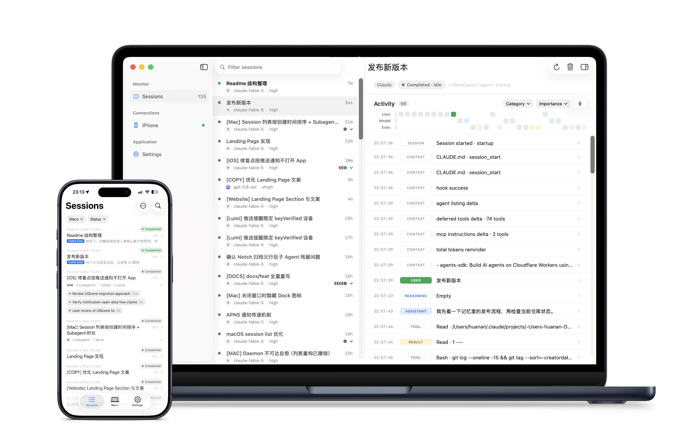

English · [简体中文](README.zh-CN.md)

# Lumi

Know when your agents need you.

Lumi brings Sessions from multiple Agents into one view on your Mac. 
See their current state in Lumi for Mac or the Notch, and check a paired iPhone when you are away.

[Download for Mac](https://lumi.huanan.app/download) · [Join iPhone TestFlight](https://testflight.apple.com/join/uYcSWMzV) · [Website](https://lumi.huanan.app)

 

## Current support

> [!IMPORTANT]
> Lumi is under active development. Only the Agents and Applications below are supported today.

| Concept | Currently supported |
| --- | --- |
| Agent | Codex, Claude Code |
| Application | ChatGPT, Codex, Claude Code, Claude Desktop, Raft, Paseo |

## Start here

**Set up Lumi for Mac — 4 steps**

1. [Download Lumi for Mac](https://lumi.huanan.app/download) on an Apple silicon Mac running macOS 26 or later.
2. Open `Settings > Daemon` and select `Install & Start daemon`.
3. Open `Settings > Agents` and select `Install` for Codex or Claude Code.
4. Start one task in that Agent.

**Done:** The Session appears in Lumi and updates while the Agent works.

**Pair an iPhone — optional, 4 steps**

1. Install [Lumi for iPhone from TestFlight](https://testflight.apple.com/join/uYcSWMzV) on iOS 26 or later.
2. Open `iPhone` in Lumi for Mac and keep this page open.
3. On the iPhone, open `Macs`, select `+ > Add Device`, then scan or enter the code shown on the Mac.
4. Compare the numbers. If they match, select `Match` on the Mac.

**Done:** The Mac lists the iPhone as `Active`, and its Sessions appear on the iPhone.

## What Lumi gives you

- **Mac overview.** See every Session's status at a glance. Open one to inspect its complete Activity and key metrics.
- **Quiet Notch.** It stays compact while Agents work and expands when a turn completes, fails, or is interrupted. Closing the Mac window does not stop the Notch or synchronization.
- **iPhone view.** Search and filter Sessions from multiple paired Macs. Cached content stays readable while a Mac is offline; notifications open the Session that needs attention.
- **Controlled updates.** Lumi uses a signed Stable update channel. You decide when to check, download, and install.

## Privacy and product boundaries

- **Read-only.** Lumi observes Agent Sessions; it does not control them. Lumi for iPhone cannot approve actions, stop work, or send input to an Agent.
- **No account.** Pairing starts with a QR code or short-lived 6-digit code. You confirm the same numbers on both devices before access is granted.
- **Session privacy.** Content is encrypted separately for each paired iPhone. The Relay forwards encrypted Session data without storing or reading it.
- **Notification privacy.** Visible notification text contains only the Session title and status—not Session content, Activity, or tool output. This text passes through the Relay in plaintext for delivery and is not stored there.

## FAQ

**A Session does not appear**

1. Confirm `Settings > Daemon` shows `Running`.
2. Confirm the Agent in `Settings > Agents` shows `Installed`.
3. If Codex shows a trust warning, select `Trust`.
4. Start a new task in the Agent.

**iPhone pairing does not finish**

1. Keep the `iPhone` page open on the Mac.
2. If the code shows `Expired`, select `New code`.
3. Compare the numbers and select `Match` on the Mac.

**A Mac is `Offline` on the iPhone**

Cached Sessions remain readable. Restore the Mac's daemon and network connection; synchronization resumes automatically.

For detailed behavior and recovery paths, read the [feature guide](docs/FEAT.md).

## License

[Apache License 2.0](LICENSE)