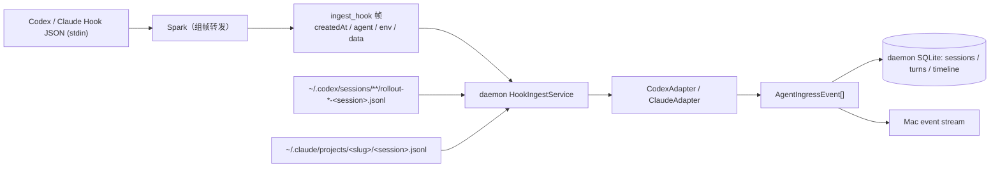

# Agent Hook 设计

Codex 与 Claude 接入都由两条互补路径组成：Hook 提供低延迟；持久日志侧 Codex 有 rollout watcher，Claude 有 transcript watcher（两者常驻，兜住没有任何 hook 的写入——用户中断正是这种写入）。两条路径都先经过对应 Adapter，再写入同一个 reducer。

## 目标

- Hook 命令尽快完成，不在 Agent 进程内做任何解析或维护状态；helper 永远以 0 退出，不阻塞 Agent 的工具调用。
- 不覆盖用户已有 Hook，包括其他 Agent 状态工具。
- 原始 Codex / Claude 格式只存在于 Adapter 边界，产品层只处理统一的 **Agent 领域事件**（Session 生命周期、Turn 聚合、Timeline item）。
- **helper 只做转发，daemon 做全部归并**：helper 把 hook 的原始 stdin、agent 类型与白名单环境变量组成一帧交给 daemon；daemon 反序列化、读取 transcript / rollout 增量、归并、去重、持久化与分发。
- 结构化保留模型配置、上下文和消耗指标；未映射记录默认忽略。

> 边界曾一度前移到 helper（「抽象在 helper 内完成」）。该论证被推翻：env 捕获不等于领域构建（白名单 6 个键随帧转发即可）；hook 进程才是受外部 kill 超时约束的脆弱侧（Codex 仅 3 秒预算）；而「hook 总会送来终态」的可用性假设被 `turn_aborted` 事故证伪——中断把终态写进 rollout 却不触发任何 hook，纯 hook 驱动的读取永远读不到那段尾巴。详见 session-timeline-redesign.md 的实现记录。

## 帧与双输入结构



`ingest_hook` 帧的字段：

| 字段 | 含义 |
| --- | --- |
| `createdAt` | 帧创建时间（RFC 3339）。观测转发延迟；payload 缺 `timestamp` 时作为事发时刻的兜底时钟 |
| `agent` | Agent 类型，`codex` / `claude`，来自安装器写死的 `--agent`。`auto` 与 provider 探测启发式已删除 |
| `env` | 环境变量白名单子集：`PASEO_AGENT_ID`、`PASEO_HOME`、`SLOCK_AGENT_ID`、`SLOCK_CLI_TRANSPORT_DIR`、`CLAUDE_PROJECT_DIR`、`CODEX_HOME`。完整 env 含 API key，绝不全量过 socket |
| `data` | stdin 原始字节，禁止重编码——hook 事件 ID 是对这些字节的 SHA-256 |

`data` 的 JSON 渲染只出现在 helper 的 `hook_frame` 帧日志里（debug 用途），不进帧——帧只携带原始字节一份。

daemon 收到帧后（`HookIngestService`，单 actor、按到达顺序处理）：

1. 按 `agent` 把 `data` 反序列化为类型化 payload——事件名词表是闭合枚举（`HookEventName`，安装器的注册表由它派生）。事件名不在词表内（手工错配的注册、版本偏差）时**降级为仅增量**：照常追平 rich source、记 `hook_event_unsupported`，只是不归并 hook 本身；结构损坏（非 JSON、缺 `session_id`）才整帧拒收。
2. 定位该 Session 的 rich source（Claude 用 payload 的 `transcript_path`；Codex 在 `CODEX_HOME/sessions`——帧内 env 优先于 daemon 自己的——按文件名后缀 `-<session>.jsonl` 由新到旧查找）。
3. 经 `RichSourceCatchUp` 追平增量：取 cursor、读、逐行 reduce、逐事件应用、存 cursor（cursor 随追平前进，早于 hook 事件应用；安全性由稳定事件 ID + 幂等去重保证）。增量读取结束时留下的开放 Turn 播种 `currentTurnID`。
4. reduce hook 本身，带上 `currentTurnID`（hook 事件挂到这个 Turn，见「Turn 边界」）；rich source 可读时 hook 只驱动 lifecycle / phase / Turn 收口 / Session marker，不再产出 message / tool item（避免与 transcript 重复）。Claude `SessionEnd` 且 rich source 不存在时，先判定「临时会话」（见下节）。
5. 从帧内 env 判定 AaaS 并在批末追加标题事件（见「AaaS 识别」），逐事件应用并发布。

## 临时会话（第一个 Turn 之前）

**有效性边界 = 第一个 Turn**（transcript 首条 human prompt 记录 / hook-only 兜底的首次 `UserPromptSubmit` / Codex `task_started`）。`SessionStart` 之后、第一个 Turn 之前的 Session 是 **临时会话**：`SessionSummary.isProvisional = lifecycle == .starting && firstTurnAt == nil`（`firstTurnAt` 由 reducer 在首个带 turnID 的事件时写入，之后不变；`resume` / `compact` 重发 `SessionStart` 会把 lifecycle 重置为 `starting`，但 `firstTurnAt` 已有值，所以不算临时）。

- **可见性**：临时会话在主窗口列表、Notch、Relay/iOS 快照里一律不出现（Mac `MacSessionStore` 过滤，daemon `health.activeSessionCount` 同口径）；它仍留在 daemon 与 Mac cache 里，等第一个 Turn 到来时连同 `session_started` marker 一起显示。唯一例外（`SessionSummary.visible`）：被某个可见 Subagent 引用为 parent 的临时会话照常显示——隐藏它会让子代理孤悬在顶层，也没法选中它做 `reingest_session` 修复（历史数据里曾有子代理 rollout 继承的 `session_meta` 给父级建出空壳的情况）。
- **存在性**：Claude `SessionEnd` 到达时，`HookIngestService` 若发现 transcript 从未落盘且仓库仍把该 Session 记为临时（或根本没有）→ 这不是会话，`ClaudeAdapter` 产出 `AgentIngressEvent(disposition: .discard)` 代替 `session_ended`；仓库删除该 Session 并写入 `ignored_sessions` 墓碑，事件照常发布，Mac cache 跑同一段代码收敛。查询失败时不判定（宁可留下空会话也不误删）。判定只能在 SessionEnd 做：真会话的 SessionStart 同样早于 transcript 创建。Codex 不适用（rollout 从 Session 开始就存在）。

典型来源：Claude 桌面 App 为加载斜杠命令 / agent 列表拉起的一次性 CLI（`withTemporaryQuery`，SessionStart→SessionEnd ≈2 s，无 turn、无 transcript，见 [research](../research/claude-desktop-temporary-query.md)），以及启动后未输入即退出的会话。

## 重算（`reingest_session`）

Mac 工具栏刷新按钮在有选中 Session 时先请求 daemon `reingest_session`；应答只是完成信号（重建后的 summary + turns，timeline 为空——带工具全文的整本 timeline 装不进单个 IPC 帧），Mac 收到后按页取回完整 timeline 写入本地缓存（页超限时逐级缩小到每页 1 条），再做一次按 Session 的对账。daemon 侧 `SessionReingester`（`Common/Adapters`）：

1. 取该 Session 现有 summary + 全部 timeline；按 `rollout_cursors.session_id` 找到 rich source（找不到时按 agent 用 `RichSourceLocator` 搜 `~/.claude/projects` / `~/.codex/sessions`；仍找不到 → `rich_source_unavailable`，不动数据）。
2. `RichSourceReader` 从 offset 0 全量读（不截尾），逐行经 ClaudeAdapter / CodexAdapter 归约。
3. `resetSession`：删 sessions/turns/timeline/cursor 行，不写 tombstone。
4. 回放：全部 rich 事件（eventID 加 `reingest:<generation>:` 前缀绕过幂等表；timeline item ID 不变）→ 之前 hook-only 的 item：`sessionMarker`（`session_ended` 带 completed/idle，仅当 transcript 里没有更晚活动时才生效）与 Claude `subagent` 起止（父 transcript 不含 sidechain）→ 标题 / lineage（重建结果为默认值时沿用旧值）。
5. 游标存到 EOF，之后 hook / watcher 继续增量。
6. Claude 父 Session 额外枚举 `<project>/<session>/subagents/agent-*.jsonl`，每个文件重建一个派生子 Session（reset → 全量归约 → `.meta.json` 标题/lineage → 游标）；这也是给旧记录补出 Claude 子代理子行的方法（选中父 Session 点刷新）。子 Session 自身 reingest 走它的游标路径。

丢失的只有 hook-only 且不可回放的瞬时状态（PermissionRequest 的 waiting_for_approval）。

`SessionReduction` 与 `TurnReduction` 是 daemon 侧唯一的状态归并器。

## Hook 安装

入口：macOS App 的 `Settings > Agents > Install Hook`。

安装过程：

1. 从 App bundle 读取已签名的 `Spark`。
2. 原子复制到 `~/Library/Application Support/Lumi/bin/Spark`。
3. helper 权限设为 `0755`。
4. 读取 `~/.codex/hooks.json`；不存在时从空对象开始。
5. 对每个受支持事件追加一组 command handler，超时 3 秒。
6. 写入前保存 `hooks.json.lumi-backup`。
7. `hooks.json` 权限设为 `0600`。

安装是幂等的：如果某事件组已经包含 `Spark`，不会重复追加。卸载只过滤包含 Lumi helper 的 handler；同组其他 handler 和其他顶层配置保留。

## Turn 边界

Turn = 一次人类提问到一次收口。两个 agent 的边界信号不同。

**Codex**：rollout 自带显式 Turn 记录——`task_started` / `turn_context` 携带 `turn_id` 开 Turn，`task_complete` / `turn_aborted` 收口；hook 的 `turn_id` 与之同名，两路天然落在同一 Turn。

**Claude**：transcript 是边界的唯一权威，按内容判定；`prompt_id` 不参与——注入式续跑（task notification、排队补发的伴随 prompt）每次都携带新 `prompt_id`，按它建 Turn 会给每次续跑多造一个幽灵 Turn。

- **开**：user 记录且 `origin.kind == "human"`（斜杠命令也算；中断标记即使带 human origin 也只收口，不开）。子代理 transcript 没有 human origin：种子与追加的普通 prompt 文本（非注入标签、非中断标记、非工具结果）即开 Turn。
- **命名**：开 Turn 的记录以自己的 `promptId`（缺则 `uuid`）作 TurnID。首个 prompt 的 hook `prompt_id` 与它一致，hook 兜底自然落在同一 Turn。
- **归属**：开与收之间的所有记录——包括带新 `promptId` 的注入式续跑——都归当前 Turn。增量读取以 daemon 已存的最后开放（否则最近一个）Turn 播种 `RolloutReadState.currentTurnID`。
- **收**：assistant 记录的终态 `stop_reason`，按下表分类。用户中断（Esc）不发任何 hook，收口靠 transcript 的中断标记（见映射表）。

| `stop_reason` | 判定 | 结果 |
| --- | --- | --- |
| `tool_use` / `tool_deferred` | 继续：工具循环 | 不收口 |
| `pause_turn` | 继续：server-tool 循环暂停，harness 自动续跑 | 不收口 |
| 缺失 | 流式中间记录 | 不收口 |
| `end_turn`；无 `error` 的 `stop_sequence` | 正常收口 | Waiting For Input（子代理 Completed）/ Idle；Turn `outcome=completed` + `lastAssistantMessage`；`turnEnd(completed, text)` |
| 顶层 `error` 非空（harness 写的 API 错误记录：`rate_limit` / `server_error` / `authentication_failed` …，伴随 `stop_sequence`） | 异常收口 | Failed / Idle；Turn `outcome=failed`；`turnEnd(failed, error · text)` |
| `max_tokens` / `refusal` / `model_context_window_exceeded` | 异常收口：截断或拒答 | 同上 |
| 其他未知值 | 视为正常收口（「会继续」是显式枚举） | 同 `end_turn` |

hook 与 transcript 的分工（`rich` = 该 Session 的 transcript 可读）：

- hook 事件不自带 Turn 身份：统一挂到 `HookIngestService` 从增量追平带回的 `HookIngestOptions.currentTurnID`；只有完全没有 transcript 数据可用（`currentTurnID` 为空且非 rich——文件未落盘、读失败降级、冷启动委托回填）才退回 `prompt_id`。
- rich 时 `UserPromptSubmit` 不建 Turn、不写 prompt——它对注入式续跑同样触发，其文本不能覆盖人类 prompt；开 Turn 全部交给 transcript。
- `Stop` / `StopFailure` 始终收口当前 Turn：终态记录可能晚于 hook 落盘，而停在 waitingForInput·idle 或 failed 的 Session 不再被 watcher 轮询，hook 是唯一有保证的收口。两路 turnEnd 落同一 item id（`turn_end:<s>:<turn>`）与同一 outcome，先后到达幂等。

已知取舍：

- 早于 `origin` 字段的历史 transcript（旧版 Claude Code 所写）回放时开不出 Turn；不为旧数据保留启发式兜底。
- steering（Turn 进行中用户再输入）开新 Turn，旧 Turn 不再收口——与 `prompt_id` 时代一致。

## Hook 事件映射（Codex 与 Claude 同构）

| Hook | lifecycle | phase | Turn | Timeline item |
| --- | --- | --- | --- | --- |
| `SessionStart(source, model)` | Starting | Idle | — | `sessionMarker(sessionStarted)` |
| `UserPromptSubmit(prompt)` | Running | Thinking | 非 rich：建 Turn（prompt/startedAt）；rich 归 transcript（见「Turn 边界」） | 非 rich：`message(user)` |
| `PreToolUse(tool_name, tool_use_id, tool_input)` | Running | Executing | toolCallCount+1（由 item 推导） | 非 rich：`tool(started, toolUseID)` |
| `PostToolUse` / `PostToolUseFailure` | Running | Thinking | — | 非 rich：`tool(succeeded/failed, toolUseID)` |
| `PermissionRequest` | Waiting For Input | Waiting For Approval | — | **无**（权限不进 Timeline） |
| `PermissionDenied`（Claude） | Running | Thinking | — | 无 |
| `SubagentStart/Stop(agent_id, agent_type)` | Running | Subagent Running / Thinking | subagentCount | `subagent(started/completed)`；Claude `agent_type` 为空的 SubagentStart/Stop 整体忽略（Claude Code 在每个 Stop 后 ≈3 s 内部 fork 一次查询，只发 SubagentStop、无 SubagentStart、无 subagent transcript；不是会话的子代理，若纳入会把已完成的 Turn / Session 改回 running）。**Claude 子代理同时得到一个派生子 Session** `<parent>:agent:<agent_id>`（`ClaudeSubagentIdentity`）：Start → 子 Session running/thinking、Stop → completed/idle，lineage.parentSessionID = 父；helper 在每个带 `agent_id` 的 hook 上增量读 `<project>/<session>/subagents/agent-<id>.jsonl`（sidechain transcript，`agent_transcript_path` 或由父 transcript 路径推出）灌进子 Session 的 timeline，并用旁边 `.meta.json` 的 `description` / `agentType` 当标题与 lineage；子代理内部触发的 hook（带 `agent_id` 的 PreToolUse 等）只驱动子 Session。sidechain 记录永不进父 Session |
| `Stop(last_assistant_message)` | Waiting For Input | Idle | 收口当前 Turn：endedAt/outcome=completed/lastAssistantMessage | `turnEnd(completed, message)` |
| `StopFailure`（Claude） | Failed | Idle | 收口当前 Turn：outcome=failed | `turnEnd(failed, error_type · error_message)` |
| `PreCompact(trigger)` / `PostCompact` | Compacting / Running | Compacting / Thinking | — | `sessionMarker(compactionStarted/Ended)` |
| `SessionEnd(reason)` | Completed | Idle | — | `sessionMarker(sessionEnded)`；Claude 且会话仍临时（无 Turn、无 transcript）→ 改为 `disposition: .discard`（删除 + 墓碑，无 item） |
| `InstructionsLoaded`（Claude） | — | — | — | `context(instructions)` |
| `ConfigChange` / `CwdChanged`（Claude） | — | — | — | `config(config_change / cwd_changed)`；CwdChanged 同时更新 workspace |
| `Notification(agent_needs_input / permission_prompt / idle_prompt)`（Claude） | Waiting For Input | Waiting For Approval / Idle | — | 无 |

未知 Hook 事件返回空数组。

## transcript / rollout 事件映射

工具行统一携带两份数据：`summary` 是活动列表行的一行摘要（首个非空行、160 字符截断），`content` 是来源原始输入 / 输出的全文（started 存完整输入，succeeded / failed 存完整结果），Raw Data 视图据此完整展示。下表 cell 里的「摘要」都只指 `summary`。内容不做脱敏：daemon、Mac 缓存和已配对 iPhone 持有的是完整数据，按高敏感数据保护。

**Codex rollout**（`RolloutReadState.currentTurnID` 由 `task_started` / `turn_context` 的 `turn_id` 设定，其余记录归入当前 Turn）：

| record | 结果 |
| --- | --- |
| `session_meta` | Starting/Idle + `sessionMarker(sessionStarted)`（与 hook 同 ID 去重）+ `modelConfiguration`（页头元数据）+ `context(base_instructions)` |
| `turn_context` | `modelConfiguration` + `config(turn_context)` |
| `task_started` | Running/Thinking，建 Turn |
| `user_message` / `agent_message` / `agent_reasoning` | `message(user)`（Turn.prompt）/ `message(assistant)` / `reasoning` |
| `response_item reasoning` | 忽略（`agent_reasoning` 的加密副本） |
| `response_item message` role=developer / user 内 `<tag>` 或 `# AGENTS.md` | `context(developer_instructions / <tag> / agents_md)`；普通 user/assistant 忽略（event_msg 已有） |
| `response_item custom_tool_call` / `function_call` | `tool(started, name, input 摘要, toolUseID=call_id)`；`update_plan` → `plan` |
| `response_item *_output` | `tool(succeeded/failed by metadata.exit_code, output 摘要, toolUseID)`；名称从同次读取的 call 或投影阶段配对补齐 |
| exec/patch/mcp/dynamic/web/image begin·end | 同上，含 `call_id` |
| `task_complete` / `turn_aborted` | `turnEnd(completed|failed|aborted)`，Waiting For Input / Failed / Interrupted |
| `world_state` / `compacted` / `context_compacted` | `context(…)` |
| `thread_settings_applied` / `token_count` | `modelConfiguration` + `config(thread_settings)` / `usageMetrics` |
| `sub_agent_activity` | `subagent(...)`，ID `subagent:<session>:<agent_thread_id>:<phase>` |

**Claude transcript**（Turn 的开/收/归属见「Turn 边界」。`isSidechain: true` 记录忽略——父 Session 通过 SubagentStart/Stop 展示子代理；sidechain 记录只在读 `subagents/agent-*.jsonl` 时归派生子 Session）：

| record / block | 结果 |
| --- | --- |
| `user` 字符串或 `text` block | `message(user)`；开 Turn 的记录以首个普通文本写 Turn.prompt 并占稳定 prompt item id（`user_prompt:<s>:<turn>`），其余文本是独立行；`<system-reminder>…</system-reminder>` 拆出为 `context(system_reminder)`；`<command-name>` 等标签块为 `context(<tag>)` |
| `user` `text` = `[Request interrupted by user]` / `[Request interrupted by user for tool use]` | 用户按 stop。**不触发任何 hook**，此标记是被中断 Turn 唯一的收口信号：Interrupted / Idle + Turn `endedAt/outcome=aborted` + `turnEnd(aborted)`（ID `turn_end:<s>:<turn>`） |
| `user` `tool_result` block | `tool(succeeded/failed by is_error, toolUseID=tool_use_id)`；content = 原始 `content` block + 顶层 `toolUseResult` 全文 |
| `assistant` `thinking` / `text` / `tool_use` | `reasoning`（`thinking` 正文为空、只有 `signature` 时仍产出，text 为空串，投影显示 `Empty`；每个 block 一条，无结束记录）/ `message(assistant)` / `tool(started, name, input 摘要, toolUseID=id)` |
| `assistant` 终态 `stop_reason` / 顶层 `error` | Turn 收口，正常/异常分类见「Turn 边界」的表；`turnEnd` ID `turn_end:<s>:<turn>`，与 Stop/StopFailure hook 落同一行，Stop hook 丢失时下一次读增量自愈 |
| `assistant.message.usage` / `model` | `usageMetrics`（上下文窗口 200k / `[1m]` 1M）/ `modelConfiguration` |
| `attachment` / `system` / `summary` | `context(…)`；attachment 中的运行模式类（`auto_mode` / `plan_mode` / `plan_mode_exit` / `command_permissions`）改为 `config(…)` |
| `custom-title` | Session 标题 |
| `queue-operation` / `last-prompt` 等 | 忽略 |

## helper 执行模型（转发器）

`Spark --agent codex|claude [--verbose]` 是一次性 SwiftPM executable，零解析零领域逻辑：

1. 读全 stdin；截取白名单 env。
2. 记一条帧日志 `hook_frame`：帧内容不含 `data`、含 `data` 的 JSON 渲染（连同 createdAt / agent / env；渲染仅入日志，不进帧）——这是「三端日志不记内容」惯例的显式例外，仅落本机 helper.log。
3. 发一帧 `ingest_hook`（超时 2 秒，低于 Codex hook 的 3 秒预算）；成功记 `hook_forwarded`。
4. 任何失败（缺 `--agent`、空 stdin、连接失败、daemon 拒收）写 stderr 与 errors.log，**仍以 0 退出**。超时不算丢失：帧到达后 daemon 照常完成处理，响应只是告知。
5. 帧预算由编解码上限推导（8 MiB 减 64 KiB 头部余量，再按 base64 的 4/3 反算）：超过预算的 stdin 放弃该次转发（rollout / transcript 的内容由 watcher 自愈，丢失的只有这一个 hook 的低延迟信号）。

hook 帧在 daemon 内应答仍有延迟预算，不做无界工作：daemon 没有该文件的游标（冷启动）且文件超过 1 MiB 时，增量追平跳过整本回放，改把历史交给 daemon 的串行回填队列（`TranscriptBackfillQueue`；父 transcript 与 subagent sidechain 同一规则）。此时 hook 以 `richSourceAvailable=false` 摊开自己的 prompt / tool 行占位——回填靠同一套稳定 item ID 覆盖它们；`SessionEnd` 的“从未使用即丢弃”启发式在委托回填时不生效，避免误删真会话。

## AaaS 层（应用层归属与标题）

服务分两层：**Agent 层**是引擎（codex、claude，即 `AgentProvider`）；**AaaS 层**（Agentic AI as a Service）是承载会话的应用。每个 session 恰好归属一个 AaaS，**session 的标题由拥有它的 AaaS 决定**。检测是全函数（`AaaS.detect(provider:environment:)`，`Common/Adapters`）：用帧内 env 白名单判断是什么 AaaS，构建 AaaS 数据（kind、agentID、terminalProgram、title），永远给出归属。

| AaaS | 判定（按优先级） | 标题来源 |
| --- | --- | --- |
| Paseo | `PASEO_AGENT_ID` | `~/.paseo/agents/*/<agentId>.json` 顶层 `title`（`PASEO_HOME` 可改根目录；按 agent id glob，不重算 Paseo 的目录名清洗规则） |
| Raft | `SLOCK_AGENT_ID` | `$SLOCK_CLI_TRANSPORT_DIR/claude-system-prompt.md` 首行 `You are "<名>"` 的引号内容（Raft 无会话标题概念，agent 名是其唯一持久身份） |
| ChatGPT | codex 且 `__CFBundleIdentifier` ∈ {com.openai.codex, com.openai.chat}（桌面 App 拉起；实测本机 ChatGPT.app 即 com.openai.codex） | Codex 原生线程名（state 元数据 + `session_index.jsonl`，见「Codex state 元数据」） |
| Codex | codex 且非 ChatGPT（终端 CLI、IDE 插件等） | 同上（原生线程名） |
| Claude Desktop | claude 且（`CLAUDE_CODE_ENTRYPOINT` 前缀 claude-desktop（含 -3p）或 `__CFBundleIdentifier`=com.anthropic.claudefordesktop）；Desktop 内承载的 Claude Code 会话也归它（按宿主划分） | transcript 的 `custom-title` 记录 |
| Claude Code | claude 兜底（entrypoint 为 cli / sdk-* / 缺失） | 同上（`custom-title`） |

`terminalProgram` 随归属一并捕获（env `TERM_PROGRAM`，如 ghostty、Apple_Terminal）；Paseo/Raft 优先于桌面/终端信号——包装器可能自己再跑在某个宿主里。

归属持久化与标题仲裁：

- **归属持久化**：`HookIngestService` 每次摄取把归属（`SessionAaaS{kind, agentID, terminalProgram}`）附在批内主会话的每个事件上，`SessionReduction` 按 metadata 门归并——不带归属的事件（watcher、回放、reingest）永不清除既有归属；同一会话换宿主 resume 时按最新 hook 改写（预期语义）。subagent 子会话归属留空，标题继续走 spawn 元数据 / 原生链。
- **仲裁**（落在 `SessionReduction` 的标题门）：归属为 Paseo / Raft 的会话，只有带归属戳的 hook 路径事件才能改标题；不带归属的事件——watcher 追平的 rollout 事件（adapter 会在每条上盖原生线程名）、thread-identity 同步、回放——一律不改标题（状态、agent、lineage 照常落）。ChatGPT / Codex / Claude 系归属与归属未知的旧会话保持原生链。watcher 的 thread-identity 循环另有同判据的前置（避免发无谓事件）。这保证包装器标题在会话结束、再无 hook 重申之后仍然存续。
- Paseo / Raft 标题事件：每次 hook 在事件批**末位**追加一条 identity-only 标题事件（Event ID `aaas-title:<kind>:<s>:<ts>:<titleHash>`，内容派生、跨进程稳定），批内按序压过 CodexAdapter 每事件附带的原生线程名；AaaS 里改名下个 hook 即跟进。其余 AaaS 不发标题事件——原生链就是它们的标题通道。
- 只作用于 hook 自己的 session；携带 `discard` 的批不追加标题（行将删除的会话不需要标题）。
- 检测出包装器但标题文件缺失/损坏时照常检出（report 记 `aaas_title_unavailable`），ingest 不受影响。
- 红线：绝不读取 `~/.slock/computer/servers/*/runner.state.json`——其中有明文 API key。
- `reingest_session` 重建没有帧 env：归属从旧 summary 原样存续；Paseo/Raft 归属且非默认标题时旧标题无条件回携（重建只见过原生线程名，而已结束会话没有下个 hook 自愈）。
- 已知局限：本机制落地前已结束的 Paseo/Raft 会话（无归属记录）不受仲裁保护，watcher 仍按旧行为换回原生名；watcher 发现的无-hook codex 会话归属留空（rollout 的 `session_meta.source` 不可靠——Paseo 走 app-server 也报 "vscode"）。

## 稳定 ID

- Hook Event ID：`hook:` / `claude-hook:` + SHA-256(raw stdin)。rollout/transcript Event ID：`rollout:` / `claude-transcript:` + SHA-256(path + byteOffset + line)。
- **跨来源可去重的 Timeline item ID**（`TimelineItemIDs`）：`marker:<s>:<kind>`、`user_prompt:<s>:<turn>`、`tool:<s>:<toolUseID>:call|result`、`subagent:<s>:<agent>:<phase>`、`turn_end:<s>:<turn>`、`diagnostic:<s>:<key>`。同一逻辑消息经 hook 与 transcript 两路到达时落到同一存储行。
- 其他 item：`<eventID>:timeline`。

## rollout watcher

`CodexRolloutWatcher`（daemon 内，常驻）兜住没有任何 hook 的 rollout 写入。典型场景即诱因 bug：中断把 `turn_aborted` 写进 rollout 的时刻晚于最后一次 hook，且中断不触发 hook——没有 watcher，该会话永远停在 running·thinking。

### 扫描范围

- 根目录默认 `~/.codex/sessions`，也可通过 `CODEX_HOME` 改变。
- 递归查找非隐藏 `.jsonl` 普通文件。
- 默认每 2 秒轮询；最低实际间隔 250ms。
- daemon 启动后的第一次 scan 检查所有文件，以恢复 daemon 离线期间追加的内容。
- 后续只处理新文件或文件尺寸变化的文件。

### 增量归并

扫描走与 hook 路径、backfill 完全相同的 `RichSourceCatchUp` 例程：取游标 → 读（32 MiB 尾部截断）→ 跨行共享 `RolloutReadState`（Turn 归属、tool 配对、channel 仲裁）→ 逐事件应用 → 存游标。watcher 特有的两个前置：

- **Session 解析**：游标里的 session id，或读文件头部 `session_meta` 窥探；两者皆无则本轮跳过（下轮文件增长后重试）。
- **thread-spawn 门**：为 subagent 生成的全新 rollout 先整本复刻父历史；首条 `session_meta` 带 `source.subagent.thread_spawn` 时，在 `inter_agent_communication_metadata(trigger_turn)` 出现前什么都不摄取；出现后只应用 meta 行并把游标直接推到触发点，其余交给常规追平。

游标每文件保存 path、byte offset、文件大小、session id、更新时间；只提交以换行结束的完整行。文件截断且小于旧 offset 时从 0 重新解析（游标里的旧 session id 一并作废），幂等表负责拒绝已处理 Event ID。

### 首次基线

第一次建立基线时（`rollout_baseline_initialized` 未置位），对每个现有 JSONL：

1. **已有游标的文件跳过**——它已在被读取，首次 scan 会从游标续读（顺带收掉无 hook 的尾巴）。升级路径的关键：hook 驱动摄取早于常驻 watcher 的库里全是这种文件，把它们打成忽略会 tombstone 活会话。
2. 否则读文件头部（128 KiB、最多 100 行）找 `session_meta` ID；**库里已知该 Session** 的（hook-only 摄取、从未认领游标），以真实 session id 把游标存到 EOF，watcher 从此接管增量。
3. 只有库里从未见过的 Session 才写入 `ignored_sessions`、以哨兵 id 把游标停在 EOF——避免首装时导入 Lumi 之前的全部历史。
4. 写入 `rollout_baseline_initialized = 1`。

因此新 rollout 文件与已追踪会话进入 Lumi，纯历史文件保持忽略。

## Claude transcript watcher

`ClaudeTranscriptWatcher`（daemon 内，常驻）弥补 hook 驱动读取的盲区：**用户中断不触发任何 hook**，此后写入 transcript 的一切（中断标记、`custom-title`、最后的 assistant 输出）在下一个 hook 到来前都不可见；用户就此弃置的 Session 会永远停在 Running。两个 watcher 都没有环境变量开关——它们是正确性保障的一部分，不是可选项。

与 rollout watcher 不同，它不扫描目录、没有首次基线问题：

- 每个轮询周期（默认 2 秒）取 `listSessions`，只轮询**活跃**的 Claude Session——`starting` / `running` / `compacting`，以及 `waitingForInput` 且 phase 非 `idle`（审批悬挂时按 Esc 同样只写标记）。停在 `waitingForInput · idle` 的已完成 Session 不轮询：它的下一次 transcript 写入必然伴随 `UserPromptSubmit` hook。
- transcript 路径来自该 Session 的 cursor；从未成功读过的 Session（启动数秒即被中断，hook 触发时文件尚未落盘）退回 `RichSourceLocator` 按 cwd slug 推导。Subagent 子 Session 由 `<parent>:agent:<id>` 解析出父路径推导 sidechain transcript。
- 读取复用 `RichSourceCatchUp`（cursor 增量、32 MiB 尾部截断、open Turn 归属），与 hook 触发的追平共享同一 cursor——两路并发读同一增量时靠 processed event 去重收敛。
- 文件尺寸未变化的路径跳过（同 rollout watcher 的 `scannedFileSizes`）。
- Session 一旦被标记 Interrupted 便退出活跃集，不再被轮询。
- hook 触发的追平、两个 watcher 与回填队列共用同一段追平例程（`RichSourceCatchUp`：取游标 → 读 → 应用 → 存游标；从字节 0 读时不继承最新 Turn ID，由历史自己的 Turn 标记归属）。多路并发最多重复读一段增量，靠事件幂等收敛。

## Codex state 元数据

daemon 与 Hook helper 以只读方式打开 `${CODEX_HOME:-~/.codex}/state_5.sqlite`，用 `threads.id` 与 rollout / Hook 的 Session ID 关联。数据库不可用或查不到记录时，事件处理继续进行：首次未知身份使用 Codex 默认值，已经同步过的 Subagent 类型和 lineage 不会被普通 rollout 事件降级。watcher 会周期比对已纳入 Lumi 的 Session，只同步变化的标题、Agent 类型和 Subagent 关系；每次实际变化使用新的幂等事件，因此 `A → B → A` 仍可正确回退。这类身份更新推进记录时钟 `updatedAt`（同步可见）但不推进状态时钟 `lastActivityAt`，不会改变活动排序。

| `threads` 字段 | 可用维度 | 当前处理 |
| --- | --- | --- |
| `id` | Codex Thread / Lumi Session 的稳定关联键 | 直接使用 |
| `title` | Codex 维护的标题，与 `first_user_message` 同步 | 没有显式改名时使用；不从用户消息猜测。显式改名（用户或 `set_thread_title` 工具）不会持久保留在这一列，见下文 `session_index.jsonl` |
| `thread_source` | `user`、`subagent` 等线程来源 | 保存到 Session lineage；Subagent 显示为 `Codex Subagent` |
| `source` | 普通来源字符串，或 Subagent JSON | 解析 `subagent.thread_spawn` 的 parent、depth、nickname、role、path；兼容 `subagent.other` 旧格式 |
| `agent_nickname`、`agent_role`、`agent_path` | Subagent 展示名、职责和树路径 | 优先使用列值，缺失时回退到 `source` JSON；空标题回退为“nickname · path 末段” |
| `cwd` | 工作目录 | rollout / Hook 已提供，state 可作为未来校验或缺失回退，不重复写入 |
| `model_provider`、`model`、`reasoning_effort`、`cli_version` | 模型配置 | rollout 已进入 Model Configuration；state 作为权威校验候选，当前不生成第二份记录 |
| `sandbox_policy`、`approval_mode`、`memory_mode`、`history_mode` | 权限与上下文策略 | turn/session context 已保留；state 作为缺失回退候选 |
| `tokens_used` | 粗粒度累计 Token | 不替换 `token_count` 的分类消耗与 rate-limit 数据 |
| `git_sha`、`git_branch`、`git_origin_url` | Git 上下文 | 可进入 Overview，但当前未持久化，避免在未确定隐私展示前扩张范围 |
| `created_at*`、`updated_at*`、`recency_at*` | Codex Thread 时间 | 不驱动 Lumi 活动排序；状态事件时间仍是当前依据 |
| `first_user_message`、`preview` | 内容摘要 | 不额外复制；用户/Assistant 内容继续来自 Timeline |
| `archived*`、`is_pinned`、`thread_section_id`、`section_*` | Codex App 组织状态 | 当前不映射；Lumi 的保留、删除和排序规则独立 |
| `rollout_path`、`has_user_event`、`name` | 索引与辅助状态 | 当前不展示；可用于后续诊断与对账 |

### 显式改名：`session_index.jsonl`

Codex 把用户或工具（`codex_app__set_thread_title`）的显式改名追加写入 `${CODEX_HOME}/session_index.jsonl`，每行 `{"id","thread_name","updated_at"}`，同一 `id` 以最后一行为准。`threads.title` 会在后续 turn 被 Codex 写回首条用户消息，因此不能作为改名后的标题来源。`CodexThreadIdentityStore` 同时读取该文件（按文件大小与修改时间缓存解析结果），标题优先级为：`session_index.thread_name` > 非继承的 `threads.title` > Subagent 的 `nickname · path 末段`。文件缺失或行不合法时忽略，不影响 sqlite 读取。

Subagent 新格式通过 `source.subagent.thread_spawn.parent_thread_id` 建立父子关系，并保留 `depth`、`agent_path`、`agent_nickname`、`agent_role`。旧的 `source.subagent.other`（例如 `guardian`）可能没有父 Session，只保留 Subagent kind，不能编造父子关系。

## rollout 事件映射

| record | 结果 |
| --- | --- |
| `session_meta` | 建立 Starting/Idle Session，保留 cwd |
| `session_meta` 配置 | 模型 provider、CLI 版本、上下文窗口标识、动态工具设置与基础指令 |
| `turn_context` | 当前模型、effort 与完整 Turn 上下文 |
| `user_message` | User message，Running/Thinking |
| `agent_message` | Assistant message，Running/Responding |
| `agent_reasoning` / reasoning item | Internal Context Timeline |
| `world_state` / `compacted` / `context_compacted` | 世界状态与压缩上下文 Timeline |
| `thread_settings_applied` | Model Configuration Timeline |
| `token_count` | Token 使用、上下文窗口与 rate-limit Timeline |
| `task_started` | Running/Thinking |
| `task_complete` | Waiting For Input/Idle；有 error 时变为 Failed 并记录 Error |
| `turn_aborted` | Interrupted/Idle + 可恢复错误 |
| shell/patch/dynamic/MCP begin/end | Tool started/succeeded/failed 和执行阶段 |
| `sub_agent_activity` | Sub-agent started/waiting/completed/failed |
| web search/image generation/view image | Tool Timeline |
| `update_plan` custom tool | 结构化 Plan steps |

未列出的 record 默认忽略。Session 标题、Codex / Codex Subagent 类型和 Subagent lineage 来自上面的 `threads` 元数据，不从 `UserPromptSubmit` 或 `user_message` 派生。

## Adapter 扩展

`AgentAdapter` 要求新 Agent 实现两个入口：

```text
events(fromHook:raw:options:) -> [AgentIngressEvent]           // 类型化 payload + 原始字节 + options.richSourceAvailable
events(fromRolloutLine:context:state:) -> [AgentIngressEvent]  // state: currentTurnID / toolNames
```

hook 入口按 provider 类型化（`CodexHookPayload` / `ClaudeHookPayload`，字段名不带 hook 前缀、CodingKeys 对齐 agent 的 snake_case 原始键，模型对齐官方 schema——Codex 按 codex-rs hooks/schema/generated 的发布版行为，Claude 按官方 hooks 文档，观察到的实测键优先、文档新键作解码回落）；`raw` 仅作事件 ID 哈希输入。事件名对 `HookEventName` 穷尽 switch，编译器保证新事件不会被无声忽略。`AgentAdapter` 协议只约束 rollout 入口——各 provider 的 hook payload 没有共同形状。

新增 Adapter 时必须继续遵守：

- 输出 Transport Package 的统一事件，不新增平台私有 Session DTO。
- 生成确定性 Event ID。
- unknown 输入安全忽略。
- 在 Adapter 内明确完整保留与忽略边界，不把“未单独映射”描述成“已脱敏”。
- 为 Hook、持久日志、异常结束、诊断数据保留和未知记录忽略添加无真实凭据的合成测试。

## 失败与恢复

| 场景 | Hook 路径 | rollout 路径 |
| --- | --- | --- |
| daemon 未启动 | helper 记错误、退出 0；帧丢失 | daemon 启动后 watcher 从持久 offset 恢复 |
| Hook 未获 Codex 信任 | 不产生低延迟事件 | 新 Session rollout 仍可被 watcher 发现 |
| 同一输入重复 | processed event 拒绝 | processed event 拒绝 |
| 乱序输入 | reducer 不回退可见状态 | reducer 不回退可见状态 |
| 日志只有半行 | 不适用 | 保留旧 offset，等待换行完成 |
| 用户删除 Session | 后续被动事件被 tombstone 拒绝；**新的用户 prompt / SessionStart 会让 Session 重新出现** | 同左 |
| daemon 未启动时 hook 到达 | helper 记 stderr、退出 0；该帧彻底丢失（helper 无本地归并、无磁盘队列） | rollout / transcript 承载的事实由 watcher 按 cursor 补读自愈；hook-only 事实（PermissionRequest 等瞬时状态）不可恢复 |

## 当前限制

- hook 触发的追平与 watcher 轮询（2 秒）之间存在最多一个轮询周期的可见性延迟。
- 父 Session 被中断时，仍在运行的 Subagent 子 Session 不会级联收口（sidechain transcript 不写中断标记），停留在 running 直至手动 reingest。
- rollout / transcript 格式不是稳定 API；未知或变化字段必须默认忽略。
- helper 没有磁盘队列；daemon 不在时的 hook 帧不重放。
- Codex 0.150 新增 `Interrupt` hook（低延迟收口中断 Turn）；等发布版成为基线后加入 `HookEventName` 与安装器注册，在此之前中断收口由 rollout watcher 承担。

## 相关文档

- [整体架构设计](system-architecture.md)
- [数据、通信与保存设计](data-communication-storage.md)
- [App 与运行时设计](application-runtime.md)
