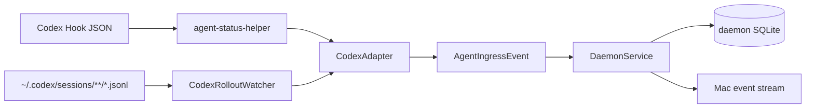

# Agent Hook 设计

Codex 接入由两条互补路径组成：Hook 提供低延迟，rollout watcher 提供持久日志补充与 daemon 离线恢复。两条路径都先经过 `CodexAdapter`，再写入同一个 reducer。

## 目标

- Hook 命令尽快完成，不在 Codex 进程内维护状态。
- 不覆盖用户已有 Hook，包括其他 Agent 状态工具。
- 原始 Codex 格式只存在于 Adapter 边界，产品层只处理统一事件。
- 不采集 reasoning、system instructions、world state、环境快照或原始 transcript。
- daemon 第一次启用时不导入旧 Codex Session。

## 双输入结构



Hook 和 watcher 不分别拥有 Session 状态。`SessionReduction` 是唯一可见状态归并器。

## Hook 安装

入口：macOS App 的 `Settings > Agents > Install Hook`。

安装过程：

1. 从 App bundle 读取已签名的 `agent-status-helper`。
2. 原子复制到 `~/Library/Application Support/Agent Status/bin/agent-status-helper`。
3. helper 权限设为 `0755`。
4. 读取 `~/.codex/hooks.json`；不存在时从空对象开始。
5. 对每个受支持事件追加一组 command handler，超时 3 秒。
6. 写入前保存 `hooks.json.agent-status-backup`。
7. `hooks.json` 权限设为 `0600`。

安装是幂等的：如果某事件组已经包含 `agent-status-helper`，不会重复追加。卸载只过滤包含 Agent Status helper 的 handler；同组其他 handler 和其他顶层配置保留。

## Hook 事件映射

| Codex Hook | lifecycle | phase | Timeline |
| --- | --- | --- | --- |
| `SessionStart` | Starting | Idle | 无 |
| `UserPromptSubmit` | Running | Thinking | User message（存在 prompt 时） |
| `PreToolUse` | Running | Executing | Tool started |
| `PermissionRequest` | Waiting For Input | Waiting For Approval | Tool waiting for approval |
| `PostToolUse` | Running | Responding | Tool succeeded/failed |
| `PreCompact` | Running | 保持当前或默认 | 无 |
| `PostCompact` | Running | 保持当前或默认 | 无 |
| `SubagentStart` | Running | Executing | Sub-agent started |
| `SubagentStop` | Running | Responding | Sub-agent completed |
| `Stop` | Waiting For Input | Idle | 最后一条 Assistant message（存在时） |
| `SessionEnd` | Completed | Idle | 无 |

未知 Hook 事件返回空事件数组，helper 正常退出，不让不认识的事件阻塞 Codex。

## helper 执行模型

`agent-status-helper` 是一次性 SwiftPM executable：

1. 一次性读完 stdin。
2. 空输入或坏 JSON 立即失败。
3. `CodexAdapter` 生成 0..N 个 `AgentIngressEvent`。
4. 每个事件通过 Unix socket 发送 `ingest` 请求。
5. 单请求超时 1 秒。
6. daemon 返回 error、连接失败或编码失败时，写 stderr 并以非零码退出。

helper 不保存游标、不重试、不创建后台任务。持久恢复由 rollout watcher 完成。

## 稳定 ID

- Hook Event ID：`hook:` + SHA-256(raw stdin JSON)。
- Hook Timeline ID：`<eventID>:timeline`。
- rollout Event ID：`rollout:` + SHA-256(path + byteOffset + line bytes)。
- rollout Timeline ID：`<eventID>:timeline`。

相同原始输入再次到达会命中同一 Event ID。JSON 字段顺序或来源变化会产生新 ID。

## rollout watcher

### 扫描范围

- 根目录默认 `~/.codex/sessions`，也可通过 `CODEX_HOME` 改变。
- 递归查找非隐藏 `.jsonl` 普通文件。
- 默认每 2 秒轮询；最低实际间隔 250ms。
- daemon 启动后的第一次 scan 检查所有文件，以恢复 daemon 离线期间追加的内容。
- 后续只处理新文件或文件尺寸变化的文件。

### 游标

每个文件保存：

- path
- 已完整消费到的 byte offset
- 上次文件大小
- 已识别 Session ID
- 更新时间

只提交以换行结束的完整 JSONL 行。文件截断且小于旧 offset 时从 0 重新解析，幂等表负责拒绝已处理 Event ID。

### 首次基线

第一次启动 watcher 时：

1. 读取每个现有 JSONL 前 128 KiB、最多 100 行，寻找 `session_meta` ID。
2. 将找到的 Session ID写入 `ignored_sessions`。
3. 把每个现有文件的 cursor 移到 EOF。
4. 写入 `rollout_baseline_initialized = 1`。

因此只有之后创建的新 rollout 文件进入 Agent Status。已存在 Session 后续追加内容仍被忽略。

## rollout 事件映射

| record | 结果 |
| --- | --- |
| `session_meta` | 建立 Starting/Idle Session，保留 cwd |
| `user_message` | User message，Running/Thinking |
| `agent_message` | Assistant message，Running/Responding |
| `task_started` | Running/Thinking |
| `task_complete` | Waiting For Input/Idle；有 error 时变为 Failed 并记录 Error |
| `turn_aborted` | Interrupted/Idle + 可恢复错误 |
| shell/patch/dynamic/MCP begin/end | Tool started/succeeded/failed 和执行阶段 |
| `sub_agent_activity` | Sub-agent started/waiting/completed/failed |
| web search/image generation/view image | Tool Timeline |
| `update_plan` custom tool | 结构化 Plan steps |

未列出的 record 默认忽略。

## 隐私边界

Adapter 只把以下内容放进产品模型：

- 用户与 Assistant 可见消息。
- 工具名称、简要状态和可用时长。
- 计划步骤和状态。
- 子 Agent 名称、标识和状态。
- 可展示错误。
- Session 工作目录和时间。

明确丢弃：

- reasoning。
- system instructions / base instructions。
- world state。
- compacted history。
- 环境快照。
- 原始 transcript 和未知 record 的完整内容。

## Adapter 扩展

`AgentAdapter` 要求新 Agent 实现两个入口：

```text
events(fromHookData:) -> [AgentIngressEvent]
events(fromRolloutLine:context:) -> [AgentIngressEvent]
```

新增 Adapter 时必须继续遵守：

- 输出 Transport Package 的统一事件，不新增平台私有 Session DTO。
- 生成确定性 Event ID。
- unknown 输入安全忽略。
- 在 Adapter 内完成敏感字段过滤。
- 为 Hook、持久日志、异常结束和隐私排除添加脱敏测试。

## 失败与恢复

| 场景 | Hook 路径 | rollout 路径 |
| --- | --- | --- |
| daemon 未启动 | helper 非零退出 | daemon 启动后从持久 offset 恢复 |
| Hook 未获 Codex 信任 | 不产生低延迟事件 | 新 Session rollout 仍可被 watcher 发现 |
| 同一输入重复 | processed event 拒绝 | processed event 拒绝 |
| 乱序输入 | reducer 不回退可见状态 | reducer 不回退可见状态 |
| 日志只有半行 | 不适用 | 保留旧 offset，等待换行完成 |
| 用户删除 Session | 后续事件被 tombstone 拒绝 | 后续行被 tombstone 拒绝 |

## 当前限制

- Hook 和 rollout 的确定性 ID 域不同；同一语义内容如果通过两条路径出现，当前没有内容级跨来源去重。
- rollout 格式不是 Agent Status 控制的稳定 API；未知或变化字段必须默认忽略。
- helper 没有磁盘队列；低延迟事件发送失败时依赖 rollout 补充。
- v1 只有 `CodexAdapter`，其他 Agent 只是接口预留。

## 相关文档

- [整体架构设计](system-architecture.md)
- [数据、通信与保存设计](data-communication-storage.md)
- [App 与运行时设计](application-runtime.md)
