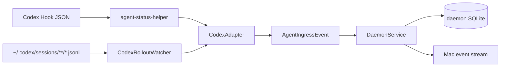

# Agent Hook 设计

Codex 接入由两条互补路径组成：Hook 提供低延迟，rollout watcher 提供持久日志补充与 daemon 离线恢复。两条路径都先经过 `CodexAdapter`，再写入同一个 reducer。

## 目标

- Hook 命令尽快完成，不在 Codex 进程内维护状态。
- 不覆盖用户已有 Hook，包括其他 Agent 状态工具。
- 原始 Codex 格式只存在于 Adapter 边界，产品层只处理统一事件。
- 结构化保留模型配置、内部上下文和消耗指标；已映射的内部上下文保留完整嵌套内容，未映射记录默认忽略。
- daemon 第一次启用时不导入旧 Codex Session。

## 双输入结构



Hook 和 watcher 不分别拥有 Session 状态。`SessionReduction` 是唯一可见状态归并器。

## Hook 安装

入口：macOS App 的 `Settings > Agents > Install Hook`。

安装过程：

1. 从 App bundle 读取已签名的 `agent-status-helper`。
2. 原子复制到 `~/Library/Application Support/Agent Status/bin/agent-status-helper`。
3. helper 权限设为 `0755`。
4. 读取 `~/.codex/hooks.json`；不存在时从空对象开始。
5. 对每个受支持事件追加一组 command handler，超时 3 秒。
6. 写入前保存 `hooks.json.agent-status-backup`。
7. `hooks.json` 权限设为 `0600`。

安装是幂等的：如果某事件组已经包含 `agent-status-helper`，不会重复追加。卸载只过滤包含 Agent Status helper 的 handler；同组其他 handler 和其他顶层配置保留。

## Hook 事件映射

| Codex Hook | lifecycle | phase | Timeline |
| --- | --- | --- | --- |
| `SessionStart` | Starting | Idle | 无 |
| `UserPromptSubmit` | Running | Thinking | User message（存在 prompt 时） |
| `PreToolUse` | Running | Executing | Tool started |
| `PermissionRequest` | Waiting For Input | Waiting For Approval | Tool waiting for approval |
| `PostToolUse` | Running | Responding | Tool succeeded/failed |
| `PreCompact` | Running | 保持当前或默认 | 无 |
| `PostCompact` | Running | 保持当前或默认 | 无 |
| `SubagentStart` | Running | Executing | Sub-agent started |
| `SubagentStop` | Running | Responding | Sub-agent completed |
| `Stop` | Waiting For Input | Idle | 最后一条 Assistant message（存在时） |
| `SessionEnd` | Completed | Idle | 无 |

未知 Hook 事件返回空事件数组，helper 正常退出，不让不认识的事件阻塞 Codex。

## helper 执行模型

`agent-status-helper` 是一次性 SwiftPM executable：

1. 一次性读完 stdin。
2. 空输入或坏 JSON 立即失败。
3. `CodexAdapter` 生成 0..N 个 `AgentIngressEvent`。
4. 每个事件通过 Unix socket 发送 `ingest` 请求。
5. 单请求超时 1 秒。
6. daemon 返回 error、连接失败或编码失败时，写 stderr 并以非零码退出。

helper 不保存游标、不重试、不创建后台任务。持久恢复由 rollout watcher 完成。

## 稳定 ID

- Hook Event ID：`hook:` + SHA-256(raw stdin JSON)。
- Hook Timeline ID：`<eventID>:timeline`。
- rollout Event ID：`rollout:` + SHA-256(path + byteOffset + line bytes)。
- rollout 用户活动 Timeline ID：`<eventID>:timeline`。
- rollout 诊断 Timeline ID：`diagnostic:<sessionID>:<category>`；同一类别的新记录替换旧记录。

相同原始输入再次到达会命中同一 Event ID。JSON 字段顺序或来源变化会产生新 Event ID。诊断记录按 session 与类别保留最新值；world state 保留最近完整状态以及每组字段的最近增量，避免 reasoning、world state 和 token_count 的每次更新无限扩大快照。

## rollout watcher

### 扫描范围

- 根目录默认 `~/.codex/sessions`，也可通过 `CODEX_HOME` 改变。
- 递归查找非隐藏 `.jsonl` 普通文件。
- 默认每 2 秒轮询；最低实际间隔 250ms。
- daemon 启动后的第一次 scan 检查所有文件，以恢复 daemon 离线期间追加的内容。
- 后续只处理新文件或文件尺寸变化的文件。

### 游标

每个文件保存：

- path
- 已完整消费到的 byte offset
- 上次文件大小
- 已识别 Session ID
- 更新时间

只提交以换行结束的完整 JSONL 行。文件截断且小于旧 offset 时从 0 重新解析，幂等表负责拒绝已处理 Event ID。

### 首次基线

第一次启动 watcher 时：

1. 读取每个现有 JSONL 前 128 KiB、最多 100 行，寻找 `session_meta` ID。
2. 将找到的 Session ID写入 `ignored_sessions`。
3. 把每个现有文件的 cursor 移到 EOF。
4. 写入 `rollout_baseline_initialized = 1`。

因此只有之后创建的新 rollout 文件进入 Agent Status。已存在 Session 后续追加内容仍被忽略。

## Codex state 元数据

daemon 与 Hook helper 以只读方式打开 `${CODEX_HOME:-~/.codex}/state_5.sqlite`，用 `threads.id` 与 rollout / Hook 的 Session ID 关联。数据库不可用或查不到记录时，事件处理继续进行：首次未知身份使用 Codex 默认值，已经同步过的 Subagent 类型和 lineage 不会被普通 rollout 事件降级。watcher 会周期比对已纳入 Agent Status 的 Session，只同步变化的标题、Agent 类型和 Subagent 关系；每次实际变化使用新的幂等事件，因此 `A → B → A` 仍可正确回退。这类身份更新不推进 `updatedAt` 或 `lastActivityAt`，不会改变活动排序。

| `threads` 字段 | 可用维度 | 当前处理 |
| --- | --- | --- |
| `id` | Codex Thread / Agent Status Session 的稳定关联键 | 直接使用 |
| `title` | Codex 当前权威标题 | 列表、详情、Notch 与同步副本使用；不从用户消息猜测 |
| `thread_source` | `user`、`subagent` 等线程来源 | 保存到 Session lineage；Subagent 显示为 `Codex Subagent` |
| `source` | 普通来源字符串，或 Subagent JSON | 解析 `subagent.thread_spawn` 的 parent、depth、nickname、role、path；兼容 `subagent.other` 旧格式 |
| `agent_nickname`、`agent_role`、`agent_path` | Subagent 展示名、职责和树路径 | 优先使用列值，缺失时回退到 `source` JSON；空标题回退为“nickname · path 末段” |
| `cwd` | 工作目录 | rollout / Hook 已提供，state 可作为未来校验或缺失回退，不重复写入 |
| `model_provider`、`model`、`reasoning_effort`、`cli_version` | 模型配置 | rollout 已进入 Model Configuration；state 作为权威校验候选，当前不生成第二份记录 |
| `sandbox_policy`、`approval_mode`、`memory_mode`、`history_mode` | 权限与上下文策略 | turn/session context 已保留；state 作为缺失回退候选 |
| `tokens_used` | 粗粒度累计 Token | 不替换 `token_count` 的分类消耗与 rate-limit 数据 |
| `git_sha`、`git_branch`、`git_origin_url` | Git 上下文 | 可进入 Overview，但当前未持久化，避免在未确定隐私展示前扩张范围 |
| `created_at*`、`updated_at*`、`recency_at*` | Codex Thread 时间 | 不驱动 Agent Status 活动排序；状态事件时间仍是当前依据 |
| `first_user_message`、`preview` | 内容摘要 | 不额外复制；用户/Assistant 内容继续来自 Timeline |
| `archived*`、`is_pinned`、`thread_section_id`、`section_*` | Codex App 组织状态 | 当前不映射；Agent Status 的保留、删除和排序规则独立 |
| `rollout_path`、`has_user_event`、`name` | 索引与辅助状态 | 当前不展示；可用于后续诊断与对账 |

Subagent 新格式通过 `source.subagent.thread_spawn.parent_thread_id` 建立父子关系，并保留 `depth`、`agent_path`、`agent_nickname`、`agent_role`。旧的 `source.subagent.other`（例如 `guardian`）可能没有父 Session，只保留 Subagent kind，不能编造父子关系。

## rollout 事件映射

| record | 结果 |
| --- | --- |
| `session_meta` | 建立 Starting/Idle Session，保留 cwd |
| `session_meta` 配置 | 模型 provider、CLI 版本、上下文窗口标识、动态工具设置与基础指令 |
| `turn_context` | 当前模型、effort 与完整 Turn 上下文 |
| `user_message` | User message，Running/Thinking |
| `agent_message` | Assistant message，Running/Responding |
| `agent_reasoning` / reasoning item | Internal Context Timeline |
| `world_state` / `compacted` / `context_compacted` | 世界状态与压缩上下文 Timeline |
| `thread_settings_applied` | Model Configuration Timeline |
| `token_count` | Token 使用、上下文窗口与 rate-limit Timeline |
| `task_started` | Running/Thinking |
| `task_complete` | Waiting For Input/Idle；有 error 时变为 Failed 并记录 Error |
| `turn_aborted` | Interrupted/Idle + 可恢复错误 |
| shell/patch/dynamic/MCP begin/end | Tool started/succeeded/failed 和执行阶段 |
| `sub_agent_activity` | Sub-agent started/waiting/completed/failed |
| web search/image generation/view image | Tool Timeline |
| `update_plan` custom tool | 结构化 Plan steps |

未列出的 record 默认忽略。Session 标题、Codex / Codex Subagent 类型和 Subagent lineage 来自上面的 `threads` 元数据，不从 `UserPromptSubmit` 或 `user_message` 派生。

## 隐私边界

Adapter 只把以下内容放进产品模型：

- 用户与 Assistant 可见消息。
- 工具名称、简要状态和可用时长。
- 计划步骤和状态。
- 子 Agent 名称、标识和状态。
- 可展示错误。
- Session 工作目录和时间。
- Codex 权威标题、Thread 来源，以及 Subagent 的父 Session、深度、昵称、职责和路径。
- 模型、provider、reasoning effort、客户端版本和线程设置。
- reasoning、基础指令、Turn 上下文、世界状态和压缩历史。
- 单次与累计 Token 使用、上下文窗口和 rate-limit 状态。

模型配置、内部上下文和消耗指标按来源类别保留最新记录；用户活动 Timeline 继续保留完整事件历史。

敏感数据边界：

- `turn_context`、`world_state`、reasoning 和 compacted payload 会保留完整嵌套内容；其中可能包含路径、凭据、环境信息、基础指令或被压缩进去的工具内容。
- 当前没有内容级脱敏、密钥识别或字段递归过滤；daemon、Mac 缓存和已配对 iPhone 都必须按高敏感数据保护。
- 普通 tool call/result record 不单独映射，结构化 Plan 除外；但相同文本仍可能出现在已保留的内部上下文或压缩历史中。
- 未建模 record 和完整原始 JSONL 文件不会被另外保存进产品模型。

## Adapter 扩展

`AgentAdapter` 要求新 Agent 实现两个入口：

```text
events(fromHookData:) -> [AgentIngressEvent]
events(fromRolloutLine:context:) -> [AgentIngressEvent]
```

新增 Adapter 时必须继续遵守：

- 输出 Transport Package 的统一事件，不新增平台私有 Session DTO。
- 生成确定性 Event ID。
- unknown 输入安全忽略。
- 在 Adapter 内明确完整保留与忽略边界，不把“未单独映射”描述成“已脱敏”。
- 为 Hook、持久日志、异常结束、诊断数据保留和未知记录忽略添加无真实凭据的合成测试。

## 失败与恢复

| 场景 | Hook 路径 | rollout 路径 |
| --- | --- | --- |
| daemon 未启动 | helper 非零退出 | daemon 启动后从持久 offset 恢复 |
| Hook 未获 Codex 信任 | 不产生低延迟事件 | 新 Session rollout 仍可被 watcher 发现 |
| 同一输入重复 | processed event 拒绝 | processed event 拒绝 |
| 乱序输入 | reducer 不回退可见状态 | reducer 不回退可见状态 |
| 日志只有半行 | 不适用 | 保留旧 offset，等待换行完成 |
| 用户删除 Session | 后续事件被 tombstone 拒绝 | 后续行被 tombstone 拒绝 |

## 当前限制

- Hook 和 rollout 的确定性 ID 域不同；同一语义内容如果通过两条路径出现，当前没有内容级跨来源去重。
- rollout 格式不是 Agent Status 控制的稳定 API；未知或变化字段必须默认忽略。
- helper 没有磁盘队列；低延迟事件发送失败时依赖 rollout 补充。
- v1 只有 `CodexAdapter`，其他 Agent 只是接口预留。

## 相关文档

- [整体架构设计](system-architecture.md)
- [数据、通信与保存设计](data-communication-storage.md)
- [App 与运行时设计](application-runtime.md)
