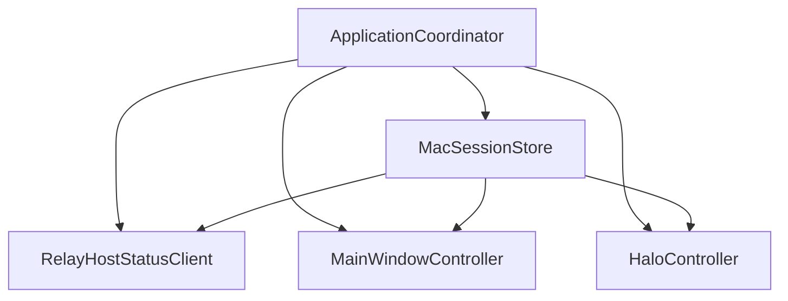
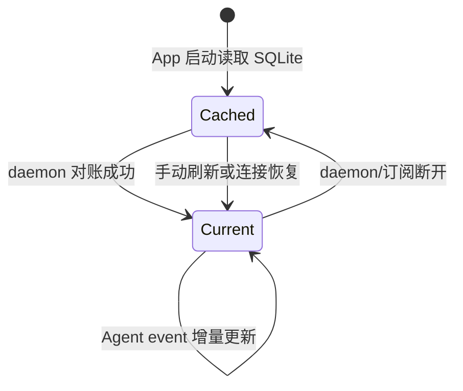

# App 与运行时设计

macOS App 是本机交互中心；daemon 同时是 Relay Host；iOS App 是按 Mac 分组的只读客户端。两个 App 都从 SQLite 驱动列表和详情，不直接把网络响应当作长期 UI 状态。

## macOS App

### 启动对象关系

`ApplicationCoordinator` 持有四个长生命周期对象：

- `MacSessionStore`：daemon 连接、Mac SQLite、Session 选择和观察通知。
- `RelayHostStatusClient`：经 IPC 读取 daemon 的 Relay 连接状态、已配对设备和当前配对会话，发起 / 决定（Match、Don't match）/ 取消配对，撤销设备、删除已撤销设备的记录（Remove）；配对页可见时 1 秒轮询 `relay_pairing_state`，否则 30 秒轮询 `relay_status`，并跟随 `health.relayConnected` 变化立即刷新。只有 `relay_unavailable` 才把连接状态打成不可用，单个动作失败（撤销、开始配对）只显示错误。配对码到期或一次结果显示完（2 秒）时配对页可见则自动开始新码；离开配对页即取消会话。App 不持有 Relay 凭据或连接，配对状态机在 daemon。
- `MainWindowController`：AppKit 窗口、toolbar 和三栏导航。
- `HaloController`：OpenNook、紧凑状态、活动队列和 Notch 设置桥接。

### 三栏窗口

主窗口只有一个 `NSSplitViewController` 层级：

1. 左栏：Sessions、iPhone、Settings 全局导航。
2. 中栏：可折叠的 Main Session / Subagent Outline，或 Settings 分类。
3. 右栏：Session 详情、iPhone 配对页或 Settings 详情。

Sessions 和 Settings 保持三栏；iPhone 配对页折叠中栏，让配对码卡和设备记录占据右侧区域。配对页自己画页头（标题、右侧 Relay 药丸、一行说明、分隔线），不用工具栏标题和 subheader 附件；内容区左右直接贴窗口边缘（28 pt 内距），设备列表随窗口伸缩，配对码卡最小 420 pt、按内容撑开（Relay 地址不折行）。

主界面使用 AppKit。Notch 本体和 Notch Settings detail 使用 SwiftUI；SwiftUI 状态来自同一个 `MacSessionStore` 或 OpenNook `AppState`，没有第二套 Session source of truth。

### 刷新策略

Mac 外部 Session 内容只有三个入口：

| 入口 | 行为 |
| --- | --- |
| App 启动 | 读缓存、与 daemon 做一次按 Session 对账、连接事件流 |
| toolbar Refresh | 手动触发一次对账（选中 Session 时先 reingest）|
| Agent event | 50ms 合并后增量应用到 Mac SQLite |

没有定时 Session 轮询。daemon 健康和 Relay 设备列表可以独立刷新，但不能修改 Session 内容。

### 缓存和性能

- Session 列表先读本地 SQLite，启动不等待 daemon。
- 详情在选择、Summary 或当前选中 Session 的 Timeline 数据变化时重新加载；其他 Session 的诊断变化只推进数据 revision。
- Timeline 每次从 SQLite 以 500 项分页拼接。
- Agent event 用 Event ID 字典合并，同一短时间批次只触发一次 reload。
- 对账等待正在写入的事件批次完成，避免整 Session 替换与增量写交错。
- `dataRevision` 只在业务数据实际变化时增长。
- Notch 读缓存，不增加 daemon 请求。

### Notch

OpenNook 配置：

- 紧凑 leading：最近可展示 Session 的统一状态色。
- 紧凑 trailing：符合条件的 Session 总数。
- 展开内容：最近更新的最多四个 Starting、Running、Waiting、Failed 或 Interrupted Session。
- 每行：标题、lifecycle + phase、当前 Turn 最近 User message。
- 完成、失败、审批和内容变化可以进入短暂 ActivityNook 卡片。
- 设置按钮打开主 App 的 `Settings > Notch`。
- Theme 在 Lumi 中固定为 Dark，Layout 固定为 Notch；第三栏的 Appearance section 不显示这两个控件，启动时会纠正旧的可变偏好。
- 屏幕可选内建屏幕、主屏幕或以稳定 UUID 记录的一台已连接屏幕；断开时按内建屏幕、主屏幕、首个可用屏幕的顺序回退。
- 紧凑 Notch gap、展开内容宽度和展开动画时长通过 OpenNook 偏好保存并实时投射到 surface；三项设置均可恢复默认值，滑块使用无刻度外观；物理刘海宽度仍是紧凑 gap 的下限。

Notch 模型观察 `dataRevision`，不会因普通 health observer 通知重复查询详情。

### daemon 与 Hook 管理

- `SMAppService.agent` 使用 App bundle 内的 LaunchAgent plist 注册 per-user daemon。
- LaunchAgent `RunAtLoad = true`，异常退出后由 `KeepAlive.SuccessfulExit = false` 触发恢复。
- daemon 是 background process，节流重启间隔 5 秒。
- helper 从 App bundle 安装到用户 Application Support，再写入 Codex Hooks。
- 开机启动使用 `SMAppService.mainApp`，与 daemon 注册分开控制。

## iOS App

### 多 Mac 通道

`RelayDeviceController` 恢复一个 Keychain credential collection。每个 HostID 创建一个 `RelayDeviceChannel`：

- 一组独立密钥和 Device token。
- 一条 Device WSS。
- 一个独立 SQLite 缓存文件（共享 `SQLiteSessionRepository`），启动时整体载入内存。
- 一组连接、Host 在线、对账完成、pending 请求、最近 health 和错误状态。

增加或移除一台 Mac 不影响其他通道。

### 同步与展示

- 启动：先显示缓存，再连 Relay；Host 在线即发 `sync_index`，收齐后用 `SyncReconcilePlan` 对账（裁剪 / 整取 / 补尾 / 改 summary），pending 到齐写 lastSync。
- 之后：`session_message` 事件通过与 daemon 相同的 `apply` 归约进缓存与内存（经同一写队列，和整 Session 替换保持顺序）；`session_info` / `session_removed` 直接落地；未知 Session 的事件触发一次整取。
- 请求超时（index 20s / fetch 30s）重发一次，再失败 10s 后整体重新 index；序号断档、任一 presence `online`（含 Host 重连）、回到前台、下拉刷新都重新 index；详情页 `···` > Refresh session 单独整取一个 Session。
- 列表始终显示缓存；Mac 离线只在 Macs 页标 Offline + 上次同步 + Relay host；没有缓存且离线时才显示 `Mac unavailable`。
- 本机隐藏（详情 Delete）的 Session 继续在后台进缓存；事件 / summary / 整取 / index 任一路径带来真实的新活动（`lastActivityAt` 超过隐藏时刻）就重新显示——纯元数据变化（改标题、配置）不会唤回。
- 凭据被 Relay 拒绝（握手 401 / 403、close `4003`）：通道进入 Revoked 态，不再重连；Macs 页该 Mac 显示 Revoked，列表空态提示重新配对；缓存保留。重新配对同一台 Mac 复用 Device ID。

### UIKit 结构

- 根控制器：double-column `UISplitViewController`。
- Primary：按 Mac 分 section 的 Session 列表。
- Secondary：只读 Timeline。
- Add Mac（sheet）：6 格配对码输入 + App 内 QR scanner（解析 `lumi://pair?relay=…&code=…`，系统相机经 URL scheme 进同一页）+ Advanced › Relay URL；随后的等待 / SAS / 成功 / 失败页在同一导航栈里推进。
- Macs：每行显示状态 + 该 Mac 的 Relay host；`+` 菜单 Add Device / Rename this iPhone；左滑删除一个本地通道。

## 并发边界

| 层 | 并发模型 |
| --- | --- |
| daemon repository | Swift actor + GRDB `DatabaseQueue` |
| daemon service | Swift actor |
| Unix socket server | POSIX：一条 accept 线程；每连接一条读线程 + 一条写线程（有界出站队列，超限断连） |
| Unix socket client | POSIX 阻塞调用（非阻塞 fd + poll deadline）；订阅流有专用读线程 |
| daemon subscription hub | `NSLock` 保护 subscriber 字典 |
| rollout watcher | 单个 Task + lock 保护文件尺寸缓存 |
| Mac/iOS controllers | `@MainActor` |
| Mac event apply | 主 Actor 管理的 Task，50ms 合并 |
| Relay host | daemon 内 `RelayHostService` actor：单串行发送循环；事件 1s 合并；每设备序号先落盘 |
| WebSocket client | Swift actor 包装 `URLSessionWebSocketTask` |
| Durable Object | Cloudflare 单对象串行事件模型 |

UI 控制器不直接跨线程操作 GRDB 或 socket。阻塞的本地 IPC request 放入 detached Task，结果回到 Main Actor。

## 状态传播

Mac 在 Cached 状态仍展示本地内容并标记 daemon 不可用；iOS 同样先显示缓存，Mac 离线时在 Macs 页标 Offline，恢复后自动重新 index。

## 当前限制

- iOS 把每个 Session 的完整 `SessionDetail` 载入内存；超大历史的懒加载待做。
- iOS 有 APNs 提醒（回合结束 / 失败 / 中断），但没有后台静默唤醒：通知只提示、不触发后台同步，数据在下次进前台时对账。
- iOS 当前只展示，不发送 Agent 操作。
- Mac 主窗口和 Notch 已做开发运行验证，正式分发行为仍取决于签名、公证和干净机器 LaunchAgent 验收。

## 相关文档

- [整体架构设计](system-architecture.md)
- [数据、通信与保存设计](data-communication-storage.md)
- [Relay、配对与安全设计](relay-pairing-security.md)
- [构建、发布与测试设计](build-release-testing.md)
