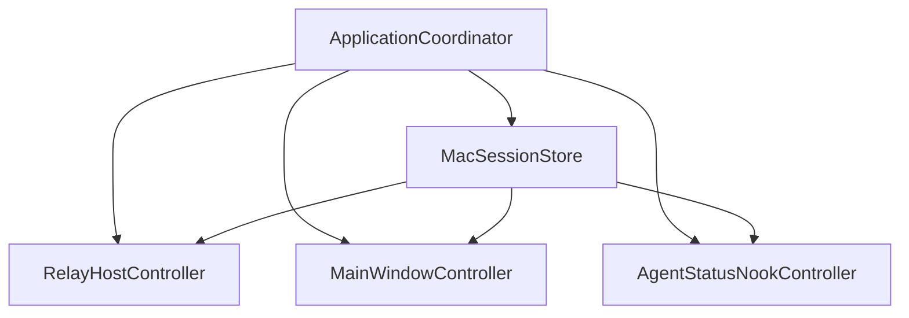
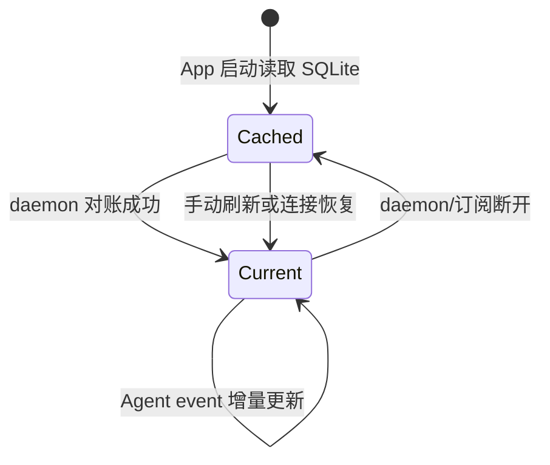

# App 与运行时设计

macOS App 是本机交互与远程发布中心；iOS App 是按 Mac 分组的只读客户端。两个 App 都从 SQLite 驱动列表和详情，不直接把网络响应当作长期 UI 状态。

## macOS App

### 启动对象关系

`ApplicationCoordinator` 持有四个长生命周期对象：

- `MacSessionStore`：daemon 连接、Mac SQLite、Session 选择和观察通知。
- `RelayHostController`：配对、Host WSS、按设备加密和逐 Session 的远程发布。
- `MainWindowController`：AppKit 窗口、toolbar 和三栏导航。
- `AgentStatusNookController`：OpenNook、紧凑状态、活动队列和 Notch 设置桥接。

### 三栏窗口

主窗口只有一个 `NSSplitViewController` 层级：

1. 左栏：Sessions、iPhone、Settings 全局导航。
2. 中栏：可折叠的 Main Session / Subagent Outline，或 Settings 分类。
3. 右栏：Session 详情、iPhone 配对页或 Settings 详情。

Sessions 和 Settings 保持三栏；iPhone 配对页折叠中栏，让 QR 和设备记录占据右侧区域。

主界面使用 AppKit。Notch 本体和 Notch Settings detail 使用 SwiftUI；SwiftUI 状态来自同一个 `MacSessionStore` 或 OpenNook `AppState`，没有第二套 Session source of truth。

### 刷新策略

Mac 外部 Session 内容只有三个入口：

| 入口 | 行为 |
| --- | --- |
| App 启动 | 读缓存、与 daemon 做一次按 Session 对账、连接事件流 |
| toolbar Refresh | 手动触发一次对账（选中 Session 时先 reingest）|
| Agent event | 50ms 合并后增量应用到 Mac SQLite |

没有定时 Session 轮询。daemon 健康和 Relay 设备列表可以独立刷新，但不能修改 Session 内容。

### 缓存和性能

- Session 列表先读本地 SQLite，启动不等待 daemon。
- 详情在选择、Summary 或当前选中 Session 的 Timeline 数据变化时重新加载；其他 Session 的诊断变化只推进数据 revision 和 Relay 发布。
- Timeline 每次从 SQLite 以 500 项分页拼接。
- Agent event 用 Event ID 字典合并，同一短时间批次只触发一次 reload。
- 对账等待正在写入的事件批次完成，避免整 Session 替换与增量写交错。
- `dataRevision` 只在业务数据实际变化时增长。
- Relay 和 Notch 都读缓存，不增加 daemon 请求。

### Notch

OpenNook 配置：

- 紧凑 leading：最近可展示 Session 的统一状态色。
- 紧凑 trailing：符合条件的 Session 总数。
- 展开内容：最近更新的最多四个 Starting、Running、Waiting、Failed 或 Interrupted Session。
- 每行：标题、lifecycle + phase、当前 Turn 最近 User message。
- 完成、失败、审批和内容变化可以进入短暂 ActivityNook 卡片。
- 设置按钮打开主 App 的 `Settings > Notch`。
- Theme 在 Agent Status 中固定为 Dark，Layout 固定为 Notch；第三栏的 Appearance section 不显示这两个控件，启动时会纠正旧的可变偏好。
- 屏幕可选内建屏幕、主屏幕或以稳定 UUID 记录的一台已连接屏幕；断开时按内建屏幕、主屏幕、首个可用屏幕的顺序回退。
- 紧凑 Notch gap、展开内容宽度和展开动画时长通过 OpenNook 偏好保存并实时投射到 surface；三项设置均可恢复默认值，滑块使用无刻度外观；物理刘海宽度仍是紧凑 gap 的下限。

Notch 模型观察 `dataRevision`，不会因普通 health observer 通知重复查询详情。

### daemon 与 Hook 管理

- `SMAppService.agent` 使用 App bundle 内的 LaunchAgent plist 注册 per-user daemon。
- LaunchAgent `RunAtLoad = true`，异常退出后由 `KeepAlive.SuccessfulExit = false` 触发恢复。
- daemon 是 background process，节流重启间隔 5 秒。
- helper 从 App bundle 安装到用户 Application Support，再写入 Codex Hooks。
- 开机启动使用 `SMAppService.mainApp`，与 daemon 注册分开控制。

## iOS App

### 多 Mac 通道

`RelayDeviceController` 恢复一个 Keychain credential collection。每个 HostID 创建一个 `RelayDeviceChannel`：

- 一组独立密钥和 Device token。
- 一条 Device WSS。
- 一个最后确认 sequence。
- 一个独立 SQLite 文件。
- 一组连接、Host 在线、当前快照和错误状态。

增加或移除一台 Mac 不影响其他通道。

### 展示门禁

iOS 即使已经从 SQLite 载入旧 Session，也只有同时满足以下条件才返回给 UI：

1. Device WSS 已连接。
2. Relay 报告 Host 在线。
3. 当前连接同步完整：`index` 已到，且其中每个 Session 都已收全。

缺少任一条件，列表显示 `Mac unavailable`，避免把旧缓存误认为实时状态。

### UIKit 结构

- 根控制器：double-column `UISplitViewController`。
- Primary：按 Mac 分 section 的 Session 列表。
- Secondary：只读 Timeline。
- Pair：摄像头 QR scanner；摄像头不可用时允许 Paste。
- Device：增加另一台 Mac，或删除一个本地通道。
- Mac Session 详情的 Activity 模块会显示已进入 Timeline 的 unknown 记录；iPhone 当前不显示 unknown，但不会中断其他内容。

## 并发边界

| 层 | 并发模型 |
| --- | --- |
| daemon repository | Swift actor + GRDB `DatabaseQueue` |
| daemon service | Swift actor |
| Unix socket server | 单线程 NIO event loop；每个 client channel 有 pipeline |
| daemon subscription hub | `NSLock` 保护 subscriber 字典 |
| rollout watcher | 单个 Task + lock 保护文件尺寸缓存 |
| Mac/iOS controllers | `@MainActor` |
| Mac event apply | 主 Actor 管理的 Task，50ms 合并 |
| Relay publish | 主 Actor Task，100ms 合并 |
| WebSocket client | Swift actor 包装 `URLSessionWebSocketTask` |
| Durable Object | Cloudflare 单对象串行事件模型 |

UI 控制器不直接跨线程操作 GRDB 或 NIO。阻塞的本地 IPC request 放入 detached Task，结果回到 Main Actor。

## 状态传播

Mac 在 Cached 状态仍展示本地内容并标记 daemon 不可用。iOS 的策略更严格：SQLite 只用于快速恢复，未取得当前在线快照时不展示 Session。

## 当前限制

- macOS App 是 Relay Host；App 退出会让 iOS 离线，daemon 独立运行不能维持远程通道。
- iOS 没有后台推送或 APNs 唤醒。
- iOS 当前只展示，不发送 Agent 操作。
- Mac 主窗口和 Notch 已做开发运行验证，正式分发行为仍取决于签名、公证和干净机器 LaunchAgent 验收。

## 相关文档

- [整体架构设计](system-architecture.md)
- [数据、通信与保存设计](data-communication-storage.md)
- [Relay、配对与安全设计](relay-pairing-security.md)
- [构建、发布与测试设计](build-release-testing.md)
