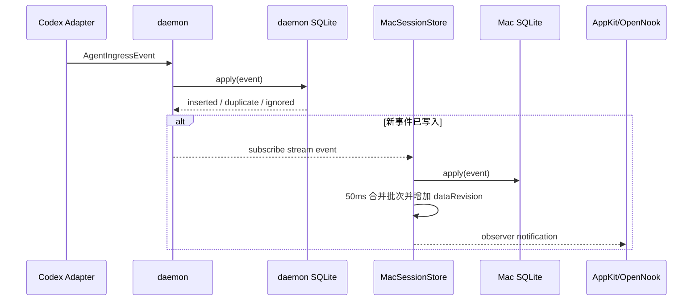
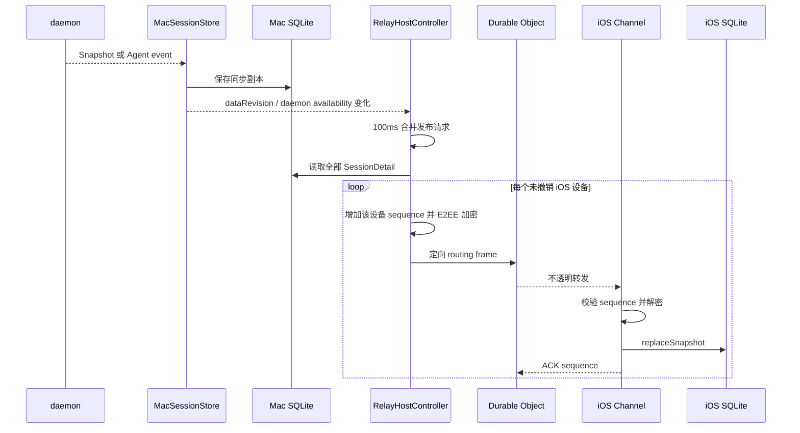

# 数据、通信与保存设计

daemon 保存本机权威 Session；Mac 和 iOS 通过完整快照建立一致副本，再用各自支持的增量路径更新。Relay 只保存路由与授权元数据。

## 统一业务模型

> 两层模型：**Agent 领域**（`SessionSummary` / `TurnSummary` / `TimelineItem`，helper 产出、daemon 存储）与 **Timeline 领域**（`TimelineRow`：tag L1/L2/L3、lane、status，由 `TimelineProjection.rows(from:)` 纯函数投影，不落库）。详见 [Session Timeline 重构方案](session-timeline-redesign.md)。

跨进程和跨设备模型由 `AgentStatusTransport` 唯一声明：

- `SessionSummary`：Agent、标题、工作目录、生命周期、Turn 阶段、时间、注意力标记，以及可选 Subagent lineage。
- `SessionDetail`：一个 Summary、完整或分页 Timeline、下一页游标。
- `TimelineItem`：稳定 ID、Session ID、可选 Turn ID、时间和 payload。
- `TimelinePayload`：消息、工具、计划、子 Agent、错误、模型配置、内部上下文、消耗指标和 unknown。
- `AgentIngressEvent`：Adapter 输出的归一化事件，是 reducer 的唯一输入。

生命周期和 Turn 阶段分开：

| 维度 | 当前值 |
| --- | --- |
| Session lifecycle | Starting、Running、Waiting For Input、Completed、Failed、Interrupted、unknown |
| Turn phase | Idle、Thinking、Executing、Responding、Waiting For Approval、unknown |
| Agent kind | Codex、Codex Subagent、unknown |

未知枚举值会保留原始字符串。旧客户端可以忽略无法展示的 Timeline 类型，而不让整个数据流解码失败。模型配置、内部上下文和消耗指标作为结构化 Timeline payload 持久化并进入完整快照，Mac 的 Session 详情会在独立模块展示这些诊断类 payload，iOS 主活动列表仍会过滤；同一 Session 的同类诊断 payload 只保留最新记录。

## 数据拥有者

| 位置 | 数据角色 | 保存内容 | 默认路径或介质 |
| --- | --- | --- | --- |
| Codex state | 外部只读元数据源 | Thread 标题、主 Session / Subagent 类型和 lineage；不复制整张表 | `${CODEX_HOME:-~/.codex}/state_5.sqlite` 的 `threads` |
| daemon | 本机权威 | Session、Timeline、已处理事件、rollout 游标、删除 tombstone、基线标记 | `~/Library/Application Support/Agent Status/sessions.sqlite3` |
| Mac App | 同步缓存 | daemon 当前 Session 与 Timeline | `~/Library/Application Support/Agent Status Mac/sessions.sqlite3` |
| iOS App | 每 Mac 通道缓存 | 对应 Mac 最近收到的完整快照 | Application Support 下 `Agent Status/Channels/<hostID>.sqlite3` |
| Mac Keychain | 远程身份 | Host ID、Host secret、Host 密钥对、每设备序号 | service `com.huanan.AgentStatusMac.relay` |
| iOS Keychain | 通道身份 | Relay URL、Host/Device ID、Device token、设备密钥对、Host 公钥、确认序号 | service `com.huanan.AgentStatusIOS.relay` |
| Durable Object SQLite | 运维元数据 | token hash、设备公钥、配对挑战 hash、过期/撤销、限流、每设备 Host 序号 | 每个 HostID 一个对象 |
| Durable Object 内存 | 短暂恢复 | 最近密文帧 | 60 秒，最多约 64 帧，重启后可丢失 |

Keychain 项使用 `AfterFirstUnlockThisDeviceOnly`，不会随常规设备备份迁移。

## GRDB Schema

daemon、Mac 和 iOS 复用同一个 `SQLiteSessionRepository` migration：

| 表 | 用途 | 关键规则 |
| --- | --- | --- |
| `sessions` | 当前 Session Summary | `id` 主键；按 `last_activity_at` 倒序读取 |
| `turns` | Turn 聚合（`TurnSummary`：phase、prompt、started/ended、outcome、tool/subagent 计数、lastAssistantMessage） | `(session_id, turn_id)` 主键；由 `TurnReduction` 从事件归并；随 Session 级联删除（migration `agent-status-v2-turns`） |
| `timeline` | Timeline item（Agent 领域消息） | `id` 主键；Session 外键级联删除；按时间与 ID 排序；跨来源同 ID 覆盖 |
| `processed_events` | 幂等键 | 同一个 Event ID 只应用一次 |
| `rollout_cursors` | JSONL 增量位置 | 保存文件路径、byte offset、文件大小和 Session ID |
| `ignored_sessions` | 删除/基线 tombstone | 阻止后到事件重新创建 Session |
| `metadata` | repository 状态 | 当前保存首次 rollout baseline 标记 |

`summary` 和 `item` 列保存由共享 Transport encoder 生成的 JSON BLOB。Summary 中的 Subagent lineage 包含 Thread source、父 Session ID、深度、昵称、职责、Agent path 和 Subagent kind。日期使用 ISO 8601，键稳定排序。

客户端快照替换在一个 GRDB write transaction 内执行：先删除现有 `sessions`，由外键级联删除 Timeline，再插入新快照。

## 保存与保留策略

- daemon、Mac 和 iOS 不按天数或最后活动时间自动清理 Session。
- daemon 的单条删除和清空历史是业务删除入口；Mac/iOS 随后用新快照收敛。
- 删除 Agent Status 数据不会删除 Codex rollout 或 Codex 自身历史。
- iOS 用户移除一个 Mac 时，只清空该通道的凭据、连接和本地同步内容。
- Relay 不保存业务快照，因此没有 Relay 侧 Session 保留期限。
- 模型配置、内部上下文和消耗指标遵循 Session 的同一保留与删除规则，不单独过期。

## 本地通信协议

### 传输

- 介质：Unix domain socket。
- 默认路径：`~/Library/Application Support/Agent Status/daemon.sock`。
- socket 权限：`0600`；父目录权限：`0700`。
- 编码：`TransportEnvelope<IPCRequest|IPCResponse>` JSON。
- framing：4-byte big-endian payload 长度 + JSON bytes。
- 最大帧：8 MiB。
- 版本：`major = 1`；只要 major 相同即视为兼容。
- request ID：用于请求/响应关联；订阅推送使用独立 envelope。

### IPC 操作

| 操作 | 用途 | 连接形态 |
| --- | --- | --- |
| `ingest` | 提交一个归一化事件 | 短连接请求 |
| `ingest_batch` | helper 一次提交一批事件（每帧 ≤200 条） | 短连接请求 |
| `get_rollout_cursor` / `save_rollout_cursor` | helper 读取 / 推进 transcript 游标（游标由 daemon 持有） | 短连接请求 |
| `snapshot_sessions` | 一次取得全部 SessionDetail 和 health | 短连接请求 |
| `list_sessions` | 查询 Summary | 短连接请求 |
| `get_session` | 分页查询一个 Timeline | 短连接请求 |
| `delete_session` | 删除一个 Session 并留下 tombstone | 短连接请求 |
| `clear_history` | 删除全部 Session 并留下 tombstone | 短连接请求 |
| `health` | daemon 状态 | 短连接请求 |
| `subscribe` | 全部 Session 共用的事件流 | Mac App 持久连接 |

daemon 使用一个 NIO event loop。Session 在协议内多路复用，不为 Session 创建 event loop 或 channel。

## 本地同步流程

Mac Session 内容只有三种外部刷新入口：

1. **启动**：先读 Mac SQLite，再请求 daemon 完整快照。
2. **手动 Refresh**：请求完整快照并原子替换缓存。
3. **Agent 事件**：从持久订阅流收到事件，50ms 合并后增量写入缓存。

删除和清空是用户操作结果同步，不属于额外的内容轮询；完成后 Mac 请求一次权威快照。

## 远程同步流程

当前实现的远程发布者是 macOS App，不是 daemon：

远程协议发送完整 `RemoteSessionPayload.snapshot`：

- 一个 payload 包含该 Mac 当前全部 SessionDetail。
- Mac 为每台 iPhone 使用不同公钥、不同密文和独立 sequence。
- 一条 Host WSS 发送所有设备的定向 frame。
- 每个 iOS Mac 通道维护自己的 Device WSS、ACK cursor 和 SQLite。
- daemon 不可用时，Mac 发送一次 `unavailable` payload；iOS 隐藏旧 Session。

## 一致性规则

### 幂等与排序

- Hook Event ID：对原始 Hook JSON 做 SHA-256。
- rollout Event ID：对文件路径、byte offset 和 JSONL 行做 SHA-256。
- `processed_events` 拒绝相同 Event ID。
- `processed_events` 先拒绝重复输入；普通 Timeline 使用唯一 Event 派生 ID，诊断 Timeline 使用稳定类别 ID并以最新记录替换旧值。
- 早于当前 `updatedAt` 的事件仍可贡献 `startedAt` 和 Timeline，但不能回退标题、lifecycle 或 phase。
- 模型配置、内部上下文和消耗指标会写入 Timeline，但不推进 Session 的 `updatedAt`、`lastActivityAt` 或注意力状态。
- 同一诊断类别只有时间不早于现有记录的新事件才能替换；批次乱序不会让旧诊断覆盖新值。
- Timeline 按 `occurredAt`、`id` 稳定排序。

幂等保证针对相同 Event ID。Hook 与 rollout 对同一语义事件生成不同 ID，当前没有跨来源内容级去重。

### 分页

- 单页 Timeline 最大 500 项。
- `snapshot_sessions` 在 daemon 内循环分页，再通过一个 IPC response 返回完整结果。
- Mac 和 iOS 从本地 SQLite 读取详情时同样循环分页。
- 单个本地 frame 仍受 8 MiB 上限约束；当前没有分片快照协议。

### 删除

1. daemon 将 Session ID 写入 `ignored_sessions`。
2. 删除 `sessions`，Timeline 通过外键级联删除。
3. 之后到达的 Hook 或 rollout 事件被拒绝。
4. Mac 通过权威快照删除本地副本。
5. Mac 发布新远程快照，iOS 原子替换对应通道副本。

清空历史会为当时全部 Session 写入 tombstone，并清空 `processed_events`；不会修改 Codex 文件。

## 缓存与读取策略

- Mac UI 不直接查询 daemon；它观察 `MacSessionStore`，详情从本地 SQLite 延迟读取。
- Notch 只读取 Mac 已同步缓存，最多加载四个可展示 Session 的详情。
- Relay 发布也读取 Mac 缓存，不额外触发 daemon snapshot。
- `dataRevision` 在任意 Session 或 Timeline 数据成功持久化后增加；完整快照替换会比较全部 SessionDetail，确保未选中 Session 的诊断变化也能触发 Relay。仅健康状态通知不增加，避免无数据变化时发布。
- iOS 可以预读本地 SQLite，但状态门禁要求“WSS 已连接 + Host 在线 + 已收到当前快照”才暴露 Session 给 UI。

## 故障与恢复

| 故障 | 当前行为 | 恢复 |
| --- | --- | --- |
| helper 找不到 daemon | 1 秒内失败、stderr、非零退出 | daemon 恢复后等待下一 Hook；rollout watcher 补充持久事件 |
| Mac 订阅断开 | health 置空，2 秒后重连 | 手动 Refresh 或重连后的事件/快照 |
| Mac daemon 不可用 | 保留 Mac SQLite 供本地查看，远程发送 unavailable | daemon 恢复后重新发布完整快照 |
| iOS WSS 断开 | 隐藏旧 Session，2 秒后重连 | hello 携带最后 ACK；优先短暂重放，随后等待当前快照 |
| Relay 对象重启 | 授权/序号元数据保留，内存重放丢失 | Mac 重连后重新发布当前快照 |
| SQLite 写失败 | UI/控制器记录可见错误，不把内存状态当作持久成功 | 修复磁盘/权限后重新同步 |

## 当前容量边界

- 本地 frame：8 MiB。
- Relay HTTP body：64 KiB。
- Relay WebSocket 外层 JSON message：2 MiB；密文经过 Base64 后，明文快照安全预算约 1.5 MiB且还需扣除路由头、nonce 与认证标签。
- Session list 请求上限：10,000。
- Timeline 单页上限：500。
- Relay 短暂重放：60 秒、约 64 帧、仅内存。
- 远程 frame 当前为 JSON text，`Data` 字段会以 Base64 表达。
- reasoning、世界状态和压缩历史可能显著增加 Timeline 与完整快照体积；诊断数据按类别只保留最新记录，但达到现有 frame 上限时请求仍会失败，当前没有分片或压缩。

远程明文快照接近约 1.5 MiB 时就需要引入分片、压缩或增量同步；当前没有精确预检或自动降级。

## 相关文档

- [整体架构设计](system-architecture.md)
- [Agent Hook 设计](agent-hook.md)
- [Relay、配对与安全设计](relay-pairing-security.md)
- [App 与运行时设计](application-runtime.md)
