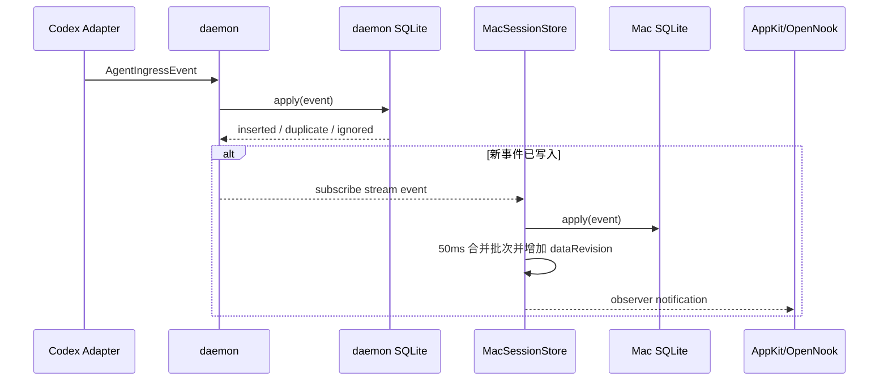
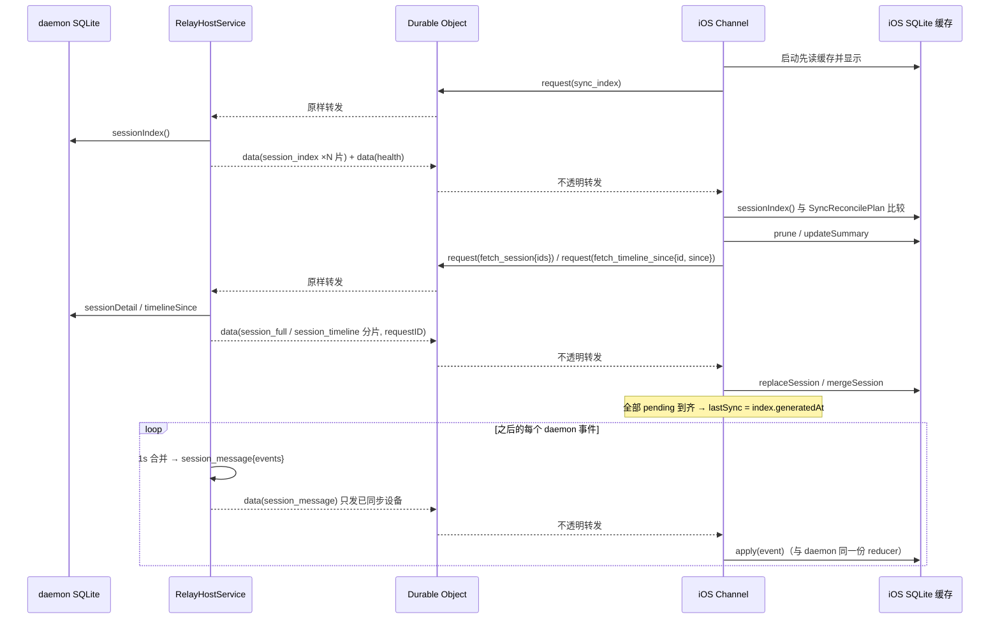

# 数据、通信与保存设计

daemon 保存本机权威 Session，也是唯一的数据源；Mac 经 IPC、iPhone 经 Relay 各自建立 SQLite 缓存（三端同一 schema），都用“index 对账 + 事件流”收敛。Relay 只保存路由与授权元数据。

## 统一业务模型

> 两层模型：**Agent 领域**（`SessionSummary` / `TurnSummary` / `TimelineItem`；summary 与 timeline 落库，`TurnSummary` 由 `TurnProjection` 读时投影）与 **Timeline 领域**（`TimelineRow`：tag L1/L2/L3、lane、status，由 `TimelineProjection.rows(from:)` 纯函数投影，不落库）。详见 [Session Timeline 重构方案](session-timeline-redesign.md)。

跨进程和跨设备模型由 `Transport` 唯一声明：

- `SessionSummary`：Agent、标题、工作目录、生命周期、Turn 阶段、时间、注意力 / 待查看标记（`needsAttention` / `needsReview`）、Notch 归档标记（`hiddenInNotch`：只把 Session 从 Notch 隐藏，Mac / iOS 照常显示；新 prompt 或会话重启时清除）、过滤判定标记（`hiddenByFilter` + 闩 `filterEvaluated`：daemon 在 Session 首条用户消息（按消息分类判定，含斜杠命令这类不开 Turn 的记录）到达时按过滤规则判一次并冻结，之后规则改动、复活、reingest 都不改它；闩区分「判过没命中」与「还没判」；Mac / Notch 读时隐藏——隐藏父 Session 连同其 Subagent 组传递性隐藏——Relay 全口径扣留使数据不进 iPhone；镜像的 reducer 只 sticky 携带，从不重算）、可选 Subagent lineage，以及 `firstTurnAt`（首个 Turn 时间；`isProvisional = lifecycle == starting && firstTurnAt == nil` 表示"第一个 Turn 之前的临时会话"，UI 不显示）。
- `SessionDetail`：一个 Summary、完整或分页 Timeline、下一页游标。
- `TimelineItem`：稳定 ID、Session ID、可选 Turn ID、时间和 payload。
- `TimelinePayload`：消息、reasoning、工具、计划、子 Agent、错误、上下文（session / turn）、session marker、turn end、模型配置、内部上下文、消耗指标。
- `AgentIngressEvent`：Adapter 输出的归一化事件，是 reducer 的唯一输入。可选 `disposition: .discard` 表示 helper 判定该 Session 不应保留（Claude 在第一个 Turn 前结束）：仓库删除 + 写墓碑，事件照常发布让所有镜像收敛。

生命周期和 Turn 阶段分开：

| 维度 | 当前值 |
| --- | --- |
| Session lifecycle | Starting、Running、Waiting For Input、Compacting、Completed、Failed、Interrupted |
| Turn phase | Idle、Thinking、Executing、Responding、Waiting For Approval、Subagent Running、Compacting |
| Agent kind | Codex、Codex Subagent、Claude、Claude Subagent |

枚举不设未知兜底：helper、daemon、Mac、iOS 一起发布，解码遇到不认识的值是要修的错误，不是要保留的原始字符串。模型配置、内部上下文和消耗指标作为结构化 Timeline payload 持久化并进入完整快照，Mac 的 Session 详情 Inspector 与 iOS 详情的 Info Tab 展示这些诊断类 payload（两端共用同一份 presentation），活动列表仍会过滤；同一 Session 的同类诊断 payload 只保留最新记录。

## 数据拥有者

| 位置 | 数据角色 | 保存内容 | 默认路径或介质 |
| --- | --- | --- | --- |
| Codex state | 外部只读元数据源 | Thread 标题、主 Session / Subagent 类型和 lineage；不复制整张表 | `${CODEX_HOME:-~/.codex}/state_5.sqlite` 的 `threads` |
| daemon | 本机权威 | Session、Timeline、已处理事件、rollout 游标、删除 tombstone、基线标记 | `~/Library/Application Support/Lumi/Lumen/sessions.sqlite3` |
| Mac App | 同步缓存 | daemon 当前 Session 与 Timeline | `~/Library/Application Support/Lumi/Storage/cache.sqlite` |
| iOS App | 每 Mac SQLite 缓存 | 对应 Mac 的 Session 与 Timeline（与 daemon 同一 schema） | `~/Library/Application Support/Lumi/Channels/<hostID>.sqlite3`（App 容器内） |
| daemon Keychain | 远程身份 | Relay URL、Host ID、Host secret、Host 密钥对 | service `app.huanan.lumi.daemon.relay`（account `host-credentials-v2`，由 daemon 自己创建） |
| daemon 状态文件 | 发送序号与设备信任 | 每个 Device ID 的 Host 发送序号（发送前先落盘）、Mac 点 Match 时钉住的设备公钥 | `~/Library/Application Support/Lumi/Lumen/relay-host-state.json`（0600） |
| iOS Keychain | 通道身份 | 每台 Mac 各自的 Relay URL、Host/Device ID、Device token、设备密钥对、Host 公钥、配对时间 | service `app.huanan.lumi.ios.relay`（account `device-channels-v4`） |
| Durable Object SQLite（`HostRelay`） | 运维元数据 | Host token hash、设备（公钥、token hash、配对 / 撤销时间）、配对会话（state、承诺、双方公钥与名称、揭示后的 nonce、签发的 Device token）、限流、每设备 Host 序号 | 每个 HostID 一个对象 |
| Durable Object SQLite（`PairingDirectory`） | 配对码目录 | SHA-256(配对码) → Host / 会话、到期与消费时间、claim 限流 | 全局一个对象 |

Keychain 项使用 `AfterFirstUnlockThisDeviceOnly`，不会随常规设备备份迁移。

## GRDB Schema

daemon、Mac 和 iOS 复用同一个 `SQLiteSessionRepository` migration（iOS 每台 Mac 一个文件，schema 完全一致）：

| 表 | 用途 | 关键规则 |
| --- | --- | --- |
| `sessions` | 当前 Session Summary | `id` 主键；按 `last_activity_at` 倒序读取 |
| `timeline` | Timeline item（Agent 领域消息） | `id` 主键；Session 外键级联删除；按时间与 ID 排序；跨来源同 ID 覆盖 |
| `processed_events` | 幂等键 | 同一个 Event ID 只应用一次 |
| `rollout_cursors` | JSONL 增量位置 | 保存文件路径、byte offset、文件大小和 Session ID |
| `ignored_sessions` | 删除/基线/helper discard tombstone | 阻止后到事件重新创建 Session；仅新的 prompt / SessionStart（未处理过的事件）能复活，重放的事件先被 `processed_events` 拒绝；客户端 `replaceSession` / `mergeSession` 会清该 Session 的本地墓碑（以 daemon 为准） |
| `metadata` | repository 状态 | 当前保存首次 rollout baseline 标记 |
| `session_filters` | 过滤规则（用户设置，不是会话历史） | 一行一条规则：`id` 主键 + `position` 排序 + `rule` JSON BLOB；整表替换写入。只有 daemon 读写（镜像里这张表恒空）。`clear_history` / 单条删除都不碰它（migration `lumi-v7-session-filters`） |
| `usage_buckets` / `usage_seen` / `usage_cursors` | Usage：按 `(agent, session_id, turn_id, model, day, tier)` 累加的 token 桶（含来源报告的费用）、全局去重键、每个 transcript / rollout 文件的扫描游标（按 inode 识别文件，含前缀哈希与解析状态 BLOB） | 与 `sessions` 无外键：删 Session、`clear_history`、`reingest` 都不碰；只有 daemon 写（镜像恒空）。详见 [Usage 设计](usage.md)（migration `lumi-v9-usage` 建表，`lumi-v10-usage-rules` 因解析规则变更整体重建） |

`turns` 表已在 migration `lumi-v8` 删除：Turn 聚合（`TurnSummary`：prompt、started/ended、outcome、tool/subagent 计数、lastAssistantMessage）改为读取时由 `TurnProjection` 从 timeline 的 turn-scoped 行现算——时间线是唯一事实源，`SessionDetail.turns` 的 API 与 wire 形状不变，写入方传来的 `turns` 被忽略。

migration `lumi-v3-sweep-empty-claude-sessions` 一次性清掉此前记录下的空 Claude 会话（`completed`、无 Turn、timeline 只有 session marker）并写墓碑——它们按现在的规则本来不会存在。

`summary` 和 `item` 列保存由共享 Transport encoder 生成的 JSON BLOB。Summary 中的 Subagent lineage 包含 Thread source、父 Session ID、深度、昵称、职责、Agent path 和 Subagent kind。日期使用带毫秒的 RFC 3339 UTC（`2026-08-22T00:27:36.266Z`），helper → daemon、daemon ↔ Mac、daemon → Relay → iPhone 和 BLOB 同一精度，同秒内的记录在三端都按时间而不是 id 排序；键稳定排序。

客户端整 Session 替换（`replaceSession`）在一个 GRDB write transaction 内执行：清该 id 的墓碑，删除现有行，由外键级联删除 Timeline，再插入。镜像还用到 `sessionIndex`（summary + timeline 行数 + 最新行时间）、`updateSummary`（只改 summary）、`mergeSession`（按 id upsert 一段 timeline 尾）和 `timelineSince`（按时间切 timeline）。

## 保存与保留策略

- daemon、Mac 和 iOS 不按天数或最后活动时间自动清理 Session。
- daemon 的单条删除和清空历史是业务删除入口；Mac/iOS 随后用新快照收敛。
- 删除 Lumi 数据不会删除 Codex rollout 或 Codex 自身历史。
- iOS 用户移除一个 Mac 时，删除该通道的凭据、连接和 SQLite 缓存文件；Settings > Clear received data 清空全部通道缓存（不写墓碑、不清 `processed_events`）并重新索取 index。
- Relay 不保存业务快照，因此没有 Relay 侧 Session 保留期限。
- 模型配置、内部上下文和消耗指标遵循 Session 的同一保留与删除规则，不单独过期。

## 本地通信协议

### 传输

- 介质：Unix domain socket。
- 默认路径：`~/Library/Application Support/Lumi/daemon.sock`。
- socket 权限：`0600`；父目录权限：`0700`。
- 启动与唤醒：daemon 由 Mac App 以 `SMAppService` 注册为登录项 `app.huanan.lumi.daemon`（RunAtLoad + KeepAlive，正常退出不重启）。launchd 处于 on-demand-only 模式时不执行 RunAtLoad（注册成功但从不拉起），所以同名 **Mach service** 承担按需拉起：客户端 `connect(2)` 得到 `ENOENT` / `ECONNREFUSED` 时先发一条 wake 消息，launchd 为投递它而拉起 daemon；daemon 在 socket 开始监听后才回复，收到回复即重连。Mach service 不承载任何会话数据，socket 仍是唯一数据通道。helper 每次 hook 的唤醒预算 4s，Mac App 事件流 8s，短请求不唤醒；并发唤醒由 launchd 合并成一次拉起。环境指向隔离 daemon（`LUMI_SOCKET` / `LUMI_SUPPORT_DIRECTORY`）时不唤醒；`LUMI_WAKE_SERVICE` 指定另一个服务名（隔离的 launchd 任务）或用 `0` 关闭，daemon 侧只在 launchd 以该 label 启动它（`XPC_SERVICE_NAME`）且无隔离覆盖时才认领服务名。
- 编码：`TransportEnvelope<IPCRequest|IPCResponse>` JSON。
- framing：4-byte big-endian payload 长度 + JSON bytes。
- 最大帧：8 MiB。
- 版本：`major = 1`；只要 major 相同即视为兼容。
- request ID：用于请求/响应关联；订阅推送使用独立 envelope。

### IPC 操作

| 操作 | 用途 | 连接形态 |
| --- | --- | --- |
| `ingest_hook` | helper 转发一次 hook 调用：`{createdAt, agent, env 白名单, data 原始字节}`（payload 的 JSON 渲染只进 helper 帧日志，不进帧）。daemon 反序列化 payload、经 `RichSourceCatchUp` 追平 transcript / rollout 增量、归并 hook、识别 AaaS 标题并逐事件应用（游标由 daemon 单一持有，不再过 IPC；冷启动大历史内部交给串行回填队列）。响应只是告知——helper 超时后 daemon 照常完成 | 短连接请求（helper 超时 2s） |
| `list_sessions` | 查询全部 Summary（对账索引） | 短连接请求 |
| `get_session` | 分页查询一个 Session 的 Timeline（全量只按单 Session 传输） | 短连接请求 |
| `delete_session` | 删除一个 Session 并留下 tombstone | 短连接请求 |
| `mark_session_reviewed` | 人打开了 Session：清除 `needsReview` | 短连接请求 |
| `mark_session_hidden_in_notch` | 人在 Notch 点了 Archive：置 `hiddenInNotch`（仅 Notch 隐藏；新 prompt 或会话重启时由 reducer 清除） | 短连接请求 |
| `reingest_session` | 用 transcript / rollout 从头重算一个 Session：清掉该 Session 的 summary / timeline / cursor（不留 tombstone），全量重读 rich source，回放 hook-only 的 session marker（`session_ended` 恢复 completed）与标题 / lineage，游标推到 EOF；Claude 父 Session 连同 sidechain 子 Agent 一起重建，用户已删除（tombstone）的子 Agent 保持删除；返回重建后的 SessionDetail。不走事件流：调用方把返回的 detail 写入本地缓存并跟一次对账，daemon 把重建的每个 Session 作为未请求的 `session_full` 推给已同步 iPhone | 短连接请求（15s） |
| `clear_history` | 删除全部 Session 并留下 tombstone | 短连接请求 |
| `health` | daemon 状态（含 `relayConnected`） | 短连接请求 |
| `subscribe` | 全部 Session 共用的本地流：Agent 事件（`event`），以及不经事件的 summary 变化（`summary`：已查看、Notch 归档——包括 iPhone 发来的已查看） | Mac App 持久连接 |
| `relay_status` | daemon 的 Relay Host 状态：已连接、Host ID、Relay URL、错误、已配对设备（含是否已钉住公钥） | Mac App 侧栏 / 工具栏（30 秒轮询；配对页可见时由 `relay_pairing_state` 代替） |
| `relay_pairing_start` | 开始一个新配对会话：daemon 生成 nonce 与承诺，向 Relay 建会话、领 6 位配对码；返回 `{sessionID, code, relayURL, expiresAt}`（上一个会话随之取消） | 短连接请求（进入配对页、New code、结果显示完） |
| `relay_pairing_state` | 当前配对会话：code、relayURL、expiresAt、`expiredAt`（码已到期，会话保留到用户换码或离开）、`pending {deviceName, sas}`（iPhone 已提交）、`outcome`（Paired / declined）；没有会话时为空 | Mac App 配对页（可见时 1 秒轮询） |
| `relay_pairing_decide {approved}` | Match / Don't match：daemon 向 Relay 提交决定；Match 同时钉住设备公钥并刷新设备列表 | 短连接请求 |
| `relay_pairing_cancel` | 离开配对页：取消会话，码立刻作废 | 短连接请求 |
| `relay_revoke_device` / `relay_refresh_devices` | 撤销一台 iPhone / 重新拉设备列表，都返回最新状态 | 短连接请求 |
| `relay_remove_device` | 删除一台已撤销 iPhone 的记录（Relay 记录 + daemon 钉住的钥匙一起删），返回最新状态 | 短连接请求 |
| `get_session_filters` | 读取 daemon 存储的过滤规则（有序全量） | 短连接请求（Settings · Agents 面板出现时） |
| `usage_report` | `{since, until}`（本地日 `YYYY-MM-DD`，闭区间，跨度 ≤ 366 天）→ `UsageReport`：totals + byAgent / byProject / byModel 切片、价目状态、扫描进度。daemon 读桶、查询时按 models.dev 价目计价（见 [Usage 设计](usage.md)） | 短连接请求（Usage 页可见时每 30 秒；切换范围 / Refresh 立即） |
| `set_session_filters` | 整表替换过滤规则：校验（≤100 条、条件非空、运算符合法）后写入 `session_filters` 表并同步进内存判定引擎。规则改动不追溯已有 Session——判定在 Session 首条用户消息到达时做一次并冻结在 `hiddenByFilter` 上（`filterEvaluated` 闩保证只判一次），因此不 publish、不通知 Relay | 短连接请求 |

daemon 的 socket 服务端跑在结构化并发上（原生 socket，无第三方网络栈）：accept 与每连接的收发都是服务 `run()` 下的子任务，就绪等待经 DispatchSource 桥接、不占线程，每连接内请求并发处理、由单写者任务串行发帧；Session 在协议内多路复用，不为 Session 创建连接。每连接的出站队列有字节上限，只有停止读取的客户端才会积满——超限即断开，Mac 端按既有路径重连并 reconcile 补数。响应在发送前检查 8 MiB frame 上限：超限时改发 `response_too_large` 失败帧（不重试、提示缩小分页），而不是发出一个客户端注定拒收的帧。

## 本地同步流程

Mac Session 内容只有三种外部刷新入口，全量同步只按单 Session 维度传输（对账）：

1. **启动 / 事件流重连**：先读 Mac SQLite，再做一次对账——`health` + `list_sessions` 索引，summary 与本地不一致或本地缺失的 Session 逐个用 `get_session` 分页拉全量并 `replaceSession` 原子替换，索引之外的本地 Session 用 `pruneSessions` 裁掉（不写墓碑）。
2. **手动 Refresh**：同一段对账；索引一致时不拉取任何 Session。
3. **Agent 事件**：从持久订阅流收到事件，50ms 合并后增量写入缓存。

删除和清空先做乐观本地写（本地墓碑 / 清空，UI 立即收敛），再发 IPC，随后一次对账向 daemon 的权威状态收敛——若 daemon 侧删除失败，对账会把 Session 拉回来。诊断类事件推进 `updatedAt` 但不推进 `lastActivityAt`：对账能看到漂移并收敛 summary，活动排序不受影响。

## 远程同步流程

远程发布者是 daemon 内的 `RelayHostService`，不是 Mac App；Mac App 退出不影响 iPhone 同步。

载荷只有数据层记录，kind 分两类（`RemoteSessionPayload`，密封在 `data` / `request` 帧里）：

| 方向 | kind | 内容 |
| --- | --- | --- |
| 设备 → daemon（`request` 帧） | `sync_index` | 给我 index |
| | `fetch_session` | `sessionIDs`：整 Session（缺失 / 差异很大 / 用户在详情点 Refresh session） |
| | `fetch_timeline_since` | `sessionIDs[0]` + `since`：该 Session `occurredAt ≥ since` 的 timeline（本地 `lastItemAt − 60s`） |
| | `session_reviewed` | `sessionIDs`：iPhone 打开了这些 Session |
| daemon → 设备（`data` 帧） | `session_index` | `index: [SessionIndexEntry{summary, timelineItemCount, lastItemAt}]`，按 600 KB 压缩分 `part / partCount` |
| | `session_info` | `summaries`：不经事件的 summary 变化（已查看、Notch 归档） |
| | `session_full` | 一个 Session 的一个分片（part 0 带 turns，末片 `session.nextCursor == nil`），回显 `requestID` |
| | `session_timeline` | 同上形态，只含 `since` 之后的 timeline 尾 |
| | `session_message` | `events: [AgentIngressEvent]`：daemon 事件流原样转发 |
| | `session_removed` | `sessionIDs`：daemon 删除 / 清空 / 应答 fetch 时不存在 |
| | `health` | `DaemonHealth` |

iPhone 对账规则（`SyncReconcilePlan`，纯函数，Common 共享）：本地有 index 无 → `pruneSessions`（不写墓碑）；index 有本地无、本地 0 行、本地行数多于远端、或差 200 行以上 → `fetch_session`；行数 / 最新行时间不等 → `fetch_timeline_since`；仅 summary 不等 → `updateSummary`。`session_message` 里未知 Session 的事件会触发一次 `fetch_session`。

- payload 明文在加密前做 zlib 压缩；daemon 为每台 iPhone 使用不同公钥、不同密文和独立 sequence；sequence 区间在发送前写入 `relay-host-state.json`（空洞合法、复用致命）。daemon 用一条串行发送循环保证应答先于其后的推送。
- 推送（events / info / removed / health）只发给本连接内请求过 index 的设备；Relay 对离线设备丢帧，设备重连、Host 上线或重连（Relay 再次广播 `online`，daemon 已忘记谁同步过）、回到前台、序号断档、下拉刷新时都重新 `sync_index`。
- 离线设备的缺口由 APNs 提醒补：回合结束 / 失败 / 中断时 daemon 经 Relay 的明文通知接口（REST，独立于帧序）向已注册 token 的 iPhone 发一条 alert；通知只提示、不带数据，iPhone 下次进前台照常对账。
- daemon 收到未知设备、或用缓存公钥解不开的 `request` 时，先按需刷新一次设备列表（最多 2 秒一次）再处理：刚配对或刚换钥匙重配的 iPhone 的第一个请求不会被丢弃。刷新时只承认与本机在 Match 时钉住的公钥相同的设备；其余（Mac 没批准过的行、Relay 换过的钥匙）Unverified，不发帧、请求丢弃（见 [Relay、配对与安全设计](relay-pairing-security.md)）。
- 一条 Host WSS 发送所有设备的定向帧并接收设备请求；每个 iOS Mac 通道维护自己的 Device WSS 和 SQLite 缓存。

## 一致性规则

### 幂等与排序

- Hook Event ID：对原始 Hook JSON 做 SHA-256。
- rollout Event ID：对文件路径、byte offset 和 JSONL 行做 SHA-256。
- `processed_events` 拒绝相同 Event ID。
- `processed_events` 先拒绝重复输入；普通 Timeline 使用唯一 Event 派生 ID，诊断 Timeline 使用稳定类别 ID并以最新记录替换旧值。
- Summary 上有两个时钟，事件只能约束它声明的字段：
  - `lastActivityAt` 是状态时钟：只被携带 lifecycle / phase 的事件推进，也只有它守门 lifecycle / phase——纯元数据事件（config、标题、诊断）无论多新都不能替更早的状态事件封门。由元数据事件创建的 Session 以 `.distantPast` 起步，等回填的历史来声明真实状态。
  - `updatedAt` 是记录时钟：任何被接受的事件都推进（单调 max），守门元数据（标题 / workspace / agent）的 last-writer-wins，并作为同步新旧的依据。
- 早于状态时钟的事件仍可贡献 `startedAt` 和 Timeline，但不能回退 lifecycle 或 phase；早于记录时钟的事件不能回退标题 / workspace。
- 模型配置、内部上下文和消耗指标会写入 Timeline 并推进 `updatedAt`（同步可见），但不推进 `lastActivityAt`，因此不影响活动排序与注意力状态。
- 同一诊断类别只有时间不早于现有记录的新事件才能替换；批次乱序不会让旧诊断覆盖新值。
- Timeline 按 `occurredAt`、`id` 稳定排序。

幂等保证针对相同 Event ID。Hook 与 rollout 对同一语义事件生成不同 ID，当前没有跨来源内容级去重。

### 分页

- 单页 Timeline 最大 500 项；Mac 对账默认按 200 拉取，收到 `response_too_large` 时降到 25 重试该页。
- Mac 和 iOS 从本地 SQLite 读取详情时同样循环分页；iOS 内存里的 `SessionDetail` 由分片组装、事件归约（`SessionDetailReduction`）维护。
- 单个本地 frame 仍受 8 MiB 上限约束；跨进程不再存在"整库一帧"的载荷。

### 删除

1. Mac 先做乐观本地删除（本地墓碑 + 行删除），UI 立即收敛。
2. daemon 将 Session ID 写入 `ignored_sessions`，删除 `sessions`，Timeline / Turn 通过外键级联删除。
3. 之后到达的 Hook 或 rollout 事件被拒绝。
4. Mac 随后一次对账确认（daemon 侧失败时 Session 会被拉回）。
5. daemon 向已同步的 iPhone 推送 `session_removed`，iPhone 删除缓存行并写本地墓碑；离线的 iPhone 在下一次 index 对账时裁掉它。

helper 发起的丢弃（`AgentIngressEvent.disposition == .discard`）走同一段删除，但不经过 `delete_session`：daemon 在 `apply` 内删除 + 写墓碑并返回"已应用"，事件经订阅流发布，Mac cache 应用同一事件时执行同样的删除。Mac 端按到达顺序应用事件（有序队列），保证与 daemon 结果一致。

清空历史会为当时全部 Session 写入 tombstone，并清空 `processed_events`；不会修改 Codex 文件。

## 缓存与读取策略

- Mac UI 不直接查询 daemon；它观察 `MacSessionStore`，详情从本地 SQLite 延迟读取。
- Notch 只读取 Mac 已同步缓存，最多加载四个可展示 Session 的详情。
- Relay 发布在 daemon 内直接读 daemon SQLite（应答 index / fetch）并转发事件流；Mac 缓存与之无关。
- `dataRevision` 在任意 Session 或 Timeline 数据成功持久化后增加，驱动 Mac UI / Notch 刷新；仅健康状态通知不增加。
- iOS 列表始终显示缓存（启动即显示、Mac 离线也不清空）；新鲜度只在 Macs 页以在线点和“上次同步”表达；已打开的详情页保留最后一次收到的内容。

## 故障与恢复

| 故障 | 当前行为 | 恢复 |
| --- | --- | --- |
| helper 找不到 daemon | 1 秒内失败、stderr、非零退出 | daemon 恢复后等待下一 Hook；rollout watcher 补充持久事件 |
| Mac 订阅断开 | health 置空，2 秒后重连 | 重连成功即触发一次对账，补上断线期间的缺口 |
| daemon 不可用 | Mac 保留 SQLite 供本地查看；Host WSS 随 daemon 下线，iPhone 收到 presence offline 在 Macs 页把该 Mac 标为 Offline，但继续显示缓存 | daemon 恢复（launchd 拉起）后 iPhone 收到 presence online 自动 `sync_index` |
| Mac App 退出 | 不影响 iPhone：Relay Host 在 daemon 里 | — |
| iOS WSS 断开 | 继续显示缓存，2 秒后重连 | 重连后 Host 在线即 `sync_index` 对账 |
| Relay 对象重启 | 授权/序号元数据保留 | 设备重连 `sync_index`；daemon 序号落后时 Worker 回 `non_monotonic_sequence{lastSequence}`，daemon 抬序号并向该设备补发一帧 health，设备据序号断档重新 index |
| SQLite 写失败 | UI/控制器记录可见错误，不把内存状态当作持久成功 | 修复磁盘/权限后重新同步 |

## 当前容量边界

- 本地 frame：8 MiB；daemon 发送侧超限改发 `response_too_large`，客户端降低分页重试。
- Relay HTTP body：64 KiB。
- Relay WebSocket 外层 JSON message：2 MiB。所有远程载荷先 zlib 压缩，压缩后超过 600 KB 再切分（index 按条目、事件按批、整 Session 按 timeline），单个 sealed frame 保持在 ~1 MiB 以下。
- Session list 请求上限：10,000。
- Timeline 单页上限：500（IPC）；Mac 对账默认 200。
- 远程 frame 当前为 JSON text，`Data` 字段会以 Base64 表达。
- 超过 1.5 MB（压缩后）的单条 timeline item 只会从 Relay 副本中省略；Mac 与 daemon 不受影响。

## 相关文档

- [整体架构设计](system-architecture.md)
- [Agent Hook 设计](agent-hook.md)
- [Relay、配对与安全设计](relay-pairing-security.md)
- [App 与运行时设计](application-runtime.md)
