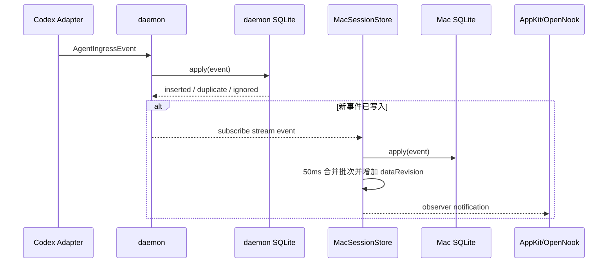
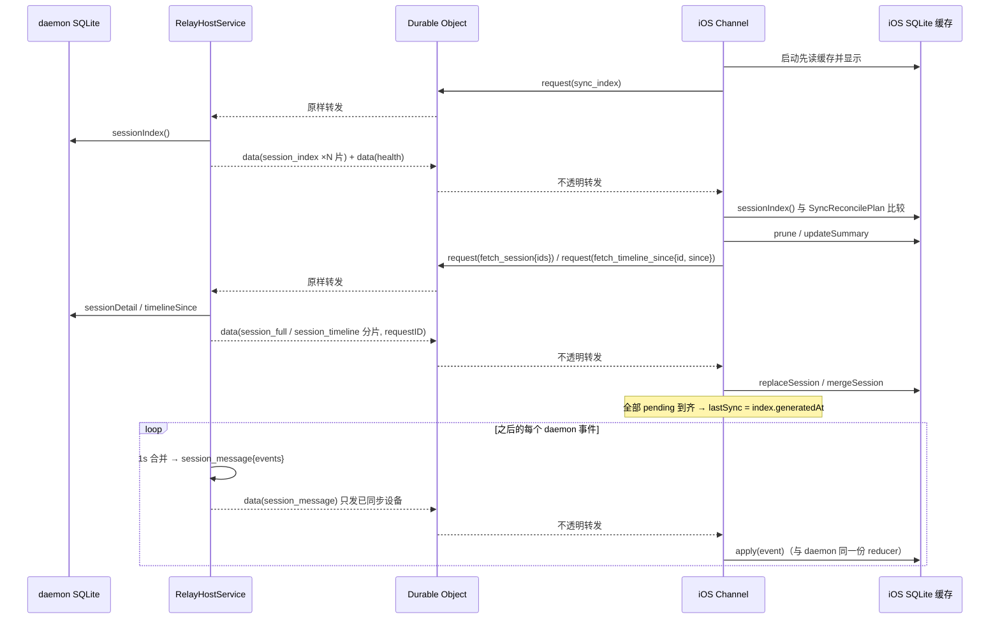

# 数据、通信与保存设计

daemon 保存本机权威 Session，也是唯一的数据源；Mac 经 IPC、iPhone 经 Relay 各自建立 SQLite 缓存（三端同一 schema），都用“index 对账 + 事件流”收敛。Relay 只保存路由与授权元数据。

## 统一业务模型

> 两层模型：**Agent 领域**（`SessionSummary` / `TurnSummary` / `TimelineItem`，helper 产出、daemon 存储）与 **Timeline 领域**（`TimelineRow`：tag L1/L2/L3、lane、status，由 `TimelineProjection.rows(from:)` 纯函数投影，不落库）。详见 [Session Timeline 重构方案](session-timeline-redesign.md)。

跨进程和跨设备模型由 `AgentStatusTransport` 唯一声明：

- `SessionSummary`：Agent、标题、工作目录、生命周期、Turn 阶段、时间、注意力 / 待查看标记（`needsAttention` / `needsReview`）、Notch 归档标记（`hiddenInNotch`：只把 Session 从 Notch 隐藏，Mac / iOS 照常显示；新 prompt 或会话重启时清除）、可选 Subagent lineage，以及 `firstTurnAt`（首个 Turn 时间；`isProvisional = lifecycle == starting && firstTurnAt == nil` 表示"第一个 Turn 之前的临时会话"，UI 不显示）。
- `SessionDetail`：一个 Summary、完整或分页 Timeline、下一页游标。
- `TimelineItem`：稳定 ID、Session ID、可选 Turn ID、时间和 payload。
- `TimelinePayload`：消息、工具、计划、子 Agent、错误、模型配置、内部上下文、消耗指标和 unknown。
- `AgentIngressEvent`：Adapter 输出的归一化事件，是 reducer 的唯一输入。可选 `disposition: .discard` 表示 helper 判定该 Session 不应保留（Claude 在第一个 Turn 前结束）：仓库删除 + 写墓碑，事件照常发布让所有镜像收敛。

生命周期和 Turn 阶段分开：

| 维度 | 当前值 |
| --- | --- |
| Session lifecycle | Starting、Running、Waiting For Input、Completed、Failed、Interrupted、unknown |
| Turn phase | Idle、Thinking、Executing、Responding、Waiting For Approval、unknown |
| Agent kind | Codex、Codex Subagent、unknown |

未知枚举值会保留原始字符串。旧客户端可以忽略无法展示的 Timeline 类型，而不让整个数据流解码失败。模型配置、内部上下文和消耗指标作为结构化 Timeline payload 持久化并进入完整快照，Mac 的 Session 详情 Inspector 与 iOS 详情的 Info Tab 展示这些诊断类 payload（两端共用同一份 presentation），活动列表仍会过滤；同一 Session 的同类诊断 payload 只保留最新记录。

## 数据拥有者

| 位置 | 数据角色 | 保存内容 | 默认路径或介质 |
| --- | --- | --- | --- |
| Codex state | 外部只读元数据源 | Thread 标题、主 Session / Subagent 类型和 lineage；不复制整张表 | `${CODEX_HOME:-~/.codex}/state_5.sqlite` 的 `threads` |
| daemon | 本机权威 | Session、Timeline、已处理事件、rollout 游标、删除 tombstone、基线标记 | `~/Library/Application Support/Agent Status/sessions.sqlite3` |
| Mac App | 同步缓存 | daemon 当前 Session 与 Timeline | `~/Library/Application Support/Agent Status Mac/sessions.sqlite3` |
| iOS App | 每 Mac SQLite 缓存 | 对应 Mac 的 Session、Turn、Timeline（与 daemon 同一 schema） | `~/Library/Application Support/Agent Status/Channels/<hostID>.sqlite3`（App 容器内） |
| daemon Keychain | 远程身份 | Relay URL、Host ID、Host secret、Host 密钥对 | service `com.huanan.AgentStatusDaemon.relay`（account `host-credentials-v2`，由 daemon 自己创建） |
| daemon 状态文件 | 发送序号 | 每个 Device ID 的 Host 发送序号（发送前先落盘） | `~/Library/Application Support/Agent Status/relay-host-state.json`（0600） |
| iOS Keychain | 通道身份 | Relay URL、Host/Device ID、Device token、设备密钥对、Host 公钥、配对时间 | service `com.huanan.AgentStatusIOS.relay`（account `device-channels-v4`） |
| Durable Object SQLite | 运维元数据 | token hash、设备公钥、配对挑战 hash、过期/撤销、限流、每设备 Host 序号 | 每个 HostID 一个对象 |

Keychain 项使用 `AfterFirstUnlockThisDeviceOnly`，不会随常规设备备份迁移。

## GRDB Schema

daemon、Mac 和 iOS 复用同一个 `SQLiteSessionRepository` migration（iOS 每台 Mac 一个文件，schema 完全一致）：

| 表 | 用途 | 关键规则 |
| --- | --- | --- |
| `sessions` | 当前 Session Summary | `id` 主键；按 `last_activity_at` 倒序读取 |
| `turns` | Turn 聚合（`TurnSummary`：phase、prompt、started/ended、outcome、tool/subagent 计数、lastAssistantMessage） | `(session_id, turn_id)` 主键；由 `TurnReduction` 从事件归并；随 Session 级联删除（migration `agent-status-v2-turns`） |
| `timeline` | Timeline item（Agent 领域消息） | `id` 主键；Session 外键级联删除；按时间与 ID 排序；跨来源同 ID 覆盖 |
| `processed_events` | 幂等键 | 同一个 Event ID 只应用一次 |
| `rollout_cursors` | JSONL 增量位置 | 保存文件路径、byte offset、文件大小和 Session ID |
| `ignored_sessions` | 删除/基线/helper discard tombstone | 阻止后到事件重新创建 Session；仅新的 prompt / SessionStart（未处理过的事件）能复活，重放的事件先被 `processed_events` 拒绝；客户端 `replaceSession` / `mergeSession` 会清该 Session 的本地墓碑（以 daemon 为准） |
| `metadata` | repository 状态 | 当前保存首次 rollout baseline 标记 |

migration `agent-status-v3-sweep-empty-claude-sessions` 一次性清掉此前记录下的空 Claude 会话（`completed`、无 Turn、timeline 只有 session marker）并写墓碑——它们按现在的规则本来不会存在。

`summary` 和 `item` 列保存由共享 Transport encoder 生成的 JSON BLOB。Summary 中的 Subagent lineage 包含 Thread source、父 Session ID、深度、昵称、职责、Agent path 和 Subagent kind。日期使用 ISO 8601，键稳定排序。

客户端整 Session 替换（`replaceSession`）在一个 GRDB write transaction 内执行：清该 id 的墓碑，删除现有行，由外键级联删除 Timeline，再插入。镜像还用到 `sessionIndex`（summary + timeline 行数 + 最新行时间）、`updateSummary`（只改 summary）、`mergeSession`（按 id upsert 一段 timeline 尾）和 `timelineSince`（按时间切 timeline）。

## 保存与保留策略

- daemon、Mac 和 iOS 不按天数或最后活动时间自动清理 Session。
- daemon 的单条删除和清空历史是业务删除入口；Mac/iOS 随后用新快照收敛。
- 删除 Agent Status 数据不会删除 Codex rollout 或 Codex 自身历史。
- iOS 用户移除一个 Mac 时，删除该通道的凭据、连接和 SQLite 缓存文件；Settings > Clear received data 清空全部通道缓存（不写墓碑、不清 `processed_events`）并重新索取 index。
- Relay 不保存业务快照，因此没有 Relay 侧 Session 保留期限。
- 模型配置、内部上下文和消耗指标遵循 Session 的同一保留与删除规则，不单独过期。

## 本地通信协议

### 传输

- 介质：Unix domain socket。
- 默认路径：`~/Library/Application Support/Agent Status/daemon.sock`。
- socket 权限：`0600`；父目录权限：`0700`。
- 编码：`TransportEnvelope<IPCRequest|IPCResponse>` JSON。
- framing：4-byte big-endian payload 长度 + JSON bytes。
- 最大帧：8 MiB。
- 版本：`major = 1`；只要 major 相同即视为兼容。
- request ID：用于请求/响应关联；订阅推送使用独立 envelope。

### IPC 操作

| 操作 | 用途 | 连接形态 |
| --- | --- | --- |
| `ingest` | 提交一个归一化事件 | 短连接请求 |
| `ingest_batch` | helper 一次提交一批事件（每帧 ≤200 条） | 短连接请求 |
| `get_rollout_cursor` / `save_rollout_cursor` | helper 读取 / 推进 transcript 游标（游标由 daemon 持有） | 短连接请求 |
| `list_sessions` | 查询全部 Summary（对账索引） | 短连接请求 |
| `get_session` | 分页查询一个 Session 的 Timeline（全量只按单 Session 传输） | 短连接请求 |
| `delete_session` | 删除一个 Session 并留下 tombstone | 短连接请求 |
| `mark_session_reviewed` | 人打开了 Session：清除 `needsReview` | 短连接请求 |
| `mark_session_hidden_in_notch` | 人在 Notch 点了 Archive：置 `hiddenInNotch`（仅 Notch 隐藏；新 prompt 或会话重启时由 reducer 清除） | 短连接请求 |
| `reingest_session` | 用 transcript / rollout 从头重算一个 Session：清掉该 Session 的 summary / turns / timeline / cursor（不留 tombstone），全量重读 rich source，回放 hook-only 的 session marker（`session_ended` 恢复 completed）与标题 / lineage，游标推到 EOF；返回重建后的 SessionDetail。不走事件流，调用方把返回的 detail 写入本地缓存并跟一次对账 | 短连接请求（15s） |
| `clear_history` | 删除全部 Session 并留下 tombstone | 短连接请求 |
| `health` | daemon 状态（含 `relayConnected`） | 短连接请求 |
| `subscribe` | 全部 Session 共用的事件流 | Mac App 持久连接 |
| `relay_status` | daemon 的 Relay Host 状态：已连接、Host ID、错误、已配对设备 | Mac App 配对页（可见时 5 秒轮询） |
| `relay_create_pairing_offer` | 让 daemon 生成并登记一次性配对 offer，返回二维码内容 | 短连接请求 |
| `relay_revoke_device` / `relay_refresh_devices` | 撤销一台 iPhone / 重新拉设备列表，都返回最新状态 | 短连接请求 |

daemon 使用一个 NIO event loop。Session 在协议内多路复用，不为 Session 创建 event loop 或 channel。响应在发送前检查 8 MiB frame 上限：超限时改发 `response_too_large` 失败帧（不重试、提示缩小分页），而不是发出一个客户端注定拒收的帧。

## 本地同步流程

Mac Session 内容只有三种外部刷新入口，全量同步只按单 Session 维度传输（对账）：

1. **启动 / 事件流重连**：先读 Mac SQLite，再做一次对账——`health` + `list_sessions` 索引，summary 与本地不一致或本地缺失的 Session 逐个用 `get_session` 分页拉全量并 `replaceSession` 原子替换，索引之外的本地 Session 用 `pruneSessions` 裁掉（不写墓碑）。
2. **手动 Refresh**：同一段对账；索引一致时不拉取任何 Session。
3. **Agent 事件**：从持久订阅流收到事件，50ms 合并后增量写入缓存。

删除和清空先做乐观本地写（本地墓碑 / 清空，UI 立即收敛），再发 IPC，随后一次对账向 daemon 的权威状态收敛——若 daemon 侧删除失败，对账会把 Session 拉回来。诊断类事件（不推进 `updatedAt`）不改变 summary，离线期间的纯诊断漂移对账不追，由下一个推进事件愈合。

## 远程同步流程

远程发布者是 daemon 内的 `RelayHostService`，不是 Mac App；Mac App 退出不影响 iPhone 同步。

载荷只有数据层记录，kind 分两类（`RemoteSessionPayload`，密封在 `data` / `request` 帧里）：

| 方向 | kind | 内容 |
| --- | --- | --- |
| 设备 → daemon（`request` 帧） | `sync_index` | 给我 index |
| | `fetch_session` | `sessionIDs`：整 Session（缺失 / 差异很大 / 用户在详情点 Refresh session） |
| | `fetch_timeline_since` | `sessionIDs[0]` + `since`：该 Session `occurredAt ≥ since` 的 timeline（本地 `lastItemAt − 60s`） |
| | `session_reviewed` | `sessionIDs`：iPhone 打开了这些 Session |
| daemon → 设备（`data` 帧） | `session_index` | `index: [SessionIndexEntry{summary, timelineItemCount, lastItemAt}]`，按 600 KB 压缩分 `part / partCount` |
| | `session_info` | `summaries`：不经事件的 summary 变化（已查看、Notch 归档） |
| | `session_full` | 一个 Session 的一个分片（part 0 带 turns，末片 `session.nextCursor == nil`），回显 `requestID` |
| | `session_timeline` | 同上形态，只含 `since` 之后的 timeline 尾 |
| | `session_message` | `events: [AgentIngressEvent]`：daemon 事件流原样转发 |
| | `session_removed` | `sessionIDs`：daemon 删除 / 清空 / 应答 fetch 时不存在 |
| | `health` | `DaemonHealth` |

iPhone 对账规则（`SyncReconcilePlan`，纯函数，Common 共享）：本地有 index 无 → `pruneSessions`（不写墓碑）；index 有本地无、本地 0 行、本地行数多于远端、或差 200 行以上 → `fetch_session`；行数 / 最新行时间不等 → `fetch_timeline_since`；仅 summary 不等 → `updateSummary`。`session_message` 里未知 Session 的事件会触发一次 `fetch_session`。

- payload 明文在加密前做 zlib 压缩；daemon 为每台 iPhone 使用不同公钥、不同密文和独立 sequence；sequence 区间在发送前写入 `relay-host-state.json`（空洞合法、复用致命）。daemon 用一条串行发送循环保证应答先于其后的推送。
- 推送（events / info / removed / health）只发给本连接内请求过 index 的设备；Relay 对离线设备丢帧，设备重连、Host 上线、回到前台、序号断档、下拉刷新时都重新 `sync_index`。
- 一条 Host WSS 发送所有设备的定向帧并接收设备请求；每个 iOS Mac 通道维护自己的 Device WSS 和 SQLite 缓存。

## 一致性规则

### 幂等与排序

- Hook Event ID：对原始 Hook JSON 做 SHA-256。
- rollout Event ID：对文件路径、byte offset 和 JSONL 行做 SHA-256。
- `processed_events` 拒绝相同 Event ID。
- `processed_events` 先拒绝重复输入；普通 Timeline 使用唯一 Event 派生 ID，诊断 Timeline 使用稳定类别 ID并以最新记录替换旧值。
- 早于当前 `updatedAt` 的事件仍可贡献 `startedAt` 和 Timeline，但不能回退标题、lifecycle 或 phase。
- 模型配置、内部上下文和消耗指标会写入 Timeline，但不推进 Session 的 `updatedAt`、`lastActivityAt` 或注意力状态。
- 同一诊断类别只有时间不早于现有记录的新事件才能替换；批次乱序不会让旧诊断覆盖新值。
- Timeline 按 `occurredAt`、`id` 稳定排序。

幂等保证针对相同 Event ID。Hook 与 rollout 对同一语义事件生成不同 ID，当前没有跨来源内容级去重。

### 分页

- 单页 Timeline 最大 500 项；Mac 对账默认按 200 拉取，收到 `response_too_large` 时降到 25 重试该页。
- Mac 和 iOS 从本地 SQLite 读取详情时同样循环分页；iOS 内存里的 `SessionDetail` 由分片组装、事件归约（`SessionDetailReduction`）维护。
- 单个本地 frame 仍受 8 MiB 上限约束；跨进程不再存在"整库一帧"的载荷。

### 删除

1. Mac 先做乐观本地删除（本地墓碑 + 行删除），UI 立即收敛。
2. daemon 将 Session ID 写入 `ignored_sessions`，删除 `sessions`，Timeline / Turn 通过外键级联删除。
3. 之后到达的 Hook 或 rollout 事件被拒绝。
4. Mac 随后一次对账确认（daemon 侧失败时 Session 会被拉回）。
5. daemon 向已同步的 iPhone 推送 `session_removed`，iPhone 删除缓存行并写本地墓碑；离线的 iPhone 在下一次 index 对账时裁掉它。

helper 发起的丢弃（`AgentIngressEvent.disposition == .discard`）走同一段删除，但不经过 `delete_session`：daemon 在 `apply` 内删除 + 写墓碑并返回"已应用"，事件经订阅流发布，Mac cache 应用同一事件时执行同样的删除。Mac 端按到达顺序应用事件（有序队列），保证与 daemon 结果一致。

清空历史会为当时全部 Session 写入 tombstone，并清空 `processed_events`；不会修改 Codex 文件。

## 缓存与读取策略

- Mac UI 不直接查询 daemon；它观察 `MacSessionStore`，详情从本地 SQLite 延迟读取。
- Notch 只读取 Mac 已同步缓存，最多加载四个可展示 Session 的详情。
- Relay 发布在 daemon 内直接读 daemon SQLite（应答 index / fetch）并转发事件流；Mac 缓存与之无关。
- `dataRevision` 在任意 Session 或 Timeline 数据成功持久化后增加，驱动 Mac UI / Notch 刷新；仅健康状态通知不增加。
- iOS 列表始终显示缓存（启动即显示、Mac 离线也不清空）；新鲜度只在 Macs 页以在线点和“上次同步”表达；已打开的详情页保留最后一次收到的内容。

## 故障与恢复

| 故障 | 当前行为 | 恢复 |
| --- | --- | --- |
| helper 找不到 daemon | 1 秒内失败、stderr、非零退出 | daemon 恢复后等待下一 Hook；rollout watcher 补充持久事件 |
| Mac 订阅断开 | health 置空，2 秒后重连 | 重连成功即触发一次对账，补上断线期间的缺口 |
| daemon 不可用 | Mac 保留 SQLite 供本地查看；Host WSS 随 daemon 下线，iPhone 收到 presence offline 把该 Mac 标为 Unavailable，但继续显示缓存 | daemon 恢复（launchd 拉起）后 iPhone 收到 presence online 自动 `sync_index` |
| Mac App 退出 | 不影响 iPhone：Relay Host 在 daemon 里 | — |
| iOS WSS 断开 | 继续显示缓存，2 秒后重连 | 重连后 Host 在线即 `sync_index` 对账 |
| Relay 对象重启 | 授权/序号元数据保留 | 设备重连 `sync_index`；daemon 序号落后时 Worker 回 `non_monotonic_sequence{lastSequence}`，daemon 抬序号 |
| SQLite 写失败 | UI/控制器记录可见错误，不把内存状态当作持久成功 | 修复磁盘/权限后重新同步 |

## 当前容量边界

- 本地 frame：8 MiB；daemon 发送侧超限改发 `response_too_large`，客户端降低分页重试。
- Relay HTTP body：64 KiB。
- Relay WebSocket 外层 JSON message：2 MiB。所有远程载荷先 zlib 压缩，压缩后超过 600 KB 再切分（index 按条目、事件按批、整 Session 按 timeline），单个 sealed frame 保持在 ~1 MiB 以下。
- Session list 请求上限：10,000。
- Timeline 单页上限：500（IPC）；Mac 对账默认 200。
- 远程 frame 当前为 JSON text，`Data` 字段会以 Base64 表达。
- 超过 1.5 MB（压缩后）的单条 timeline item 只会从 Relay 副本中省略；Mac 与 daemon 不受影响。

## 相关文档

- [整体架构设计](system-architecture.md)
- [Agent Hook 设计](agent-hook.md)
- [Relay、配对与安全设计](relay-pairing-security.md)
- [App 与运行时设计](application-runtime.md)
