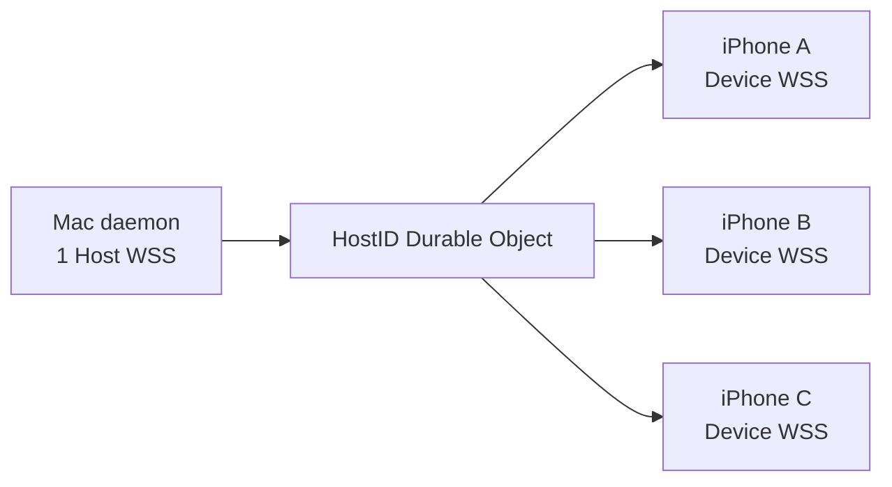
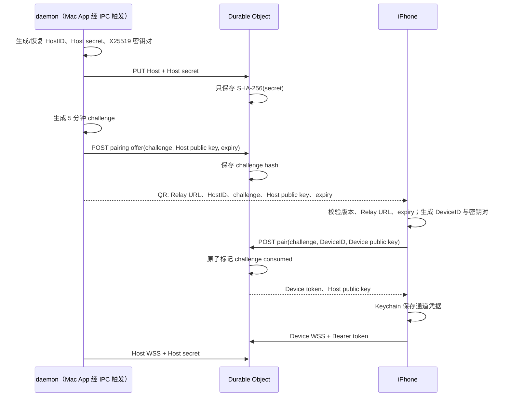

# Relay、配对与安全设计

Relay 使用 TypeScript Cloudflare Worker 和 Durable Objects。每个 `HostID` 映射到一个 Durable Object；业务 payload 在 Mac 的 daemon 加密、iPhone 解密（设备请求反向同理），Relay 只理解路由头。

## 选择 Durable Objects 的原因

- 同一台 Mac 的 Host socket、Device sockets、授权和序号在一个单线程对象内协调。
- `getByName(hostID)` 提供稳定路由，不需要全局在线注册表。
- WebSocket Hibernation 允许空闲连接不持续占用 Worker 计算。
- Durable Object SQLite 适合保存少量授权和限流元数据。
- 不需要 KV、D1 或 R2 保存 Session 内容。

## 连接拓扑

- 一个 daemon 同时只保留一个 Host WSS；新 Host 连接会关闭旧 Host 连接。Mac App 不持有 Relay 凭据或连接，只经 IPC 驱动 daemon。
- 一台 iPhone 对每台已配对 Mac 建立一个 Device WSS。
- 逻辑通道按 Mac—iPhone 设备对划分；Host WSS 可以多路复用全部通道。
- 所有 Session 复用通道，不建立 Session WSS。

## 固定 Relay 地址

Relay URL 由 macOS/iOS `Shared.xcconfig` 写入各自 Info.plist。用户界面不允许修改。

iOS 扫描配对码后会检查 `offer.relayURL == RelayBuildConfiguration.url`。不同构建配置生成的配对码不能跨 Relay 使用。

## REST 接口

| Method | Path | 调用方 | 作用 |
| --- | --- | --- | --- |
| `GET` | `/health` | 运维/CI | 返回状态和 protocol major |
| `PUT` | `/v1/hosts/:hostID` | daemon | 注册 Host secret（幂等，同 secret 返回 200） |
| `POST` | `/v1/hosts/:hostID/pairing-offers` | daemon | 保存一次性挑战 hash、Host 公钥和过期时间 |
| `POST` | `/v1/hosts/:hostID/pair` | iPhone | 消费挑战并取得独立 Device token |
| `GET` | `/v1/hosts/:hostID/devices` | daemon | 列出设备与撤销状态 |
| `DELETE` | `/v1/hosts/:hostID/devices/:deviceID` | daemon | 撤销单台设备并关闭其 socket |
| `GET` | `/v1/hosts/:hostID/ws` | daemon/iPhone | 升级 Host 或 Device WebSocket |

Host 管理接口使用 Host secret Bearer token。Device WSS 使用独立 Device token。

## 配对流程

daemon 生成的配对 offer 默认 5 分钟有效；Relay 拒绝已过期、已消费或超过 10 分钟的 offer。配对码属于短期敏感凭据，不应公开分享。

## 密钥与加密

每个端点生成 Curve25519 Key Agreement 密钥对：

1. Mac private key + iPhone public key 计算 shared secret。
2. iPhone private key + Mac public key 得到同一 shared secret。
3. HKDF-SHA256 派生 32-byte symmetric key。
4. salt 为 `Agent Status Relay/v1`。
5. shared info 包含 `HostID` 和 `DeviceID`，隔离不同设备通道。
6. `RemoteSessionPayload` 使用 ChaChaPoly 加密和认证。

每个 routing frame 包含：

- protocol version
- HostID
- DeviceID
- sequence
- kind（`data`：daemon → 设备；`request`：设备 → daemon）
- nonce
- ciphertext + authentication tag

Relay 能看到 routing header、帧大小、连接时间和流量模式；看不到 `RemoteSessionPayload` 的任何字段（kind、index、events…）。

当前 ChaChaPoly 调用没有把 `sequence` 和 `kind` 作为 additional authenticated data。payload 密文有完整性保护，但路由头完整性仍依赖通道校验和服务端策略；这是后续协议加固点。

## 凭据保存

### daemon Keychain（service `com.huanan.AgentStatusDaemon.relay`）

- Relay URL
- Host ID
- Host secret
- Host private/public key

Keychain 项由 daemon 进程自己创建，因此 daemon 在该项 ACL 内，之后读写不弹窗；Mac App 不读它。每个 Device ID 的发送 sequence 放在 `relay-host-state.json`（0600），不进 Keychain。

### iOS Keychain（account `device-channels-v4`）

- 每台 Mac 的 Relay URL、Host ID 和显示名
- Device ID 和 Device token
- Device private/public key
- Host public key
- 配对时间

### Relay Durable Object SQLite

- Host token hash
- Device ID、名称、公钥、token hash、配对与撤销时间
- pairing challenge hash、Host 公钥、过期与消费时间
- 每个设备最后 Host sequence
- 基于来源地址 hash 的限流窗口

Relay 不持久化 nonce、ciphertext、Session、Timeline 或用户消息。

## 序号与重连

- daemon 对每台未撤销 iPhone 独立递增 sequence，区间先写入状态文件再发送。
- Durable Object 拒绝同一设备通道非单调 Host sequence，并把该通道当前序号回给 daemon（`non_monotonic_sequence{deviceID, lastSequence}`）；daemon 据此抬序号、把该设备移出“已同步”集合，并向它补发一帧 health（序号已越过空洞）——Relay 不会替 daemon 通知设备，设备只能靠这帧的序号断档发现并重新 `sync_index`。
- Host 重连时 Relay 向设备再次广播 `online`（之前可能没有 `offline`）；设备收到任一 `online` 都重新 `sync_index`，因为 daemon 重连后忘记了谁同步过。
- daemon 收到未知设备或解不开的 `request` 时先按需刷新设备列表（最多 2 秒一次），再决定丢弃。
- iOS 在一条连接内只接受单调递增的 frame sequence（重复或更早的帧丢弃）；看到空洞就处理完本帧后重新 `sync_index`。
- 没有 ACK，没有 hello：iPhone 有本地缓存，恢复路径永远是“再要一次 index，按差异补”。
- 设备 → daemon 的 `request` 帧序号只是连接内自增的诊断值，Relay 不校验。

Relay 不保留重放缓冲：离线设备错过的帧由下一次 index 对账补齐。

## 在线状态

- Host WSS 建立：Relay 向所有 Device sockets 广播 `presence: online`。
- 最后一个 Host WSS 关闭：广播 `presence: offline`。
- Device WSS 建立：立即收到当前 Host 是否在线。
- iOS 收到 offline 后把该 Mac 标为 Unavailable，继续显示缓存；收到 online 立即重新 `sync_index`。

Host WSS 属于 daemon：Mac App 退出不影响在线状态；daemon 被 launchd 重启时 presence 短暂翻转，iPhone 自动重新对账。

## 撤销

Mac 使用 Host secret 撤销一个 Device ID：

1. Durable Object 写入 `revoked_at`。
2. 关闭该设备所有 WSS，close code `4003`。
3. 后续 Device token 鉴权失败（WSS 握手 401）。
4. 其他设备授权和连接保持不变。
5. iPhone 把握手 401 / 403 和 close code `4003` 识别为“凭据被拒”：该通道进入 Revoked 态并停止重连（不再 2 秒一轮），Macs 页显示 `Revoked · 在 Mac 上重新配对`，缓存保留可读；重新配对同一台 Mac 复用原 Device ID，Relay 和 Mac 更新同一条设备记录（撤销标记清除，不会出现第二台 Active）。

iPhone 本地“Remove Mac”只删除自己的 Keychain 通道、SQLite 缓存文件和 WSS；不会替 Mac 撤销 Relay 设备记录。

## 输入限制与滥用保护

- Host/Device ID：8..128 位字母、数字、下划线或连字符。
- HTTP JSON body：最大 64 KiB。
- WebSocket message：最大 2 MiB，只接受 JSON text。
- 注册 Host：每来源每分钟 10 次。
- 配对：每来源每分钟 20 次。
- Pairing offer：最长 10 分钟。
- Device 只允许发送密封的 `request` 帧（`sync_index` / `fetch_session` / `fetch_timeline_since` / `session_reviewed`，Relay 读不到是哪一种）；其他 kind 关闭为只读违规（1008）。解析失败（缺少 nonce / ciphertext、ID 不合规）回 `{type:"error",code:"invalid_frame"}` 不关闭；转发到对端失败只记日志（`forward_failed`），不算发送方的错误，序号照常推进。
- 协议 major 不是 1 时拒绝 frame。

## 安全边界与当前缺口

| 风险 | 当前控制 | 剩余边界 |
| --- | --- | --- |
| Relay 读取正文 | 端到端 ChaChaPoly | Relay 仍观察路由元数据、帧大小和 `data` / `request` 方向，但读不到请求或载荷类型 |
| 凭据泄露 | Relay 只存 hash；端点存 Keychain | 配对 QR 在有效期内需要像 bearer credential 一样保护 |
| 重放 | per-device 单调 sequence（Relay 拒绝复用，设备丢弃重复帧） | 设备 → daemon 方向没有重放防护（请求幂等，最坏多发一次 index） |
| 设备被撤销 | 持久 revoked_at + 主动关闭 socket；iPhone 识别 401 / 4003 进入 Revoked 态并停止重连 | 需重新配对才能恢复（复用 Device ID） |
| 大 Session | 2 MiB message 上限 | 载荷按单 Session 发送、明文 zlib 压缩、超预算按 timeline 分片；超大单条 item 只在 Relay 副本中省略 |
| 路由头篡改 | Host/Device/sequence 规则校验 | sequence/kind 当前没有作为 AEAD AAD |
| 手机后台更新 | 当前无 APNs | App 未运行时没有通用唤醒通知 |

## 相关文档

- [整体架构设计](system-architecture.md)
- [数据、通信与保存设计](data-communication-storage.md)
- [App 与运行时设计](application-runtime.md)
