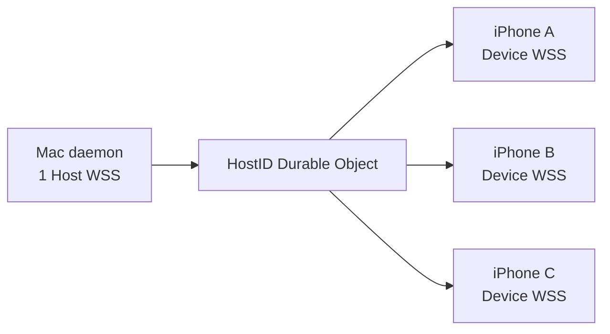

# Relay、配对与安全设计

Relay 使用 TypeScript Cloudflare Worker 和 Durable Objects。每个 `HostID` 映射到一个 `HostRelay` Durable Object；另有一个全局的 `PairingDirectory` 对象，只回答“这个配对码属于哪台 Mac”。业务 payload 在 Mac 的 daemon 加密、iPhone 解密（设备请求反向同理），Relay 只理解路由头。威胁模型按“Relay 可能作恶”设计：两端的公钥都不由 Relay 担保——daemon 先对自己的公钥做承诺，等 iPhone 的公钥到了才揭示 nonce，两端各自算出同一组 6 位数字（SAS），人在 Mac 上比对后点 Match，Device token 才签发、设备公钥才被钉住。Relay 换钥匙只有一次 10⁻⁶ 的盲猜机会，失败在两块屏幕上可见。

## 选择 Durable Objects 的原因

- 同一台 Mac 的 Host socket、Device sockets、授权、配对会话和序号在一个单线程对象内协调。
- `getByName(hostID)` 提供稳定路由，不需要全局在线注册表。
- 配对码必须全局唯一，所以只有一个全局对象 `PairingDirectory`；它只存 SHA-256(code) → Host / session，不知道公钥、承诺或设备。
- WebSocket Hibernation 允许空闲连接不持续占用 Worker 计算。
- Durable Object SQLite 适合保存少量授权、配对会话和限流元数据。
- 不需要 KV、D1 或 R2 保存 Session 内容。

## 连接拓扑



- 一个 daemon 同时只保留一个 Host WSS；新 Host 连接会关闭旧 Host 连接。Mac App 不持有 Relay 凭据或连接，只经 IPC 驱动 daemon。
- 一台 iPhone 对每台已配对 Mac 建立一个 Device WSS。
- 逻辑通道按 Mac—iPhone 设备对划分；Host WSS 可以多路复用全部通道。
- 所有 Session 复用通道，不建立 Session WSS。

## Relay 地址

- **Mac**：Relay URL 是 daemon 的启动配置（`Shared.xcconfig` → Info.plist），界面上不可改。配对页、二维码和 daemon Keychain 用的都是它。
- **iPhone**：没有全局唯一的 Relay。每条 Mac 通道在配对时记下自己的 Relay URL（Keychain），REST / WSS 各用各的地址；一台 iPhone 可以同时连着两个不同 Relay 上的 Mac。
- **配对时怎么来**：二维码 / 链接 `agentstatus://pair?relay=<https URL>&code=<6 位>` 直接给出；手输时默认内置 Relay（`agent-status-relay.afuture.workers.dev`），Add Mac › Advanced 可改。上次填过的地址只作下次预填（`LocalSettings`），不参与信任。
- **校验**：`https`、有 host、无 userinfo / query / fragment、host 小写、去尾 `/`、≤ 256 字符；DEBUG 构建额外放行 `http://localhost` / `http://127.0.0.1`（`wrangler dev`）。
- **地址不承载信任**：指向攻击者 Relay 的二维码最多让 iPhone 配上一台“假 Mac”，碰不到真 Mac 的通道——所以每个配对界面都显示 Relay host。

## REST 接口

| Method | Path | 鉴权 | 作用 |
| --- | --- | --- | --- |
| `GET` | `/health` | — | 返回状态和 protocol major |
| `PUT` | `/v1/hosts/:h` | — | 注册 Host secret（幂等，同 secret 返回 200；只存 SHA-256） |
| `POST` | `/v1/hosts/:h/pairing-sessions` | Host secret | daemon 建配对会话：`{commit, hostPublicKey, hostName, expiresAt}` → `{sessionID, code, expiresAt}`；同一 Host 之前没结束的会话一律 cancelled |
| `POST` | `/v1/pairing/claim` | 无（限流） | iPhone 花掉配对码：`{code}` → `{sessionID, hostID, hostName, commit}`；码错 / 过期 / 用过 → `404 invalid_or_expired_code`；超限 → `429 rate_limited` |
| `POST` | `/v1/hosts/:h/pairing-sessions/:s/device` | Bearer sessionID | iPhone 提交 `{deviceID, deviceName, devicePublicKey}`；Host WSS 不在线 → `409 host_offline`（会话留在 claimed，可重试） |
| `GET` | `/v1/hosts/:h/pairing-sessions/:s` | Bearer sessionID | `{state, hostName, hostPublicKey?, hostNonce?, deviceToken?, pairedAt?}`，字段随 state 逐步出现；iPhone 1 秒轮询 |
| `POST` | `/v1/hosts/:h/pairing-sessions/:s/reveal` | Host secret | daemon 揭示 `{hostNonce}`，只接受 submitted 状态 |
| `POST` | `/v1/hosts/:h/pairing-sessions/:s/decision` | Host secret | `{approved}`：true → 写 / 覆盖 `devices` 行并签发 Device token；false → rejected |
| `DELETE` | `/v1/hosts/:h/pairing-sessions/:s` | Host secret 或 sessionID | 任一端取消 |
| `GET` | `/v1/hosts/:h/devices` | Host secret | 列出设备、公钥、配对与撤销时间 |
| `DELETE` | `/v1/hosts/:h/devices/:d` | Host secret | 撤销单台设备并关闭其 socket；加 `?purge=1` 则删除这条记录（Mac 在 Revoked 行点 Remove，daemon 同时忘掉钉住的钥匙） |
| `GET` | `/v1/hosts/:h/ws` | Host secret / Device token | 升级 Host 或 Device WebSocket |

非法状态跳转一律 `409 invalid_state`。sessionID 是 128 bit 随机 base64url，既是会话 ID 也是 iPhone 在这次配对里的 capability（timing-safe 比较）。

Host WSS 多两种控制帧（与 `presence` / `error` 同一通道）：

- `{type:"pairing_device", sessionID, deviceID, deviceName, devicePublicKey}`：iPhone 提交了设备。
- `{type:"pairing_closed", sessionID, reason:"cancelled"|"expired"}`：iPhone 取消了，或 Relay 在访问时发现会话过期。只在 daemon 已经看到设备（submitted / revealed）后才发。

## 配对流程

会话状态单向：`offered → claimed → submitted → revealed → approved | rejected | cancelled | expired`。claimed = 码已被花掉；submitted = 设备信息已进来；revealed = daemon 已揭示 nonce。

```mermaid
sequenceDiagram
    participant A as Mac App
    participant D as daemon
    participant R as Relay
    participant I as iPhone

    A->>D: IPC relay_pairing_start（进入配对页 / 码到期 / New code）
    D->>D: nonceH = random(32); commit = H(hostPub ‖ nonceH)
    D->>R: POST pairing-sessions {commit, hostPublicKey, hostName, expiresAt}   [Host secret]
    R->>R: HostRelay 建 session（取消上一个）；Directory 分配唯一 code
    R-->>D: {sessionID, code, expiresAt}
    D-->>A: relay_pairing_state（1 秒轮询）→ 显示 code、Relay host、倒计时、QR

    I->>R: POST /v1/pairing/claim {code}
    R->>R: Directory: SHA-256(code) 命中 → consumed；HostRelay: offered → claimed
    R-->>I: {sessionID, hostID, hostName, commit}
    I->>I: 生成 / 复用 deviceID 与设备密钥对
    I->>R: POST …/:s/device {deviceID, deviceName, devicePublicKey}   [sessionID]
    R->>R: claimed → submitted（Host 不在线则 409 host_offline）
    R-->>D: Host WSS {type:"pairing_device", …}

    D->>D: SAS = f(hostID, deviceID, hostPub, devicePub, nonceH)
    D-->>A: relay_pairing_state → pending {deviceName, sas}；60 秒倒计时
    D->>R: POST …/:s/reveal {hostNonce}   [Host secret]
    R->>R: submitted → revealed

    loop 1 秒轮询
        I->>R: GET …/:s   [sessionID]
    end
    R-->>I: {state: revealed, hostPublicKey, hostNonce}
    I->>I: 校验 H(hostPub ‖ hostNonce) == commit，否则中止、不存凭据
    I->>I: 算 SAS → 显示 Mac 名、Relay host、482 913

    Note over A,I: 人比对两边的 6 位数字
    A->>D: IPC relay_pairing_decide {approved: true}（Match）
    D->>R: POST …/:s/decision {approved: true}   [Host secret]
    R->>R: 写 / 覆盖 devices 行；签发 deviceToken；revealed → approved
    D->>D: 钉住 devicePub（状态文件）；refreshDevices
    R-->>I: GET → {state: approved, deviceToken, pairedAt}
    I->>I: Keychain 存通道；开 Device WSS；sync_index
```

- **配对码**：6 位 Crockford Base32（`0-9 A-Z` 去 I L O U，30 bit），由 `PairingDirectory` 生成并保证与活跃码不撞；5 分钟；单次；输入归一化（大写、去空格 / 连字符、`O→0`、`I→1`、`L→1`、`U→V`）。码不参与任何密钥。
- **状态机在 daemon**：Mac App 退出不影响进行中的配对；daemon 重启 = 内存会话丢失，Relay 侧会话到期自然作废，重开配对页即可。
- **Mac 侧节奏**：配对页可见时 1 秒轮询 `relay_pairing_state`；码到期自动 `relay_pairing_start` 续一个；离开页面 `relay_pairing_cancel`，码立刻作废。
- **超时**：pending 60 秒无人点 → daemon 自动 `decision{approved:false}`，iPhone 看到 rejected。
- **取消**：iPhone 取消 → Relay 给 daemon `pairing_closed`，daemon 丢掉该会话，Mac 不显示结果、直接开始新码。结果态只有 Paired / Pairing declined，停 2 秒后卡片收起、新码开始。
- **失败不落盘**：iPhone 任何一步失败都不写 Keychain。

### 钥匙为什么不信 Relay

- **承诺先行**：`commit` 在会话创建时就交给 Relay（iPhone claim 时拿到），nonce 只在 daemon 收到 `pairing_device` 之后才揭示。Relay 想换钥匙，必须在没见过 devicePub 时伪造 `commit'`，又在不知道 nonceH 时伪造 `devicePub'`——两边的 SAS 在它能“适应”之前已被钉死，碰巧相等的概率 10⁻⁶。没有承诺的 6 位 SAS 可以离线枚举约 1000 对假钥匙凑出来，所以 reveal 必须等 devicePub 到了之后。
- **iPhone**：`revealed` 时校验 `commit`，不符即中止（界面“校验失败”，红色）、不存任何凭据、DELETE 会话。Host 公钥以校验通过的那把为准。
- **Mac**：Match 时 daemon 把 `pairing_device` 里的设备公钥写进状态文件（钉住）。之后 `GET devices` 列出的公钥只在与钉住值相同时才被相信；其余——这台 Mac 没批准过的行，或 Relay 换掉的钥匙——是 Unverified：不发任何帧、请求一律丢弃、Mac 配对页显示 `Key not verified · pair this iPhone again`。
- **Device token**：只在 Mac `decision{approved:true}` 后签发，绑定 Mac 看到的那把 devicePub；Relay 拿着 token 冒充 iPhone 也解不开帧、SAS 也对不上。
- 升级前配对的设备在状态文件里没有钉住值 → Unverified，重新配对即可（deviceID 复用）。

## 密钥与加密

每个端点生成 Curve25519 Key Agreement 密钥对：

1. Mac private key + iPhone public key 计算 shared secret。
2. iPhone private key + Mac public key 得到同一 shared secret。
3. HKDF-SHA256 派生 32-byte symmetric key。
4. salt 为 `Agent Status Relay/v1`。
5. shared info 包含 `HostID` 和 `DeviceID`，隔离不同设备通道。
6. `RemoteSessionPayload` 使用 ChaChaPoly 加密和认证，路由头（`HostID`、`DeviceID`、`sequence`、`kind`）作为 additional authenticated data 一起认证。

配对派生（`RelayCryptography`，Swift 与 Relay 的 TS 各算一遍、黄金向量相等）：

- `nonceH`：32 字节随机。
- `commit = SHA256("Agent Status Relay/pair-commit/v1" ‖ hostPub ‖ nonceH)`。
- `SAS = SHA256("Agent Status Relay/pair-sas/v1" ‖ hostID ‖ deviceID ‖ hostPub ‖ devicePub ‖ nonceH)` 取前 4 字节 big-endian `mod 1 000 000`，补零 6 位，显示 `482 913`。
- SAS 不混入 Relay URL（攻击者本来就控制 Relay），也不混入 Device token（那时还不存在）。

每个 routing frame 包含：

- protocol version
- HostID
- DeviceID
- sequence
- kind（`data`：daemon → 设备；`request`：设备 → daemon）
- nonce
- ciphertext + authentication tag

Relay 能看到 routing header、帧大小、连接时间和流量模式；看不到 `RemoteSessionPayload` 的任何字段（kind、index、events…）。路由头是 AAD：Relay 改 `sequence`（把旧帧套上新序号重放）、改 `kind`（换方向）或改 ID，接收端都解不开。

## 凭据保存

### daemon Keychain（service `com.huanan.AgentStatusDaemon.relay`）

- Relay URL
- Host ID
- Host secret
- Host private/public key

Keychain 项由 daemon 进程自己创建，因此 daemon 在该项 ACL 内，之后读写不弹窗；Mac App 不读它。

### daemon 状态文件（`relay-host-state.json`，0600）

- 每个 Device ID 的发送 sequence（发送前先落盘）
- Match 时钉住的设备公钥（Device ID → 公钥）

配对会话本身（sessionID、code、nonceH、pending 设备）只在 daemon 内存。

### iOS Keychain（account `device-channels-v4`）

- 每台 Mac 各自的 Relay URL、Host ID 和显示名
- Device ID 和 Device token
- Device private/public key
- Host public key（`revealed` 时取得、经承诺校验）
- 配对时间

### Relay Durable Object SQLite

`HostRelay`（每 HostID 一个）：

- Host token hash
- `devices`：Device ID、名称、公钥、token hash、配对与撤销时间
- `pairing_sessions`：state、commit、Host 公钥与名称、reveal 后的 nonce、设备 ID / 名称 / 公钥、approve 后的 Device token hash 与明文 token（留给 iPhone 下一次轮询领取，只有 sessionID 持有者可读；目前不另行清理）、创建 / 到期 / 更新时间
- 每个设备最后 Host sequence
- 基于来源地址 hash 的限流窗口

`PairingDirectory`（全局一个）：

- `pairing_codes`：SHA-256(code)、host_id、session_id、到期与消费时间（每次写入顺手删过期行）
- claim 限流窗口

Relay 不持久化帧 nonce、ciphertext、Session、Timeline 或用户消息。配对过程中它额外看到 hostName、设备名、两把公钥、承诺和揭示后的 nonce；拿不到任何一端的私钥，算不出通道密钥，Host secret 只有 hash。

## 序号与重连

- daemon 对每台未撤销且已钉住公钥的 iPhone 独立递增 sequence，区间先写入状态文件再发送。
- Durable Object 拒绝同一设备通道非单调 Host sequence，并把该通道当前序号回给 daemon（`non_monotonic_sequence{deviceID, lastSequence}`）；daemon 据此抬序号、把该设备移出“已同步”集合，并向它补发一帧 health（序号已越过空洞）——Relay 不会替 daemon 通知设备，设备只能靠这帧的序号断档发现并重新 `sync_index`。
- Host 重连时 Relay 向设备再次广播 `online`（之前可能没有 `offline`）；设备收到任一 `online` 都重新 `sync_index`，因为 daemon 重连后忘记了谁同步过。
- daemon 收到未知设备或解不开的 `request` 时先按需刷新设备列表（最多 2 秒一次），再决定丢弃。
- iOS 在一条连接内只接受单调递增的 frame sequence（重复或更早的帧丢弃）；看到空洞就处理完本帧后重新 `sync_index`。
- 没有 ACK，没有 hello：iPhone 有本地缓存，恢复路径永远是“再要一次 index，按差异补”。
- 设备 → daemon 的 `request` 帧序号只是连接内自增的诊断值，Relay 不校验。

Relay 不保留重放缓冲：离线设备错过的帧由下一次 index 对账补齐。

## 在线状态

- Host WSS 建立：Relay 向所有 Device sockets 广播 `presence: online`。
- 最后一个 Host WSS 关闭：广播 `presence: offline`。
- Device WSS 建立：立即收到当前 Host 是否在线。
- iOS 收到 offline 后把该 Mac 标为 Offline，继续显示缓存；收到 online 立即重新 `sync_index`。

Host WSS 属于 daemon：Mac App 退出不影响在线状态；daemon 被 launchd 重启时 presence 短暂翻转，iPhone 自动重新对账。

## 撤销

Mac 使用 Host secret 撤销一个 Device ID：

1. Durable Object 写入 `revoked_at`。
2. 关闭该设备所有 WSS，close code `4003`。
3. 后续 Device token 鉴权失败（WSS 握手 401）。
4. 其他设备授权和连接保持不变。
5. iPhone 把握手 401 / 403 和 close code `4003` 识别为“凭据被拒”：该通道进入 Revoked 态并停止重连（不再 2 秒一轮），Macs 页显示 `Revoked · <relay host>`，缓存保留可读。

重新配对同一台 Mac 复用原 Device ID：approve 时 Relay 覆盖同一条 `devices` 行（新公钥、新 token、撤销标记清除，不会出现第二台 Active），daemon 在 Match 时钉住新公钥替换旧值。

iPhone 本地“Remove”只删除自己的 Keychain 通道、SQLite 缓存文件和 WSS；不会替 Mac 撤销 Relay 设备记录。

## 输入限制与滥用保护

- Host/Device ID：8..128 位字母、数字、下划线或连字符。
- HTTP JSON body：最大 64 KiB。
- WebSocket message：最大 2 MiB，只接受 JSON text。
- 注册 Host：每来源每分钟 10 次。
- 配对码：6 位 Crockford Base32，Directory 只存 SHA-256(code)；5 分钟到期、单次消费；`claim` 每来源 IP 每分钟 5 次、全局每分钟 60 次（对错都计数，猜码只能走这一个口）。
- 配对会话：每 Host 每分钟最多建 10 个；同一 Host 同时只有一个活会话（新建即取消上一个）；Relay 接受的最长有效期 10 分钟（daemon 用 5 分钟）；过期会话在下一次访问时标 expired。
- 限流窗口按 key 记在 DO SQLite，开新窗口时顺手删掉 10 个窗口期之前的旧行。
- Device 只允许发送密封的 `request` 帧（`sync_index` / `fetch_session` / `fetch_timeline_since` / `session_reviewed`，Relay 读不到是哪一种）；其他 kind 关闭为只读违规（1008）。解析失败（缺少 nonce / ciphertext、ID 不合规）回 `{type:"error",code:"invalid_frame"}` 不关闭；转发到对端失败只记日志（`forward_failed`），不算发送方的错误，序号照常推进。
- 协议 major 不是 1 时拒绝 frame。

## 安全边界与当前缺口

| 风险 | 当前控制 | 剩余边界 |
| --- | --- | --- |
| Relay 读取正文 | 端到端 ChaChaPoly | Relay 仍观察路由元数据、Host / 设备名、两把公钥、承诺与 nonce、IP、帧大小和 `data` / `request` 方向，但读不到请求或载荷类型 |
| 路人猜码 | 30 bit、5 分钟、单次、claim 限流（≈ 300 次 / 窗口 → ≈ 3×10⁻⁷）；猜中仍要过 Mac 的 Match | 可忽略 |
| 偷看屏幕抄到码 | 能走到提交设备，但 Mac 弹“陌生 iPhone wants to pair”且默认焦点在 Don't match | 用户误点 Match |
| Relay 换钥匙（MITM） | 承诺 + SAS：一次盲猜 10⁻⁶，失败可见；Mac 钉住 Match 时看到的设备公钥，Relay 之后换钥匙 = Unverified | 用户不比对数字直接点 Match |
| Relay 冒充 iPhone 取 token | token 只在 Mac `decision{approved}` 后签发、绑定 Mac 看到的 devicePub；Relay 换 devicePub 则通道密钥和 SAS 都对不上 | — |
| 恶意 QR / 链接指向攻击者 Relay | 攻击者 Relay 没有真 Mac 的 code / Host secret，只能扮演“假 Mac”推假数据；iPhone 泄露的只有设备名、设备公钥和 `session_reviewed` 的 session ID；每个界面显示 Relay host | 用户被假数据误导 |
| 凭据泄露 | Host secret 只存 hash；端点凭据在 Keychain；配对会话在 daemon 内存 | approved 的 `pairing_sessions` 行保留明文 Device token（sessionID 持有者可读，token 本身解不开任何帧），目前不清理 |
| 重放 / 路由头篡改 | 路由头为 AEAD AAD；per-device 单调 sequence（Relay 拒绝复用，设备丢弃重复帧） | 设备 → daemon 方向没有序号校验（请求幂等，最坏多发一次 index） |
| 设备被撤销 | 持久 revoked_at + 主动关闭 socket；iPhone 识别 401 / 4003 进入 Revoked 态并停止重连 | 需重新配对才能恢复（复用 Device ID） |
| 大 Session | 2 MiB message 上限 | 载荷按单 Session 发送、明文 zlib 压缩、超预算按 timeline 分片；超大单条 item 只在 Relay 副本中省略 |
| 资源滥用 | 注册 / 建会话 / claim 限流；一 Host 一活会话；ID 正则；body / 消息上限 | 任何人都能用随机 HostID 实例化一个空 DO（无全局限流）；`GET session` 轮询没有单独限流 |
| 手机后台更新 | 当前无 APNs | App 未运行时没有通用唤醒通知 |

## 相关文档

- [整体架构设计](system-architecture.md)
- [数据、通信与保存设计](data-communication-storage.md)
- [App 与运行时设计](application-runtime.md)
