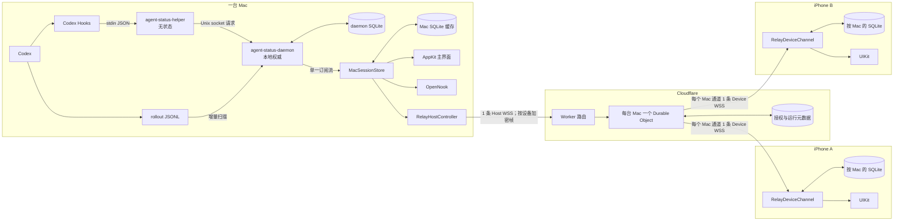
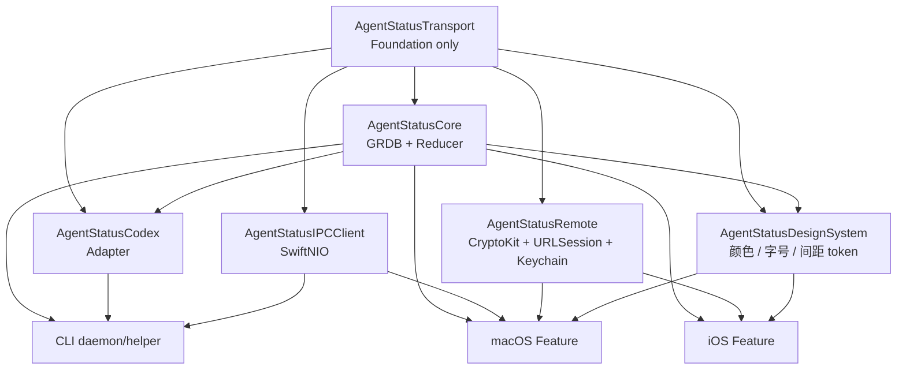

# 整体架构设计

Agent Status 使用“本地权威、客户端持久副本、Relay 不透明转发”的结构。daemon 负责采集与归并；macOS App 负责本机 UI、Notch 和远程发布；iOS 只读消费按 Mac 划分、逐 Session 推送的副本。

## 目标

1. 聚合一台 Mac 上多个 Agent、多个 Session，不让连接数随 Session 数增长。
2. Hook 低延迟事件和 rollout 持久日志互相补充，daemon 重启后可以继续处理新内容。
3. daemon、Mac、iOS 都使用 SQLite，使读取和重启恢复不依赖内存快照。
4. Relay 无法读取 Session payload，也不提供业务历史查询。
5. 传输对象只有一个定义源，避免 daemon、App 和 Relay 协议漂移。

## 非目标

- v1 不支持从 iPhone 审批、输入、终止或控制 Agent。
- v1 不实现 Claude、Pi 或其他 Agent Adapter。
- 当前不实现 APNs。
- Relay 不是 Session 数据库，也不承担长期重放。
- daemon 当前不直接连接 Relay；远程连接由 macOS App 持有。

## 系统拓扑

## 数量关系

| 对象 | 数量关系 | 连接策略 |
| --- | --- | --- |
| Mac | 1 台设备 | 1 daemon + 1 macOS App |
| Agent | 每台 Mac 0..N 个 | 事件统一进入同一个 daemon |
| Session | 每个 Agent 0..N 个 | 不创建独立 socket、event loop 或 WSS |
| 本地 request | 按操作创建 | helper 和普通 IPC 请求使用短连接 |
| 本地事件订阅 | 每个 Mac App 1 条 | 全部 Session 复用持久 Unix socket channel |
| Relay Host WSS | 每个 Mac App 1 条 | 一条连接发送所有已配对设备的定向帧 |
| Mac—iPhone 逻辑通道 | 每对设备 1 个 | 独立授权、密钥、序号和 iOS SQLite |
| iPhone Device WSS | 每个已配对 Mac 1 条 | 一台 iPhone 可同时连接多台 Mac |
| Durable Object | 每个 `HostID` 1 个 | 隔离授权、连接与序号状态 |

## 组件职责

| 组件 | 负责 | 不负责 |
| --- | --- | --- |
| helper | 读取 Hook stdin、归一化、发送事件、报告失败 | 保存状态、扫描日志、重试队列 |
| daemon | 建立基线、归并事件、SQLite 权威存储、本地查询与事件扇出 | UI、QR 配对、当前远程 WSS |
| Mac App | SQLite 客户端缓存、AppKit UI、Notch、daemon 管理、Hook 安装、Relay Host | 解析原始 rollout、成为业务权威 |
| iOS App | 多 Mac 配对、每通道 SQLite、同步完整后展示 | Agent 控制、Relay 历史查询 |
| Relay | Host/Device 鉴权、配对、撤销、在线状态、密文转发 | 解密 Session、保存业务数据、重放历史 |
| Transport Package | DTO、版本、编码、framing、golden fixture | 网络连接、SQLite、UI、Reducer |

## Swift Package 分层

边界规则：

- `AgentStatusTransport` 只依赖 Foundation。
- Session、Timeline、IPC 和 Relay routing DTO 不在 Package 外重复声明。
- `AgentStatusCore` 拥有 reducer 与 GRDB repository，不依赖 AppKit/UIKit。
- `AgentStatusDesignSystem` 承载设计系统 L1 基础规范（颜色、字号、间距、圆角、关键尺寸、消息类别标签与状态色梯度），只依赖 Foundation（SwiftUI 适配放在 `#if canImport(SwiftUI)`）；macOS、Notch、iOS 视图不写颜色 / 字号 literal，只引用这里的 token。设计交接原件归档在仓库根目录 `design/`（`DESIGN SYSTEM.html` 为唯一取值来源）。
- App 创建 ViewModel 或控制器状态，但不重新声明传输层业务对象。
- Relay 通过共享 golden JSON 校验 routing frame，不解析 `RemoteSessionPayload`。

## 权威边界

1. **Agent 原始事实**：Codex Hook JSON 与 rollout JSONL。
2. **本机产品事实**：daemon SQLite；Reducer 决定当前 Session 状态。
3. **Mac 展示副本**：Mac SQLite；启动/手动对账按 Session 替换与裁剪，Agent 事件可增量应用。
4. **iOS 展示副本**：每台 Mac 一个 SQLite；由解密后的单 Session 载荷替换、index 载荷裁剪。
5. **Relay 元数据**：授权、配对、限流和序号；不是业务事实源。

删除操作先进入 daemon。daemon 记录 ignored Session tombstone 后再删除业务数据，避免之后到达的晚事件让 Session 复活。

## 启动顺序

### daemon

1. 创建权限为 `0700` 的 Application Support 目录。
2. 打开并迁移 daemon SQLite。
3. 第一次运行时把已存在 rollout 文件标为基线，不导入旧 Session。
4. 启动 Unix socket，socket 权限设为 `0600`。
5. 启动 rollout watcher，默认每 2 秒检查文件尺寸变化。

### macOS App

1. 打开 Mac SQLite 缓存并先渲染已保存内容。
2. 与 daemon 对账：索引 diff 后逐 Session 拉取替换、裁剪多余项。
3. 建立一个持久事件订阅 channel。
4. 启动 Relay Host 连接、主窗口和 OpenNook。

### iOS App

1. 从 Keychain 恢复所有 Mac 通道凭据。
2. 为每台 Mac 打开独立 SQLite 并建立 Device WSS。
3. 发送最后确认序号。
4. 只有 Host 在线且同步完整（index 已到且逐 Session 收全）才显示缓存内容。

## 当前实现约束

- `DaemonHealth.relayConnected` 已预留，但 daemon 当前没有连接 Relay，因此该值没有被 Relay Host 状态驱动。
- macOS App 退出时，即使 daemon 仍运行，iOS 也会因为 Host WSS 关闭而显示不可用。
- 远程同步按整 Session 重发，不是字段级或 Timeline 增量协议。
- Release 签名、公证、干净机器 LaunchAgent 和真实物理 iPhone 仍待最终验收。

## 相关文档

- [数据、通信与保存设计](data-communication-storage.md)
- [Agent Hook 设计](agent-hook.md)
- [Relay、配对与安全设计](relay-pairing-security.md)
- [App 与运行时设计](application-runtime.md)
- [构建、发布与测试设计](build-release-testing.md)
