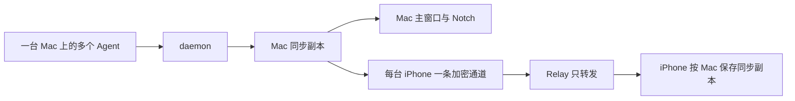

# 业务数据结构与流转

> 验证状态：开发预览。daemon、Mac 与 iOS 模拟器已通过同一合成 Session 的创建、时间线同步和删除验证；真实 Codex Hook 与 iPhone 实机仍待验收。

本页描述三类用户相关数据：Session 状态与时间线、设备与通道、配对授权。

## 数据主线

## Session 状态与时间线

- **用户相关数据**：Session 标题、Agent、工作目录、生命周期、阶段、用户/Assistant 消息、工具状态、计划、子 Agent 和错误。
- **创建来源**：启用 Agent Status 后新建的 Codex Session。
- **更新来源**：用户消息、Assistant 回复、工具调用、计划变化、子 Agent 活动、完成、中断或错误。
- **主要消费者**：Mac 主窗口、Notch，以及在线的已配对 iPhone。
- **保留方式**：不按时间自动删除；用户可删除单条或清空全部。
- **隐私边界**：reasoning、系统指令、环境快照和原始 transcript 不进入产品时间线。

### 从 Agent 事件到三端一致

1. 新 Agent 事件先进入本机 daemon。
2. daemon 归并重复或乱序事件，更新该设备的 Session。
3. Mac 在收到 Agent 事件后更新自己的同步副本和界面。
4. Mac 把当前结果按目标 iPhone 加密，经 Relay 转发。
5. iPhone 更新对应 Mac 的同步副本和界面。

外部 Session 内容只在三种时机同步：App 启动、用户手动刷新、Agent 事件。删除和清空会立即同步操作结果；系统不会周期轮询。规则见 [MAC-R-009](modules/mac-session-view.md#mac-r-009-外部内容只有三种同步入口)。

### 删除

- **单条删除**：用户在 Mac 选择 Session，通过删除图标（Delete Session）并确认后，daemon、Mac 和已连接 iPhone 移除同一 Session。
- **全部清空**：用户在 Settings 确认“Clear Session history…”后，全部 Agent Status Session 被清空。
- **删除后的新事件**：同一已删除 Session 不会重新出现在 Agent Status。
- **外部影响**：Codex 自身 Session 和日志不被删除。

## 设备与通道

一台 Mac 是一个数据来源设备，可包含多个 Agent 和多个 Session。

- 每台 Mac 运行一个 daemon 和一个 Mac App。
- 同一 Mac 的全部 Session 通过同一条 Mac—iPhone 通道传输。
- 不会为每个 Session 创建连接。
- 一台 Mac 可以同时向多台已授权 iPhone 提供数据，因此会有多条设备通道。
- 一台 iPhone 可以建立多条通道，分别连接多台 Mac。

## 配对授权

- **用户相关数据**：设备名称、配对时间、当前授权状态。
- **创建来源**：iPhone 成功使用 Mac 生成的一次性配对码。
- **更新入口**：Mac 撤销某台 iPhone，或 iPhone 移除某台 Mac。
- **主要用途**：确定哪台 iPhone 可以接收哪台 Mac 的加密更新。
- **删除影响**：只关闭目标通道，不影响其他设备。

规则引用：[IOS-R-001](modules/iphone-live-view.md#ios-r-001-每台设备独立授权)、[IOS-R-004](modules/iphone-live-view.md#ios-r-004-撤销按设备生效)、[IOS-R-008](modules/iphone-live-view.md#ios-r-008-一台-iphone-可连接多台-mac)。

## 三端保存范围

| 位置 | 保存内容 | 用户可见行为 |
| --- | --- | --- |
| daemon | 该 Mac 已加入 Agent Status 的 Session | 本机权威数据；不自动过期 |
| Mac App | 与 daemon 同步的本地副本 | 快速启动和浏览；断线时仍可查看最近同步内容 |
| iPhone App | 每台已配对 Mac 的独立同步副本 | 只有收到在线状态与当前快照后展示 |
| Relay | 设备授权和运行所需信息 | 不提供 Session 正文或历史查询 |

## 离线与恢复

- **daemon 离线**：Mac 保留已同步内容供查看，但显示不可用；恢复后可手动刷新。
- **Mac 或通道离线**：iPhone 将该 Mac 标为 Unavailable，不展示旧 Session；其他 Mac 通道不受影响。
- **恢复在线**：Mac 发送当前快照，iPhone 再显示已确认的当前内容。

## 相关文档

- [功能全景](index.md)
- [Mac 会话查看](modules/mac-session-view.md)
- [iPhone 在线查看](modules/iphone-live-view.md)
- [用户摩擦点](friction-points.md)
