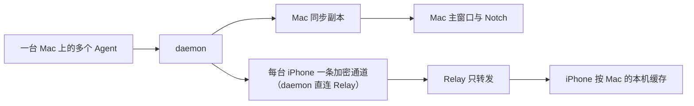

# 业务数据结构与流转

> 验证状态：开发预览。daemon、Mac 与 iOS 模拟器已通过同一合成 Session 的创建、时间线同步和删除验证；模型配置、内部上下文和消耗指标已通过结构化解析、保存与跨端编译验证；真实 Codex Hook 与 iPhone 实机仍待验收。

本页描述四类用户相关数据：Session 状态与时间线、设备与通道、配对授权、软件更新。

## 数据主线

## Session 状态与时间线

- **用户相关数据**：Session 标题、Agent、主 Session / Subagent 类型、Subagent 父子关系、工作目录、生命周期、阶段、用户/Assistant 消息、工具状态、计划、子 Agent、错误、模型配置、内部上下文和消耗指标，以及两个由用户操作产生的标记——已查看（清除绿色待查看，[MAC-R-019](modules/mac-session-view.md#mac-r-019-打开-session-即视为已查看)）和 Notch 归档（[MAC-R-014](modules/mac-session-view.md#mac-r-014-notch-显示-session-当前状态)）。
- **创建来源**：启用 Lumi 后新建的 Codex Session。
- **更新来源**：Codex Session 身份提供 Main Session 标题、Subagent 自身名称或任务身份，以及两者的父子关系；用户消息、Assistant 回复、工具调用、计划变化、子 Agent 活动、模型或线程设置变化、上下文压缩、内部推理、Token 使用、完成、中断或错误更新对应状态或 Timeline。用户在 CLI 里主动中止（Esc）Claude 后，即使 Claude 不再上报任何事件，Session 也会在数秒内变为中断（红色），中止前最后设置的标题一并生效。
- **主要消费者**：Mac 主窗口、Notch，以及在线的已配对 iPhone。
- **保留方式**：不按时间自动删除；用户可删除单条或清空全部。
- **展示边界**：主活动时间线显示属于当前 Session 的消息、工具、计划、子 Agent、错误和已进入 Timeline 的未知记录；Subagent 为执行任务获得的父 Session 历史不重复显示为自身活动。模型配置、内部上下文与消耗指标按类别保留最新记录，不混入 Activity。Mac Session 详情的 Inspector 与 iPhone 详情的 Info Tab 展示这些诊断数据。规则见 [MAC-R-018](modules/mac-session-view.md#mac-r-018-subagent-使用自己的标题与活动)。
- **隐私边界**：每类最新内部上下文会完整保留来源提供的嵌套内容，可能包含 reasoning、基础指令、线程上下文、世界状态、压缩历史，以及其中出现的路径、凭据、环境信息或工具内容。本地副本及已配对设备都必须视为高敏感数据；当前没有内容级脱敏保证。Lumi 未识别的其他事件和完整原始日志文件不会被另外复制。

### 从 Agent 事件到三端一致

1. 新 Agent 事件先进入本机 daemon。
2. daemon 归并重复或乱序事件，更新该设备的 Session。
3. Mac App 在收到 Agent 事件后更新自己的同步副本和界面。
4. daemon 把同一条事件按目标 iPhone 加密，经 Relay 转发（Mac App 是否打开无关）。
5. iPhone 用与 daemon 相同的规则更新本机缓存和界面；对不上的地方用 Session 索引对账补齐。

外部 Session 内容只在三种时机同步：App 启动、用户手动刷新、Agent 事件。删除、清空、标记已查看和 Notch 归档会立即同步操作结果；手动刷新的重算保留这两个人为标记；系统不会周期轮询。规则见 [MAC-R-009](modules/mac-session-view.md#mac-r-009-外部内容只有三种同步入口)。

### 删除

- **单条删除**：用户在 Mac 选择 Session，通过删除图标（Delete Session）并确认后，daemon、Mac 和已连接 iPhone 移除同一 Session。删除 Main Session 会连带删除挂在它下面的全部 Subagent（含 Subagent 的 Subagent）；单独删除一个 Subagent 不影响父级。
- **全部清空**：用户在 Settings 确认“Clear Session history…”后，全部 Lumi Session 被清空。
- **删除后的新事件**：被动到达的旧活动不会让已删除 Session 重新出现；同一 Session 再次被人使用（新的用户请求，或会话重新启动）时它会回来。
- **外部影响**：Codex 自身 Session 和日志不被删除。

## 设备与通道

一台 Mac 是一个数据来源设备，可包含多个 Agent 和多个 Session。

- 每台 Mac 运行一个 daemon 和一个 Mac App。
- 同一 Mac 的全部 Session 通过同一条 Mac—iPhone 通道传输。
- 不会为每个 Session 创建连接。
- 一台 Mac 可以同时向多台已授权 iPhone 提供数据，因此会有多条设备通道。
- 一台 iPhone 可以建立多条通道，分别连接多台 Mac。

## 配对授权

- **用户相关数据**：设备名称、配对时间、当前授权状态（Active / Unverified / Revoked）；iPhone 侧还有每台 Mac 的 Relay 地址。
- **创建来源**：iPhone 用 Mac“iPhone”页显示的 6 位配对码（手输或扫码）提交自己，两端各显示一组 6 位数字，Mac 上点 Match 才生效。
- **更新入口**：Mac 撤销某台 iPhone；iPhone 移除某台 Mac；iPhone 重新配对（Unverified 或 Revoked 变回 Active）。
- **主要用途**：确定哪台 iPhone 可以接收哪台 Mac 的加密更新。
- **删除影响**：只关闭目标通道，不影响其他设备。

规则引用：[IOS-R-001](modules/iphone-live-view.md#ios-r-001-每台设备独立授权)、[IOS-R-002](modules/iphone-live-view.md#ios-r-002-配对码短时且一次性)、[IOS-R-004](modules/iphone-live-view.md#ios-r-004-撤销按设备生效)、[IOS-R-008](modules/iphone-live-view.md#ios-r-008-一台-iphone-可连接多台-mac)、[IOS-R-014](modules/iphone-live-view.md#ios-r-014-配对时两端比对数字mac-点-match-才生效)、[IOS-R-015](modules/iphone-live-view.md#ios-r-015-relay-地址跟着每台-mac-走)。

## 三端保存范围

| 位置 | 保存内容 | 用户可见行为 |
| --- | --- | --- |
| daemon | 该 Mac 已加入 Lumi 的 Session，包括保留的模型、上下文和消耗数据 | 本机权威数据；不自动过期 |
| Mac App | 与 daemon 同步的完整本地副本 | 快速启动和浏览；断线时仍可查看最近同步内容 |
| iPhone App | 每台已配对 Mac 一个本机缓存数据库（与 Mac 同一格式）；Keychain 只存配对凭据（含每台 Mac 的 Relay 地址） | 启动立即显示缓存；在线后按索引只补差异；Mac 离线仍可翻看 |
| Relay | 设备授权、进行中的配对会话和运行所需信息 | 不提供 Session 正文或历史查询 |

## 离线与恢复

- **daemon 离线**：Mac 保留已同步内容供查看，但显示不可用；恢复后可手动刷新。
- **Mac 或通道离线**：iPhone 在 Macs 页将该 Mac 标为 Offline，继续显示缓存；其他 Mac 通道不受影响。退出 Mac App 不算离线（Relay 连接在 daemon）。
- **恢复在线**：iPhone 向 Mac 索取 Session 索引，只补差异（缺失的整个取、变过的取新增部分），之后继续实时接收。

## 软件更新

- **用户相关数据**：这台 Mac 是否允许自动检查、当前 App 版本和正式更新通道提供的可用版本。
- **创建来源**：第二次启动时的许可选择，或用户在“Settings > General”主动切换；可用版本来自 Lumi 的公开更新信息。
- **更新入口**：App 菜单和“Settings > About”可以立即检查；General 开关改变之后是否定期检查。
- **主要消费者**：Lumi for Mac 的更新提示和“Settings > About”版本显示。
- **删除影响**：关闭自动检查只停止定期检查，不删除当前 App、Session 历史或手动入口。
- **规则引用**：[UPD-R-001](modules/software-updates.md#upd-r-001-两个入口使用同一个更新状态)、[UPD-R-003](modules/software-updates.md#upd-r-003-自动检查设置可随时更改)、[UPD-R-004](modules/software-updates.md#upd-r-004-只接受签名的-stable-更新)。

### 从检查到替换

1. 自动调度或用户主动检查读取正式更新信息并验证其真实性。
2. Lumi 比较当前 build 与可用 build；没有更高版本时报告当前已是最新。
3. 有新版本时，用户决定是否继续；更新包必须通过当前安全设置要求的来源和完整性验证。
4. 用户确认安装后 App 被完整替换并重新启动，Session 历史保留；已安装的 helper 跟随刷新，正在运行且已连接的已安装 daemon 在版本不一致时重启刷新。

检查失败、验证失败或用户取消时，当前 App 与 Session 历史保持不变。完整入口和分支见[软件更新模块](modules/software-updates.md)与[更新旅程](journeys/keep-lumi-up-to-date.md)。

## 相关文档

- [功能全景](index.md)
- [Mac 会话查看](modules/mac-session-view.md)
- [iPhone 在线查看](modules/iphone-live-view.md)
- [软件更新](modules/software-updates.md)
- [用户摩擦点](friction-points.md)
