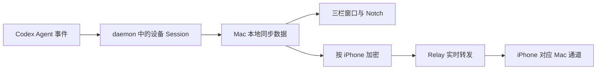

# Lumi 功能全景

> 适用版本：v1 开发预览。macOS App 已完成本机编译与运行，iOS App 已完成模拟器编译、单元测试与预览数据页面走查，Relay 已部署并通过健康检查。真实 Codex Hook、iPhone 实机、Developer ID 签名、公证和干净机器安装仍待验收。

Lumi 把一台 Mac 上多个 Codex Agent、多个 Session 的状态集中到一个地方。用户可以在 Mac 的三栏主窗口和 Notch 查看状态，也可以把一台或多台 Mac 配对到 iPhone，进行只读查看。

本文把后台服务称为“daemon”，把 Codex 会话称为“Session”，把屏幕顶部状态胶囊称为“Notch”。

## 立即开始

1. 打开 Mac App，在侧边栏选择“Settings”。
2. 在中栏选择“Daemon”并点击“Install & Start daemon”，再选择“Agents”并点击“Install Hook”。
3. 新建一个 Codex Session，在“Sessions”中查看状态和时间线。

完成信号：工具栏显示 Session 数量；新 Agent 事件到达时，列表和详情自动更新。

Codex 只运行它信任过的 Hook，而且不信任时不给任何提示。安装 Hook 和每次启动 App 都会自动补上这份信任，所以正常情况不需要做别的；只有自动授权没成功时，“Settings > Agents”才会出现一行提示和“Authorize”按钮。

## 功能模块

### Mac 会话查看

Mac 主窗口参考系统 Mail.app：左侧是固定宽度的功能导航，中间是当前区域的列表，右侧是详情，工具栏按三栏分段放置折叠侧栏、搜索框和标题动作。Sessions 列表按最后更新时间倒序，Subagent 通过左侧引导线挂在 Main Session 下且可折叠；每行显示 Agent 图标、标题、相对时间和状态色点，点击父级行即可折叠。详情由 Activity 主区和右侧 Inspector 组成：Activity 提供三泳道 / 单行可切换的横向时间轴，并可按消息类别与重要性（L1–L3）过滤列表（时间轴始终画全量），Inspector 汇总 Token / Context / Elapsed 指标与 Session 信息。Settings 使用“设置分类—设置详情”；只有 iPhone 配对页会收起中栏。

Notch 紧凑状态显示列表中的 Session 数量，展开后按最近更新时间列出最近七天内活动过的全部主 Session（含已关闭的会话），视口一次最多显示六条、可滚动；正在工作的 Session 显示最近一条活动；带 Subagent 的 Session 在标题下多一条可点开的 Subagent 计数条（运行中默认展开成胶囊，其他状态默认折叠）；Session 完成或失败时 Notch 会自动展开并短暂提示；回合开始不自动展开。Notch 设置按钮打开主 App 的“Settings > Notch”，用户可以在第三栏的 Appearance section 选择显示屏幕，调整并恢复紧凑宽度、展开宽度和展开动画；Theme 固定为 Dark，Layout 固定为 Notch，但不显示这两个控件。

外部产生的 Session 新增或内容变化只有三类同步入口：App 启动、用户点击刷新图标（Refresh）、收到 Agent 事件。删除和清空操作会立即同步结果。历史不会自动过期。

[查看模块详情](modules/mac-session-view.md)

### iPhone 实时查看

Mac 上的 daemon 使用构建内置的 Relay。用户从 Mac 侧边栏进入“iPhone”，看到 6 位配对码和二维码；iPhone 在 Macs Tab 点 `+` > Add Device 输码或扫码，两边各显示同一组 6 位数字，在 Mac 上点 Match 才建立独立通道（自托管 Relay 在 iPhone 的 Advanced 里填，每台 Mac 各自记住）。之后 Mac App 关着也照样同步。

一台 iPhone 可以连接多台 Mac；一台 Mac 也可以授权多台 iPhone。iPhone 的 Sessions Tab 把所有 Mac 的 Session 合并成一条列表（可按 Mac、状态多选过滤，可搜索），子 Agent 折叠成父 Session 下的计数条、点开成标签；详情分 Activity（三泳道时间线）和 Info（指标与 Session 信息）。只读，不提供审批、终止、输入或其他远程控制；收到的内容缓存在本机（每台 Mac 一个数据库），启动即显示，Mac 离线也能翻看，只有 Mac 上的 daemon 是数据源。

[查看模块详情](modules/iphone-live-view.md)

## 主要用户旅程

- [在 Mac 上跟进一次 Codex Session](journeys/observe-session-locally.md)
- [在 iPhone 上查看多台 Mac](journeys/check-session-away.md)

## 核心业务数据

- [Session 状态与时间线](data-flows.md#session-状态与时间线)：由新加入 Lumi 的 Codex Session 产生，并同步到 daemon、Mac 与在线 iPhone。
- [设备与通道](data-flows.md#设备与通道)：每台 Mac 对每台已授权 iPhone 建立一条通道，一条通道承载该 Mac 的所有 Session。
- [配对授权](data-flows.md#配对授权)：每台 iPhone 独立授权，可在 Mac 上单独撤销。

## 数据如何连接功能

Relay 不保存 Session 正文或可浏览的历史。Mac 不在线时，iPhone 将该 Mac 标为不可用，不把旧数据当成实时状态展示。

## 遇到卡点

按“Daemon unavailable”“Codex 未信任 Hook”“Relay unavailable”“配对失败”或“Mac unavailable”等可见症状查看[恢复路径](friction-points.md)。说不清原因时，先看 `~/Library/Logs/Lumi/errors.log`（“Settings > Daemon > Logs > Show in Finder”）——日志只记标识和数量，不含 Session 正文。

## 当前边界

- v1 只正式支持 Codex。
- iPhone 仅查看，不控制 Agent。
- Mac 侧 Relay 地址是编译配置，不是 App 内设置项；iPhone 只在添加 Mac 时可填自托管地址，之后跟着那台 Mac 走。
- v1 不提供后台状态通知；iPhone Settings 里的通知权限行只管理系统授权，Relay 尚未接入推送。
- 真实 Codex Hook、iPhone 实机和正式发布链路尚未完成验收。
