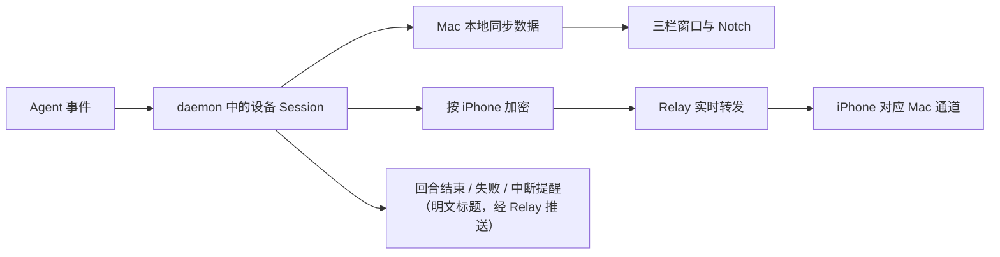

# Lumi 功能全景

> 适用版本：v0.1.3（已正式发布，含签名更新通道与 APNs 推送）及其后的开发工作副本。真实 Codex Hook 长期运行、iPhone 实机和干净机器安装仍待验收。

Lumi 把一台 Mac 上多个 Agent（Codex 与 Claude Code）、多个 Session 的状态集中到一个地方。用户可以在 Mac 的三栏主窗口和 Notch 查看状态，也可以把一台或多台 Mac 配对到 iPhone，进行只读查看，并在回合结束、失败或被中断时收到提醒。

本文把后台服务称为“daemon”，把 Agent 会话称为“Session”，把屏幕顶部状态胶囊称为“Notch”。

## 立即开始

1. 打开 Mac App，在侧边栏选择“Settings”。
2. 在中栏选择“Daemon”并点击“Install & Start daemon”，再在“Agents”里给你使用的 Agent（Codex / Claude Code）点击“Install Hook”。
3. 在 Agent 里提交一次任务，回到“Sessions”查看状态和时间线。

完成信号：Session 出现在中栏列表；新 Agent 事件到达时，列表和详情自动更新。

Codex 只运行它信任过的 Hook，而且不信任时不给任何提示。安装 Hook 和每次启动 App 都会自动补上这份信任，所以正常情况不需要做别的；只有自动授权没成功时，“Settings > Agents”才会出现提示和“Authorize”按钮。

## 功能模块

### Mac 会话查看

Mac 主窗口参考系统 Mail.app 的“导航—列表—详情”三栏：Session 列表按最近活动时间倒序，两行式行内即可看到标题、状态、模型与 Subagent 状态；详情由 Activity 主区（可切换密度的横向时间轴，按消息类别与重要性 L1–L3 过滤）和 Inspector（Token / Context / Elapsed 指标与 Session 信息）组成。关闭主窗口不退出 Lumi，Dock 图标随窗口隐藏，Notch 和同步照常运行。

Notch 紧凑状态只占屏幕顶部一小条，展开后列出最近七天内活动过的主 Session；Turn 结束或失败时自动展开并短暂提示，回合开始不打扰；处理完的 Session 可以就地归档出 Notch，主窗口和 iPhone 不受影响。外部产生的 Session 内容只在 App 启动、手动刷新和收到 Agent 事件时同步；历史不会自动过期，删除由用户决定。

[查看模块详情](modules/mac-session-view.md)

### iPhone 实时查看

Mac 上的 daemon 使用构建内置的 Relay。用户从 Mac 侧边栏进入“iPhone”，看到 6 位配对码和二维码；iPhone 在 Macs Tab 点 `+` > Add Device 输码或扫码，两边各显示同一组 6 位数字，在 Mac 上点 Match 才建立独立通道（自托管 Relay 在 iPhone 的 Advanced 里填，每台 Mac 各自记住）。配对全程停在 Mac 的“iPhone”页完成；之后 Mac App 关着也照样同步。

一台 iPhone 可以连接多台 Mac；一台 Mac 也可以授权多台 iPhone。iPhone 的 Sessions Tab 把所有 Mac 的 Session 合并成一条列表（可按 Mac、状态多选过滤，可搜索），子 Agent 折叠成父 Session 下的计数条、点开成标签；详情分 Activity（三泳道时间线）和 Info（指标与 Session 信息）。只读，不提供审批、终止、输入或其他远程控制；收到的内容缓存在本机（每台 Mac 一个数据库），启动即显示，Mac 离线也能翻看，只有 Mac 上的 daemon 是数据源。

允许通知权限后，Session 回合结束、失败或被中断时 iPhone 会收到系统推送——App 不在前台也能知道哪个 Session 需要回来看，点通知直接落在它的详情页。

[查看模块详情](modules/iphone-live-view.md)

### 软件更新

用户可以从 Lumi App 菜单或“Settings > About”主动检查 Stable 更新；第二次启动时，Lumi 会先询问是否允许自动检查，也可在“Settings > General”随时开关。检查不会静默下载或安装，发现新版本后仍由用户确认；签名更新通道已上线并包含跨版本升级路径（端到端安装体验待验收，见文末边界）。

[查看模块详情](modules/software-updates.md)

## 主要用户旅程

- [在 Mac 上跟进一次 Codex Session](journeys/observe-session-locally.md)
- [在 iPhone 上查看多台 Mac](journeys/check-session-away.md)
- [让 Lumi 保持最新](journeys/keep-lumi-up-to-date.md)

## 核心业务数据

- [Session 状态与时间线](data-flows.md#session-状态与时间线)：由产生新活动的 Agent Session 创建，并同步到 daemon、Mac 与在线 iPhone。
- [设备与通道](data-flows.md#设备与通道)：每台 Mac 对每台已授权 iPhone 建立一条通道，一条通道承载该 Mac 的所有 Session。
- [配对授权](data-flows.md#配对授权)：每台 iPhone 独立授权，可在 Mac 上单独撤销。
- [软件更新](data-flows.md#软件更新)：Mac 读取签名的 Stable 更新信息，用户确认后才替换 App。

## 数据如何连接功能

Relay 不保存 Session 正文或可浏览的历史；推送提醒的标题和状态以明文经 Relay 转发但不写入存储。Mac 不在线时，iPhone 在 Macs 页把它标为 Offline——缓存内容仍可翻看，但新鲜度一目了然，不会被当成实时状态。

## 遇到卡点

按“daemon 不可用”“Codex 未信任 Hook”“Relay unavailable”“配对失败”“Mac unavailable”或“Check for Updates… 显示错误”等可见症状查看[恢复路径](friction-points.md)。说不清原因时，先看 `~/Library/Logs/Lumi/errors.log`（“Settings > Daemon > Logs > Show in Finder”）——日志不含 Session 正文和凭据。

## 当前边界

- v1 支持 Codex 与 Claude Code 两种 Agent。
- Mac 端要求 Apple silicon 与 macOS 26；iPhone 端要求 iOS 26。
- iPhone 仅查看，不控制 Agent。
- Mac 侧 Relay 地址是构建配置，不是 App 内设置项；iPhone 只在添加 Mac 时可填自托管地址，之后跟着那台 Mac 走。
- 真实 Codex Hook 长期运行、iPhone 实机配对与推送、跨版本更新的端到端体验尚未完成验收。
