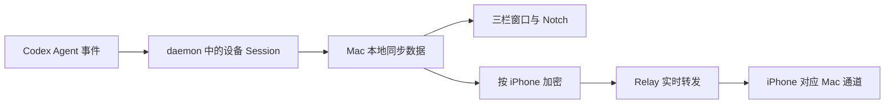

# Agent Status 功能全景

> 适用版本：v1 开发预览。macOS App 已完成本机编译与运行，iOS App 已完成模拟器编译与实时同步验证，Relay 已部署并通过健康检查。真实 Codex Hook、iPhone 实机、Developer ID 签名、公证和干净机器安装仍待验收。

Agent Status 把一台 Mac 上多个 Codex Agent、多个 Session 的状态集中到一个地方。用户可以在 Mac 的三栏主窗口和 Notch 查看状态，也可以把一台或多台 Mac 配对到 iPhone，进行只读查看。

本文把后台服务称为“daemon”，把 Codex 会话称为“Session”，把屏幕顶部状态胶囊称为“Notch”。

## 立即开始

1. 打开 Mac App，在侧边栏选择“Settings”。
2. 在中栏选择“Daemon”并点击“Install & Start daemon”，再选择“Agents”并点击“Install Hook”。
3. 如 Codex 要求审核 Hook，在 Codex `/hooks` 中确认 Agent Status 命令。
4. 新建一个 Codex Session，在“Sessions”中查看状态和时间线。

完成信号：工具栏显示 Session 数量；新 Agent 事件到达时，列表和详情自动更新。

## 功能模块

### Mac 会话查看

Mac 主窗口参考系统 Mail.app：左侧是功能导航，中间是当前区域的列表，右侧是详情。Sessions 使用“Session 列表—时间线详情”；Settings 使用“设置分类—设置详情”；只有 iPhone 配对页会收起中栏。

Notch 紧凑状态统计全部符合展示条件的 Session，展开后显示最近更新的最多四个 Session 的标题、状态和当前 Turn 用户消息；Session 完成时可以短暂显示完成卡片。Notch 设置按钮打开主 App 的“Settings > Notch”，外观与交互设置不会在 Notch 内重复出现。

外部产生的 Session 新增或内容变化只有三类同步入口：App 启动、用户点击刷新图标（Refresh Sessions）、收到 Agent 事件。删除和清空操作会立即同步结果。历史不会自动过期。

[查看模块详情](modules/mac-session-view.md)

### iPhone 实时查看

Mac App 使用产品内置的 Relay，不要求用户输入地址。用户从 Mac 侧边栏进入“iPhone”，生成一次性二维码；iPhone 扫码后建立独立通道。

一台 iPhone 可以连接多台 Mac；一台 Mac 也可以授权多台 iPhone。iPhone 按 Mac 分组显示 Session 与只读时间线，不提供审批、终止、输入或其他远程控制。

[查看模块详情](modules/iphone-live-view.md)

## 主要用户旅程

- [在 Mac 上跟进一次 Codex Session](journeys/observe-session-locally.md)
- [在 iPhone 上查看多台 Mac](journeys/check-session-away.md)

## 核心业务数据

- [Session 状态与时间线](data-flows.md#session-状态与时间线)：由新加入 Agent Status 的 Codex Session 产生，并同步到 daemon、Mac 与在线 iPhone。
- [设备与通道](data-flows.md#设备与通道)：每台 Mac 对每台已授权 iPhone 建立一条通道，一条通道承载该 Mac 的所有 Session。
- [配对授权](data-flows.md#配对授权)：每台 iPhone 独立授权，可在 Mac 上单独撤销。

## 数据如何连接功能

Relay 不保存 Session 正文或可浏览的历史。Mac 不在线时，iPhone 将该 Mac 标为不可用，不把旧数据当成实时状态展示。

## 遇到卡点

按“Daemon unavailable”“Hook 尚未信任”“Relay unavailable”“配对失败”或“Mac unavailable”等可见症状查看[恢复路径](friction-points.md)。

## 当前边界

- v1 只正式支持 Codex。
- iPhone 仅查看，不控制 Agent。
- Relay 地址是编译配置，不是 App 内设置项。
- v1 不提供后台状态通知。
- 真实 Codex Hook、iPhone 实机和正式发布链路尚未完成验收。
